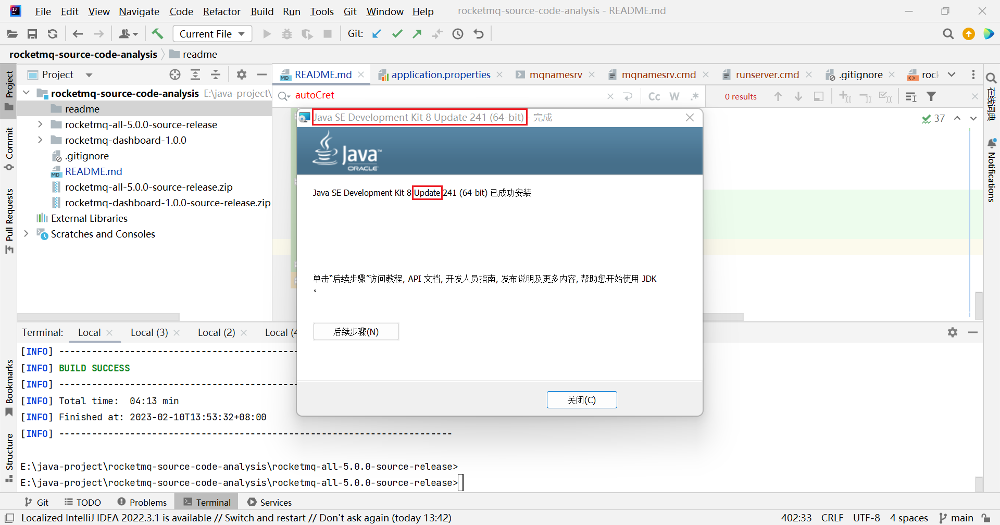

# RocketMQ 源码分析

## 生产端更新Topic路由信息 

rocketmq-client (not rocketmq-client-java)

1. 定时更新，默认每隔30秒；
2. 主动更新，发消息时，具体的Topic路由

到NameServer获取最新的Topic路由，并保存到本地内存

rocketmq-all-5.0.0-source-release/example/src/main/java/org/apache/rocketmq/example/quickstart

```java
public class MQClientInstance {
    // ...
    private void startScheduledTask() {
        // ...
        this.scheduledExecutorService.scheduleAtFixedRate(() -> {
            try {
                MQClientInstance.this.updateTopicRouteInfoFromNameServer();
            } catch (Exception e) {
                log.error("ScheduledTask updateTopicRouteInfoFromNameServer exception", e);
            }
        }, 10, this.clientConfig.getPollNameServerInterval(), TimeUnit.MILLISECONDS);
        // ...
    }
    // ...
}    
```

```java
public class DefaultMQProducerImpl implements MQProducerInner {
    // ...
    private TopicPublishInfo tryToFindTopicPublishInfo(final String topic) {
        TopicPublishInfo topicPublishInfo = this.topicPublishInfoTable.get(topic);
        if (null == topicPublishInfo || !topicPublishInfo.ok()) {
            this.topicPublishInfoTable.putIfAbsent(topic, new TopicPublishInfo());
            this.mQClientFactory.updateTopicRouteInfoFromNameServer(topic);
            topicPublishInfo = this.topicPublishInfoTable.get(topic);
        }

        if (topicPublishInfo.isHaveTopicRouterInfo() || topicPublishInfo.ok()) {
            return topicPublishInfo;
        } else {
            this.mQClientFactory.updateTopicRouteInfoFromNameServer(topic, true, this.defaultMQProducer);
            topicPublishInfo = this.topicPublishInfoTable.get(topic);
            return topicPublishInfo;
        }
    }
    // ...
}    
```

## RocketMQ 官网

https://rocketmq.apache.org/

## 源码地址

RocketMQ https://github.com/apache/rocketmq

## 源码编译构建

```shell
> java -version
java version "1.8.0_333"
Java(TM) SE Runtime Environment (build 1.8.0_333-b02)
Java HotSpot(TM) 64-Bit Server VM (build 25.333-b02, mixed mode)

> mvn -Prelease-all -DskipTests -Dspotbugs.skip=true clean install -U
```

检查 java -version，尽量保证编译用的 java 版本，跟后面运行用的 java 版本一致，不然可能会出现奇怪问题。

例如：用 java 11 来编译，用 java 8 来运行 会出现

```shell
> .\bin\mqbroker.cmd --namesrvAddr localhost:9876
java.lang.NoSuchMethodError: java.nio.ByteBuffer.position(I)Ljava/nio/ByteBuffer;
        at org.apache.rocketmq.store.timer.TimerWheel.checkPhyPos(TimerWheel.java:176)
        at org.apache.rocketmq.store.timer.TimerMessageStore.recover(TimerMessageStore.java:281)
        at org.apache.rocketmq.store.timer.TimerMessageStore.load(TimerMessageStore.java:218)
        at org.apache.rocketmq.broker.BrokerController.initialize(BrokerController.java:757)
        at org.apache.rocketmq.broker.BrokerStartup.createBrokerController(BrokerStartup.java:224)
        at org.apache.rocketmq.broker.BrokerStartup.main(BrokerStartup.java:58)
```

## Could not find artifact io.grpc:grpc-core:jar:1.45.0

D:\apache-maven-3.8.6\conf\settings.xml 去掉 mirrors 里面的所有 mirror

## Windows 运行

启动 mqnamesrc (用 start 命令可以开启新的窗口)

```shell
> cd rocketmq-all-5.0.0-source-release\distribution\target\rocketmq-5.0.0\rocketmq-5.0.0
> .\bin\mqnamesrv.cmd
Please set the ROCKETMQ_HOME variable in your environment!
> set ROCKETMQ_HOME=E:\java-project\rocketmq-source-code-analysis\rocketmq-all-5.0.0-source-release\distribution\target\rocketmq-5.0.0\rocketmq-5.0.0
(最好设置环境变量，避免每次都要设置临时环境变量)
> .\bin\mqnamesrv.cmd
Java HotSpot(TM) 64-Bit Server VM warning: Option UseConcMarkSweepGC was deprecated in version 9.0 and will likely be removed in a future release.
Unrecognized VM option 'UseCMSCompactAtFullCollection'
Error: Could not create the Java Virtual Machine.
Error: A fatal exception has occurred. Program will exit.

解决方案：使用支持 VM option 'UseCMSCompactAtFullCollection' 的 Java 版本。
也可以考虑去掉这个选项，但可能要改的地方很多，并且会出现新的错误 Unrecognized VM option 'UseParNewGC'。

JDK 8 下载 https://www.oracle.com/java/technologies/javase/javase8u211-later-archive-downloads.html

> .\bin\mqnamesrv.cmd
Java HotSpot(TM) 64-Bit Server VM warning: Using the DefNew young collector with the CMS collector is deprecated and will likely be removed in a future release
Java HotSpot(TM) 64-Bit Server VM warning: UseCMSCompactAtFullCollection is deprecated and will likely be removed in a future release.
The Name Server boot success. serializeType=JSON

查看环境变量 `set XXX`
临时设置环境变量 `set XXX=XXX`
临时追加环境变量 `set PATH=...;%PATH%`
(变量名不区分大小写)

留意 start call 执行命令的区别，简单理解 start 会启动新的窗口
```

启动 mqbroker

```shell
> .\bin\mqbroker.cmd -h
usage: mqbroker [-c <arg>] [-h] [-m] [-n <arg>] [-p]
 -c,--configFile <arg>       Broker config properties file
 -h,--help                   Print help
 -m,--printImportantConfig   Print important config item
 -n,--namesrvAddr <arg>      Name server address list, eg: '192.168.0.1:9876;192.168.0.2:9876'
 -p,--printConfigItem        Print all config item
"Broker starts OK"

> start .\bin\mqbroker.cmd --namesrvAddr localhost:9876
(新窗口)
The broker[BROKER_NAME, 192.168.1.103:10911] boot success. serializeType=JSON and name server is localhost:9876
```

输出 mqbroker 配置项

```shell
>.\bin\mqbroker.cmd --printConfigItem
2023-02-10 15:08:34 INFO main - brokerConfigPath=
2023-02-10 15:08:34 INFO main - rocketmqHome=E:\java-project\rocketmq-source-code-analysis\rocketmq-all-5.0.0-source-release\distribution\target\rocketmq-5.0.0\rocketmq-5.0.0
2023-02-10 15:08:34 INFO main - namesrvAddr=
2023-02-10 15:08:34 INFO main - listenPort=6888
2023-02-10 15:08:34 INFO main - brokerIP1=192.168.1.103
2023-02-10 15:08:34 INFO main - brokerIP2=192.168.1.103
2023-02-10 15:08:34 INFO main - brokerPermission=6
2023-02-10 15:08:34 INFO main - defaultTopicQueueNums=8
2023-02-10 15:08:34 INFO main - autoCreateTopicEnable=true
2023-02-10 15:08:34 INFO main - clusterTopicEnable=true
2023-02-10 15:08:34 INFO main - brokerTopicEnable=true
2023-02-10 15:08:34 INFO main - autoCreateSubscriptionGroup=true
2023-02-10 15:08:34 INFO main - messageStorePlugIn=
2023-02-10 15:08:34 INFO main - msgTraceTopicName=RMQ_SYS_TRACE_TOPIC
2023-02-10 15:08:34 INFO main - traceTopicEnable=false
2023-02-10 15:08:34 INFO main - sendMessageThreadPoolNums=4
2023-02-10 15:08:34 INFO main - putMessageFutureThreadPoolNums=4
2023-02-10 15:08:34 INFO main - pullMessageThreadPoolNums=40
2023-02-10 15:08:34 INFO main - litePullMessageThreadPoolNums=40
2023-02-10 15:08:34 INFO main - ackMessageThreadPoolNums=3
2023-02-10 15:08:34 INFO main - processReplyMessageThreadPoolNums=40
2023-02-10 15:08:34 INFO main - queryMessageThreadPoolNums=20
2023-02-10 15:08:34 INFO main - adminBrokerThreadPoolNums=16
2023-02-10 15:08:34 INFO main - clientManageThreadPoolNums=32
2023-02-10 15:08:34 INFO main - consumerManageThreadPoolNums=32
2023-02-10 15:08:34 INFO main - loadBalanceProcessorThreadPoolNums=32
2023-02-10 15:08:34 INFO main - heartbeatThreadPoolNums=12
2023-02-10 15:08:34 INFO main - endTransactionThreadPoolNums=32
2023-02-10 15:08:34 INFO main - flushConsumerOffsetInterval=5000
2023-02-10 15:08:34 INFO main - flushConsumerOffsetHistoryInterval=60000
2023-02-10 15:08:34 INFO main - rejectTransactionMessage=false
2023-02-10 15:08:34 INFO main - fetchNamesrvAddrByAddressServer=false
2023-02-10 15:08:34 INFO main - sendThreadPoolQueueCapacity=10000
2023-02-10 15:08:34 INFO main - putThreadPoolQueueCapacity=10000
2023-02-10 15:08:34 INFO main - pullThreadPoolQueueCapacity=100000
2023-02-10 15:08:34 INFO main - litePullThreadPoolQueueCapacity=100000
2023-02-10 15:08:34 INFO main - ackThreadPoolQueueCapacity=100000
2023-02-10 15:08:34 INFO main - replyThreadPoolQueueCapacity=10000
2023-02-10 15:08:34 INFO main - queryThreadPoolQueueCapacity=20000
2023-02-10 15:08:34 INFO main - clientManagerThreadPoolQueueCapacity=1000000
2023-02-10 15:08:34 INFO main - consumerManagerThreadPoolQueueCapacity=1000000
2023-02-10 15:08:34 INFO main - heartbeatThreadPoolQueueCapacity=50000
2023-02-10 15:08:34 INFO main - endTransactionPoolQueueCapacity=100000
2023-02-10 15:08:34 INFO main - adminBrokerThreadPoolQueueCapacity=10000
2023-02-10 15:08:34 INFO main - loadBalanceThreadPoolQueueCapacity=100000
2023-02-10 15:08:34 INFO main - filterServerNums=0
2023-02-10 15:08:34 INFO main - longPollingEnable=true
2023-02-10 15:08:34 INFO main - shortPollingTimeMills=1000
2023-02-10 15:08:34 INFO main - notifyConsumerIdsChangedEnable=true
2023-02-10 15:08:34 INFO main - highSpeedMode=false
2023-02-10 15:08:34 INFO main - commercialBaseCount=1
2023-02-10 15:08:34 INFO main - commercialSizePerMsg=4096
2023-02-10 15:08:34 INFO main - accountStatsEnable=true
2023-02-10 15:08:34 INFO main - accountStatsPrintZeroValues=true
2023-02-10 15:08:34 INFO main - transferMsgByHeap=true
2023-02-10 15:08:34 INFO main - maxDelayTime=40
2023-02-10 15:08:34 INFO main - regionId=DefaultRegion
2023-02-10 15:08:34 INFO main - registerBrokerTimeoutMills=24000
2023-02-10 15:08:34 INFO main - sendHeartbeatTimeoutMillis=1000
2023-02-10 15:08:34 INFO main - slaveReadEnable=false
2023-02-10 15:08:34 INFO main - disableConsumeIfConsumerReadSlowly=false
2023-02-10 15:08:34 INFO main - consumerFallbehindThreshold=17179869184
2023-02-10 15:08:34 INFO main - brokerFastFailureEnable=true
2023-02-10 15:08:34 INFO main - waitTimeMillsInSendQueue=200
2023-02-10 15:08:34 INFO main - waitTimeMillsInPullQueue=5000
2023-02-10 15:08:34 INFO main - waitTimeMillsInLitePullQueue=5000
2023-02-10 15:08:34 INFO main - waitTimeMillsInHeartbeatQueue=31000
2023-02-10 15:08:34 INFO main - waitTimeMillsInTransactionQueue=3000
2023-02-10 15:08:34 INFO main - waitTimeMillsInAckQueue=3000
2023-02-10 15:08:34 INFO main - startAcceptSendRequestTimeStamp=0
2023-02-10 15:08:34 INFO main - traceOn=true
2023-02-10 15:08:34 INFO main - enableCalcFilterBitMap=false
2023-02-10 15:08:34 INFO main - rejectPullConsumerEnable=false
2023-02-10 15:08:34 INFO main - expectConsumerNumUseFilter=32
2023-02-10 15:08:34 INFO main - maxErrorRateOfBloomFilter=20
2023-02-10 15:08:34 INFO main - filterDataCleanTimeSpan=86400000
2023-02-10 15:08:34 INFO main - filterSupportRetry=false
2023-02-10 15:08:34 INFO main - enablePropertyFilter=false
2023-02-10 15:08:34 INFO main - compressedRegister=false
2023-02-10 15:08:34 INFO main - forceRegister=true
2023-02-10 15:08:34 INFO main - registerNameServerPeriod=30000
2023-02-10 15:08:34 INFO main - brokerHeartbeatInterval=1000
2023-02-10 15:08:34 INFO main - brokerNotActiveTimeoutMillis=10000
2023-02-10 15:08:34 INFO main - enableNetWorkFlowControl=false
2023-02-10 15:08:34 INFO main - popPollingSize=1024
2023-02-10 15:08:34 INFO main - popPollingMapSize=100000
2023-02-10 15:08:34 INFO main - maxPopPollingSize=100000
2023-02-10 15:08:34 INFO main - reviveQueueNum=8
2023-02-10 15:08:34 INFO main - reviveInterval=1000
2023-02-10 15:08:34 INFO main - reviveMaxSlow=3
2023-02-10 15:08:34 INFO main - reviveScanTime=10000
2023-02-10 15:08:34 INFO main - enablePopLog=false
2023-02-10 15:08:34 INFO main - enablePopBufferMerge=false
2023-02-10 15:08:34 INFO main - popCkStayBufferTime=10000
2023-02-10 15:08:34 INFO main - popCkStayBufferTimeOut=3000
2023-02-10 15:08:34 INFO main - popCkMaxBufferSize=200000
2023-02-10 15:08:34 INFO main - popCkOffsetMaxQueueSize=20000
2023-02-10 15:08:34 INFO main - realTimeNotifyConsumerChange=true
2023-02-10 15:08:34 INFO main - litePullMessageEnable=true
2023-02-10 15:08:34 INFO main - syncBrokerMemberGroupPeriod=1000
2023-02-10 15:08:34 INFO main - loadBalancePollNameServerInterval=30000
2023-02-10 15:08:34 INFO main - cleanOfflineBrokerInterval=30000
2023-02-10 15:08:34 INFO main - serverLoadBalancerEnable=true
2023-02-10 15:08:34 INFO main - defaultMessageRequestMode=PULL
2023-02-10 15:08:34 INFO main - defaultPopShareQueueNum=-1
2023-02-10 15:08:34 INFO main - transactionTimeOut=6000
2023-02-10 15:08:34 INFO main - transactionCheckMax=15
2023-02-10 15:08:34 INFO main - transactionCheckInterval=60000
2023-02-10 15:08:34 INFO main - aclEnable=false
2023-02-10 15:08:34 INFO main - storeReplyMessageEnable=true
2023-02-10 15:08:34 INFO main - enableDetailStat=true
2023-02-10 15:08:34 INFO main - autoDeleteUnusedStats=false
2023-02-10 15:08:34 INFO main - isolateLogEnable=false
2023-02-10 15:08:34 INFO main - forwardTimeout=3000
2023-02-10 15:08:34 INFO main - enableSlaveActingMaster=false
2023-02-10 15:08:34 INFO main - enableRemoteEscape=false
2023-02-10 15:08:34 INFO main - skipPreOnline=false
2023-02-10 15:08:34 INFO main - asyncSendEnable=true
2023-02-10 15:08:34 INFO main - consumerOffsetUpdateVersionStep=500
2023-02-10 15:08:34 INFO main - delayOffsetUpdateVersionStep=200
2023-02-10 15:08:34 INFO main - lockInStrictMode=false
2023-02-10 15:08:34 INFO main - compatibleWithOldNameSrv=true
2023-02-10 15:08:34 INFO main - enableControllerMode=false
2023-02-10 15:08:34 INFO main - controllerAddr=
2023-02-10 15:08:34 INFO main - syncBrokerMetadataPeriod=5000
2023-02-10 15:08:34 INFO main - checkSyncStateSetPeriod=5000
2023-02-10 15:08:34 INFO main - syncControllerMetadataPeriod=10000
2023-02-10 15:08:34 INFO main - bindAddress=0.0.0.0
2023-02-10 15:08:34 INFO main - listenPort=10911
2023-02-10 15:08:34 INFO main - serverWorkerThreads=8
2023-02-10 15:08:34 INFO main - serverCallbackExecutorThreads=0
2023-02-10 15:08:34 INFO main - serverSelectorThreads=3
2023-02-10 15:08:34 INFO main - serverOnewaySemaphoreValue=256
2023-02-10 15:08:34 INFO main - serverAsyncSemaphoreValue=64
2023-02-10 15:08:34 INFO main - serverChannelMaxIdleTimeSeconds=120
2023-02-10 15:08:34 INFO main - serverSocketSndBufSize=0
2023-02-10 15:08:34 INFO main - serverSocketRcvBufSize=0
2023-02-10 15:08:34 INFO main - writeBufferHighWaterMark=0
2023-02-10 15:08:34 INFO main - writeBufferLowWaterMark=0
2023-02-10 15:08:34 INFO main - serverSocketBacklog=1024
2023-02-10 15:08:34 INFO main - serverPooledByteBufAllocatorEnable=true
2023-02-10 15:08:34 INFO main - useEpollNativeSelector=false
2023-02-10 15:08:34 INFO main - clientWorkerThreads=4
2023-02-10 15:08:34 INFO main - clientCallbackExecutorThreads=12
2023-02-10 15:08:34 INFO main - clientOnewaySemaphoreValue=65535
2023-02-10 15:08:34 INFO main - clientAsyncSemaphoreValue=65535
2023-02-10 15:08:34 INFO main - connectTimeoutMillis=3000
2023-02-10 15:08:34 INFO main - channelNotActiveInterval=60000
2023-02-10 15:08:34 INFO main - clientChannelMaxIdleTimeSeconds=120
2023-02-10 15:08:34 INFO main - clientSocketSndBufSize=0
2023-02-10 15:08:34 INFO main - clientSocketRcvBufSize=0
2023-02-10 15:08:34 INFO main - clientPooledByteBufAllocatorEnable=false
2023-02-10 15:08:34 INFO main - clientCloseSocketIfTimeout=true
2023-02-10 15:08:34 INFO main - useTLS=false
2023-02-10 15:08:34 INFO main - writeBufferHighWaterMark=0
2023-02-10 15:08:34 INFO main - writeBufferLowWaterMark=0
2023-02-10 15:08:34 INFO main - disableCallbackExecutor=false
2023-02-10 15:08:34 INFO main - disableNettyWorkerGroup=false
2023-02-10 15:08:34 INFO main - storePathRootDir=C:\Users\zhouh\store
2023-02-10 15:08:34 INFO main - storePathCommitLog=
2023-02-10 15:08:34 INFO main - storePathDLedgerCommitLog=
2023-02-10 15:08:34 INFO main - storePathEpochFile=C:\Users\zhouh\store\epochFileCheckpoint
2023-02-10 15:08:34 INFO main - readOnlyCommitLogStorePaths=
2023-02-10 15:08:34 INFO main - mappedFileSizeCommitLog=1073741824
2023-02-10 15:08:34 INFO main - mappedFileSizeTimerLog=104857600
2023-02-10 15:08:34 INFO main - timerPrecisionMs=1000
2023-02-10 15:08:34 INFO main - timerRollWindowSlot=172800
2023-02-10 15:08:34 INFO main - timerFlushIntervalMs=1000
2023-02-10 15:08:34 INFO main - timerGetMessageThreadNum=3
2023-02-10 15:08:34 INFO main - timerPutMessageThreadNum=3
2023-02-10 15:08:34 INFO main - timerEnableDisruptor=false
2023-02-10 15:08:34 INFO main - timerEnableCheckMetrics=true
2023-02-10 15:08:34 INFO main - timerInterceptDelayLevel=false
2023-02-10 15:08:34 INFO main - timerMaxDelaySec=259200
2023-02-10 15:08:34 INFO main - timerWheelEnable=true
2023-02-10 15:08:34 INFO main - disappearTimeAfterStart=-1
2023-02-10 15:08:34 INFO main - timerStopEnqueue=false
2023-02-10 15:08:34 INFO main - timerCheckMetricsWhen=05
2023-02-10 15:08:34 INFO main - timerSkipUnknownError=false
2023-02-10 15:08:34 INFO main - timerWarmEnable=false
2023-02-10 15:08:34 INFO main - timerStopDequeue=false
2023-02-10 15:08:34 INFO main - timerCongestNumEachSlot=2147483647
2023-02-10 15:08:34 INFO main - timerMetricSmallThreshold=1000000
2023-02-10 15:08:34 INFO main - timerProgressLogIntervalMs=10000
2023-02-10 15:08:34 INFO main - mappedFileSizeConsumeQueue=6000000
2023-02-10 15:08:34 INFO main - enableConsumeQueueExt=false
2023-02-10 15:08:34 INFO main - mappedFileSizeConsumeQueueExt=50331648
2023-02-10 15:08:34 INFO main - mapperFileSizeBatchConsumeQueue=13800000
2023-02-10 15:08:34 INFO main - bitMapLengthConsumeQueueExt=64
2023-02-10 15:08:34 INFO main - flushIntervalCommitLog=500
2023-02-10 15:08:34 INFO main - commitIntervalCommitLog=200
2023-02-10 15:08:34 INFO main - maxRecoveryCommitlogFiles=30
2023-02-10 15:08:34 INFO main - diskSpaceWarningLevelRatio=90
2023-02-10 15:08:34 INFO main - diskSpaceCleanForciblyRatio=85
2023-02-10 15:08:34 INFO main - useReentrantLockWhenPutMessage=true
2023-02-10 15:08:34 INFO main - flushCommitLogTimed=true
2023-02-10 15:08:34 INFO main - flushIntervalConsumeQueue=1000
2023-02-10 15:08:34 INFO main - cleanResourceInterval=10000
2023-02-10 15:08:34 INFO main - deleteCommitLogFilesInterval=100
2023-02-10 15:08:34 INFO main - deleteConsumeQueueFilesInterval=100
2023-02-10 15:08:34 INFO main - destroyMapedFileIntervalForcibly=120000
2023-02-10 15:08:34 INFO main - redeleteHangedFileInterval=120000
2023-02-10 15:08:34 INFO main - deleteWhen=04
2023-02-10 15:08:34 INFO main - diskMaxUsedSpaceRatio=75
2023-02-10 15:08:34 INFO main - fileReservedTime=72
2023-02-10 15:08:34 INFO main - deleteFileBatchMax=10
2023-02-10 15:08:34 INFO main - putMsgIndexHightWater=600000
2023-02-10 15:08:34 INFO main - maxMessageSize=4194304
2023-02-10 15:08:34 INFO main - checkCRCOnRecover=true
2023-02-10 15:08:34 INFO main - flushCommitLogLeastPages=4
2023-02-10 15:08:34 INFO main - commitCommitLogLeastPages=4
2023-02-10 15:08:34 INFO main - flushLeastPagesWhenWarmMapedFile=4096
2023-02-10 15:08:34 INFO main - flushConsumeQueueLeastPages=2
2023-02-10 15:08:34 INFO main - flushCommitLogThoroughInterval=10000
2023-02-10 15:08:34 INFO main - commitCommitLogThoroughInterval=200
2023-02-10 15:08:34 INFO main - flushConsumeQueueThoroughInterval=60000
2023-02-10 15:08:34 INFO main - maxTransferBytesOnMessageInMemory=262144
2023-02-10 15:08:34 INFO main - maxTransferCountOnMessageInMemory=32
2023-02-10 15:08:34 INFO main - maxTransferBytesOnMessageInDisk=65536
2023-02-10 15:08:34 INFO main - maxTransferCountOnMessageInDisk=8
2023-02-10 15:08:34 INFO main - accessMessageInMemoryMaxRatio=40
2023-02-10 15:08:34 INFO main - messageIndexEnable=true
2023-02-10 15:08:34 INFO main - maxHashSlotNum=5000000
2023-02-10 15:08:34 INFO main - maxIndexNum=20000000
2023-02-10 15:08:34 INFO main - maxMsgsNumBatch=64
2023-02-10 15:08:34 INFO main - messageIndexSafe=false
2023-02-10 15:08:34 INFO main - haListenPort=10912
2023-02-10 15:08:34 INFO main - haSendHeartbeatInterval=5000
2023-02-10 15:08:34 INFO main - haHousekeepingInterval=20000
2023-02-10 15:08:34 INFO main - haTransferBatchSize=32768
2023-02-10 15:08:34 INFO main - haMasterAddress=
2023-02-10 15:08:34 INFO main - haMaxGapNotInSync=268435456
2023-02-10 15:08:34 INFO main - brokerRole=ASYNC_MASTER
2023-02-10 15:08:34 INFO main - flushDiskType=ASYNC_FLUSH
2023-02-10 15:08:34 INFO main - syncFlushTimeout=5000
2023-02-10 15:08:34 INFO main - putMessageTimeout=8000
2023-02-10 15:08:34 INFO main - slaveTimeout=3000
2023-02-10 15:08:34 INFO main - messageDelayLevel=1s 5s 10s 30s 1m 2m 3m 4m 5m 6m 7m 8m 9m 10m 20m 30m 1h 2h
2023-02-10 15:08:34 INFO main - flushDelayOffsetInterval=10000
2023-02-10 15:08:34 INFO main - cleanFileForciblyEnable=true
2023-02-10 15:08:34 INFO main - warmMapedFileEnable=false
2023-02-10 15:08:34 INFO main - offsetCheckInSlave=false
2023-02-10 15:08:34 INFO main - debugLockEnable=false
2023-02-10 15:08:34 INFO main - duplicationEnable=false
2023-02-10 15:08:34 INFO main - diskFallRecorded=true
2023-02-10 15:08:34 INFO main - osPageCacheBusyTimeOutMills=1000
2023-02-10 15:08:34 INFO main - defaultQueryMaxNum=32
2023-02-10 15:08:34 INFO main - transientStorePoolEnable=false
2023-02-10 15:08:34 INFO main - transientStorePoolSize=5
2023-02-10 15:08:34 INFO main - fastFailIfNoBufferInStorePool=false
2023-02-10 15:08:34 INFO main - enableDLegerCommitLog=false
2023-02-10 15:08:34 INFO main - dLegerGroup=
2023-02-10 15:08:34 INFO main - dLegerPeers=
2023-02-10 15:08:34 INFO main - dLegerSelfId=
2023-02-10 15:08:34 INFO main - preferredLeaderId=
2023-02-10 15:08:34 INFO main - isEnableBatchPush=false
2023-02-10 15:08:34 INFO main - enableScheduleMessageStats=true
2023-02-10 15:08:34 INFO main - enableLmq=false
2023-02-10 15:08:34 INFO main - enableMultiDispatch=false
2023-02-10 15:08:34 INFO main - maxLmqConsumeQueueNum=20000
2023-02-10 15:08:34 INFO main - enableScheduleAsyncDeliver=false
2023-02-10 15:08:34 INFO main - scheduleAsyncDeliverMaxPendingLimit=2000
2023-02-10 15:08:34 INFO main - scheduleAsyncDeliverMaxResendNum2Blocked=3
2023-02-10 15:08:34 INFO main - maxBatchDeleteFilesNum=50
2023-02-10 15:08:34 INFO main - dispatchCqThreads=10
2023-02-10 15:08:34 INFO main - dispatchCqCacheNum=4096
2023-02-10 15:08:34 INFO main - enableAsyncReput=true
2023-02-10 15:08:34 INFO main - recheckReputOffsetFromCq=false
2023-02-10 15:08:34 INFO main - maxTopicLength=1000
2023-02-10 15:08:34 INFO main - travelCqFileNumWhenGetMessage=1
2023-02-10 15:08:34 INFO main - correctLogicMinOffsetSleepInterval=1
2023-02-10 15:08:34 INFO main - correctLogicMinOffsetForceInterval=300000
2023-02-10 15:08:34 INFO main - mappedFileSwapEnable=true
2023-02-10 15:08:34 INFO main - commitLogForceSwapMapInterval=43200000
2023-02-10 15:08:34 INFO main - commitLogSwapMapInterval=3600000
2023-02-10 15:08:34 INFO main - commitLogSwapMapReserveFileNum=100
2023-02-10 15:08:34 INFO main - logicQueueForceSwapMapInterval=43200000
2023-02-10 15:08:34 INFO main - logicQueueSwapMapInterval=3600000
2023-02-10 15:08:34 INFO main - cleanSwapedMapInterval=300000
2023-02-10 15:08:34 INFO main - logicQueueSwapMapReserveFileNum=20
2023-02-10 15:08:34 INFO main - searchBcqByCacheEnable=true
2023-02-10 15:08:34 INFO main - dispatchFromSenderThread=false
2023-02-10 15:08:34 INFO main - wakeCommitWhenPutMessage=true
2023-02-10 15:08:34 INFO main - wakeFlushWhenPutMessage=false
2023-02-10 15:08:34 INFO main - enableCleanExpiredOffset=false
2023-02-10 15:08:34 INFO main - maxAsyncPutMessageRequests=5000
2023-02-10 15:08:34 INFO main - pullBatchMaxMessageCount=160
2023-02-10 15:08:34 INFO main - totalReplicas=1
2023-02-10 15:08:34 INFO main - inSyncReplicas=1
2023-02-10 15:08:34 INFO main - minInSyncReplicas=1
2023-02-10 15:08:34 INFO main - allAckInSyncStateSet=false
2023-02-10 15:08:34 INFO main - enableAutoInSyncReplicas=false
2023-02-10 15:08:34 INFO main - haFlowControlEnable=false
2023-02-10 15:08:34 INFO main - maxHaTransferByteInSecond=104857600
2023-02-10 15:08:34 INFO main - haMaxTimeSlaveNotCatchup=15000
2023-02-10 15:08:34 INFO main - syncMasterFlushOffsetWhenStartup=false
2023-02-10 15:08:34 INFO main - maxChecksumRange=1073741824
2023-02-10 15:08:34 INFO main - replicasPerDiskPartition=1
2023-02-10 15:08:34 INFO main - logicalDiskSpaceCleanForciblyThreshold=0.8
2023-02-10 15:08:34 INFO main - maxSlaveResendLength=268435456
2023-02-10 15:08:34 INFO main - syncFromLastFile=false
2023-02-10 15:08:34 INFO main - asyncLearner=false
"Broker starts OK"
```

## RocketMQ Dashboard

https://github.com/apache/rocketmq-dashboard

https://rocketmq.apache.org/zh/download#rocketmq-dashboard

旧版本源码是在rocketmq-external里的rocketmq-console，新版本已经单独拆分成rocketmq-dashboard

https://rocketmq.apache.org/zh/docs/deploymentOperations/04Dashboard

`mvn spring-boot:run`

## Java 版本命名

例如 jdk 8u101

```text
jdk: Java development Kit
8: jdk版本，即是jdk 1.8
u: update 更新的意思
101: 更新次数，即 jdk 1.8 版本更新了 101 次了
```



## 简单测试

```shell
$ export NAMESRV_ADDR=localhost:9876
$ sh bin/tools.sh org.apache.rocketmq.example.quickstart.Producer
SendResult [sendStatus=SEND_OK, msgId= ...
$ sh bin/tools.sh org.apache.rocketmq.example.quickstart.Consumer
ConsumeMessageThread_%d Receive New Messages: [MessageExt...

> set NAMESRV_ADDR=localhost:9876

> call bin\tools.cmd org.apache.rocketmq.example.quickstart.Producer
SendResult [sendStatus=SEND_OK, msgId=7F0000012D98214C265E31BFB8990000, offsetMsgId=C0A8016700002A9F000000000003ACFA, messageQueue=MessageQueue [topic=TopicTest, brokerName=BROKER_NAME, queueId=3], queueOffset=250]
SendResult [sendStatus=SEND_OK, msgId=7F0000012D98214C265E31BFB8A10001, offsetMsgId=C0A8016700002A9F000000000003ADE9, messageQueue=MessageQueue [topic=TopicTest, brokerName=BROKER_NAME, queueId=0], queueOffset=250]
SendResult [sendStatus=SEND_OK, msgId=7F0000012D98214C265E31BFB8A20002, offsetMsgId=C0A8016700002A9F000000000003AED8, messageQueue=MessageQueue [topic=TopicTest, brokerName=BROKER_NAME, queueId=1], queueOffset=250]
SendResult [sendStatus=SEND_OK, msgId=7F0000012D98214C265E31BFB8A30003, offsetMsgId=C0A8016700002A9F000000000003AFC7, messageQueue=MessageQueue [topic=TopicTest, brokerName=BROKER_NAME, queueId=2], queueOffset=250]
...

> call bin\tools.cmd org.apache.rocketmq.example.quickstart.Consumer
Consumer Started.
ConsumeMessageThread_please_rename_unique_group_name_4_7 Receive New Messages: [MessageExt [brokerName=BROKER_NAME, queueId=0, storeSize=239, queueOffset=767, sysFlag=0, bornTim
estamp=1676015545864, bornHost=/192.168.1.103:52747, storeTimestamp=1676015545864, storeHost=/192.168.1.103:10911, msgId=C0A8016700002A9F00000000000B4C1C, commitLogOffset=740
380, bodyCRC=988340972, reconsumeTimes=0, preparedTransactionOffset=0, toString()=Message{topic='TopicTest', flag=0, properties={MIN_OFFSET=0, TRACE_ON=true, MAX_OFFSET=862, 
MSG_REGION=DefaultRegion, CONSUME_START_TIME=1676015566432, UNIQ_KEY=7F0000010A24214C265E31C136080007, CLUSTER=DefaultCluster, WAIT=true, TAGS=TagA}, body=[72, 101, 108, 108, 111, 32, 82, 111, 99, 107, 101, 116, 77, 81, 32, 55], transactionId='null'}]]
ConsumeMessageThread_please_rename_unique_group_name_4_20 Receive New Messages: [MessageExt [brokerName=BROKER_NAME, queueId=3, storeSize=240, queueOffset=771, sysFlag=0, bornTi
mestamp=1676015545877, bornHost=/192.168.1.103:52747, storeTimestamp=1676015545877, storeHost=/192.168.1.103:10911, msgId=C0A8016700002A9F00000000000B5669, commitLogOffset=74
3017, bodyCRC=89962020, reconsumeTimes=0, preparedTransactionOffset=0, toString()=Message{topic='TopicTest', flag=0, properties={MIN_OFFSET=0, TRACE_ON=true, MAX_OFFSET=863, 
MSG_REGION=DefaultRegion, CONSUME_START_TIME=1676015566432, UNIQ_KEY=7F0000010A24214C265E31C136150012, CLUSTER=DefaultCluster, WAIT=true, TAGS=TagA}, body=[72, 101, 108, 108, 111, 32, 82, 111, 99, 107, 101, 116, 77, 81, 32, 49, 56], transactionId='null'}]]
ConsumeMessageThread_please_rename_unique_group_name_4_19 Receive New Messages: [MessageExt [brokerName=BROKER_NAME, queueId=1, storeSize=240, queueOffset=771, sysFlag=0, bornTi
mestamp=1676015545875, bornHost=/192.168.1.103:52747, storeTimestamp=1676015545875, storeHost=/192.168.1.103:10911, msgId=C0A8016700002A9F00000000000B5489, commitLogOffset=74
2537, bodyCRC=1659149091, reconsumeTimes=0, preparedTransactionOffset=0, toString()=Message{topic='TopicTest', flag=0, properties={MIN_OFFSET=0, TRACE_ON=true, MAX_OFFSET=863
, MSG_REGION=DefaultRegion, CONSUME_START_TIME=1676015566432, UNIQ_KEY=7F0000010A24214C265E31C136130010, CLUSTER=DefaultCluster, WAIT=true, TAGS=TagA}, body=[72, 101, 108, 108, 111, 32, 82, 111, 99, 107, 101, 116, 77, 81, 32, 49, 54], transactionId='null'}]]
...
(挂起，等待新的消息)

```
 
## RocketMQ Proxy

RocketMQ Proxy 是一个 RocketMQ Broker 的代理服务，支持客户端用 GRPC 协议访问 Broker

```shell
> start .\bin\mqproxy.cmd -n localhost:9876
(新窗口)
Java HotSpot(TM) 64-Bit Server VM warning: Using the DefNew young collector with the CMS collector is deprecated and will likely be removed in a future release
Java HotSpot(TM) 64-Bit Server VM warning: UseCMSCompactAtFullCollection is deprecated and will likely be removed in a future release.
Fri Feb 10 16:10:47 CST 2023 rocketmq-proxy startup successfully
```

## 通过 mqadmin 创建 topic

```shell
$ sh bin/mqadmin updatetopic -n localhost:9876 -t TestTopic -c DefaultCluster

> call bin\mqadmin.cmd updatetopic -n localhost:9876 -t TestTopic123 -c DefaultCluster
create topic to 192.168.1.103:10911 success.
TopicConfig [topicName=TestTopic123, readQueueNums=8, writeQueueNums=8, perm=RW-, topicFilterType=SINGLE_TAG, topicSysFlag=0, order=false, attributes={}]

```

## rocketmq-client-java 和 rocketmq-client

https://github.com/apache/rocketmq-clients

https://github.com/apache/rocketmq-clients/issues/325

> 欢迎关注 5.0 客户端，rocketmq-client-java 对应的客户端是 RocketMQ 社区推荐的新的 5.0 客户端，未来 RocketMQ 客户端新的 feature 和主力维护方向是在当前仓库进行的（包含以此衍生的所有多语言客户端），关于这一点，你可以在 RocketMQ 官网进行参阅。
rocketmq-client 对应的是 RocketMQ 旧有的客户端，沿袭 RocketMQ 的旧有设计和编码，原则上只做 bugfix，不再进行 feature 新增。

## Articles

+ 全面升级 —— Apache RocketMQ 5.0 SDK 的新面貌 https://developer.aliyun.com/article/797655
