# RocketMQ 源码分析

## messageRequestQueue

1. MessageRequest messageRequest = this.messageRequestQueue.take(); 没有数据
2. RebalanceService 会一直循环 this.mqClientFactory.doRebalance();
   会一直this.dispatchPullRequest(pullRequestList, 500);
   this.defaultMQPushConsumerImpl.executePullRequestLater(pullRequest, delay);
   PullMessageService.this.executePullRequestImmediately(pullRequest);
   也就是RebalanceService会一直往this.messageRequestQueue.put数据
3. MessageRequest messageRequest = this.messageRequestQueue.take() 拿到数据，发起pull请求，请求成功，异步回调

[messageRequestQueue](readme/messageRequestQueue.png)

## 消费者拉取消息

```
        // 注册消息监听器
		consumer.registerMessageListener((MessageListenerConcurrently) (msgs, context) -> {
            for (MessageExt msg : msgs) {
                System.out.println("=========================" + "\n" +
                                   "MsgID = " + msg.getMsgId() + "\n" +
                                   "BrokerName = " + msg.getBrokerName() + "\n" +
                                   "Topic = " + msg.getTopic() + "\n" +
                                   "QueueId = " + msg.getQueueId() + "\n" +
                                   "MessageBody = " + new String(msg.getBody()) + "\n" +
                                   "ThreadName = " + Thread.currentThread().getName());
            }
            // 返回 消息消费结果
            return ConsumeConcurrentlyStatus.CONSUME_SUCCESS;
        });
        
----------------- 消费者启动 -------------------------        
        
    public synchronized void start() throws MQClientException {
        switch (this.serviceState) {
            case CREATE_JUST:
                log.info("the consumer [{}] start beginning. messageModel={}, isUnitMode={}", this.defaultMQPushConsumer.getConsumerGroup(),
                    this.defaultMQPushConsumer.getMessageModel(), this.defaultMQPushConsumer.isUnitMode());
                this.serviceState = ServiceState.START_FAILED;

                this.checkConfig();

                this.copySubscription();
                // 消息模式 CLUSTERING 默认是这个 
                if (this.defaultMQPushConsumer.getMessageModel() == MessageModel.CLUSTERING) {
                    this.defaultMQPushConsumer.changeInstanceNameToPID();
                }

                this.mQClientFactory = MQClientManager.getInstance().getOrCreateMQClientInstance(this.defaultMQPushConsumer, this.rpcHook);

                this.rebalanceImpl.setConsumerGroup(this.defaultMQPushConsumer.getConsumerGroup());
                this.rebalanceImpl.setMessageModel(this.defaultMQPushConsumer.getMessageModel());
                this.rebalanceImpl.setAllocateMessageQueueStrategy(this.defaultMQPushConsumer.getAllocateMessageQueueStrategy());
                this.rebalanceImpl.setmQClientFactory(this.mQClientFactory);

                if (this.pullAPIWrapper == null) {
                    // 拉取接口封装器
                    this.pullAPIWrapper = new PullAPIWrapper(
                        mQClientFactory,
                        this.defaultMQPushConsumer.getConsumerGroup(), isUnitMode());
                }
                this.pullAPIWrapper.registerFilterMessageHook(filterMessageHookList);

                if (this.defaultMQPushConsumer.getOffsetStore() != null) {
                    this.offsetStore = this.defaultMQPushConsumer.getOffsetStore();
                } else {
                    switch (this.defaultMQPushConsumer.getMessageModel()) {
                        // BROADCASTING 模式 本地文件偏移存储
                        case BROADCASTING:
                            this.offsetStore = new LocalFileOffsetStore(this.mQClientFactory, this.defaultMQPushConsumer.getConsumerGroup());
                            break;
                        // CLUSTERING 模式 远程Broker偏移存储
                        case CLUSTERING:
                            this.offsetStore = new RemoteBrokerOffsetStore(this.mQClientFactory, this.defaultMQPushConsumer.getConsumerGroup());
                            break;
                        default:
                            break;
                    }
                    this.defaultMQPushConsumer.setOffsetStore(this.offsetStore);
                }
                // 偏移存储 加载
                this.offsetStore.load();
                // 有序的消息监听器
                if (this.getMessageListenerInner() instanceof MessageListenerOrderly) {
                    this.consumeOrderly = true;
                    this.consumeMessageService =
                        new ConsumeMessageOrderlyService(this, (MessageListenerOrderly) this.getMessageListenerInner());
                    //POPTODO reuse Executor ?
                    this.consumeMessagePopService = new ConsumeMessagePopOrderlyService(this, (MessageListenerOrderly) this.getMessageListenerInner());
                }
                // 并发的消息监听器 使用的是这个
                else if (this.getMessageListenerInner() instanceof MessageListenerConcurrently) {
                    this.consumeOrderly = false;
                    // 创建消费消息服务，执行异步任务的线程池
                    this.consumeMessageService =
                        new ConsumeMessageConcurrentlyService(this, (MessageListenerConcurrently) this.getMessageListenerInner());
                    //POPTODO reuse Executor ?
                    this.consumeMessagePopService =
                        new ConsumeMessagePopConcurrentlyService(this, (MessageListenerConcurrently) this.getMessageListenerInner());
                }
                // 启动消费消息服务
                this.consumeMessageService.start();
                // POPTODO
                this.consumeMessagePopService.start();
                // 注册消费者
                boolean registerOK = mQClientFactory.registerConsumer(this.defaultMQPushConsumer.getConsumerGroup(), this);
                if (!registerOK) {
                    this.serviceState = ServiceState.CREATE_JUST;
                    this.consumeMessageService.shutdown(defaultMQPushConsumer.getAwaitTerminationMillisWhenShutdown());
                    throw new MQClientException("The consumer group[" + this.defaultMQPushConsumer.getConsumerGroup()
                        + "] has been created before, specify another name please." + FAQUrl.suggestTodo(FAQUrl.GROUP_NAME_DUPLICATE_URL),
                        null);
                }

                mQClientFactory.start();
                log.info("the consumer [{}] start OK.", this.defaultMQPushConsumer.getConsumerGroup());
                this.serviceState = ServiceState.RUNNING;
                break;
            case RUNNING:
            case START_FAILED:
            case SHUTDOWN_ALREADY:
                throw new MQClientException("The PushConsumer service state not OK, maybe started once, "
                    + this.serviceState
                    + FAQUrl.suggestTodo(FAQUrl.CLIENT_SERVICE_NOT_OK),
                    null);
            default:
                break;
        }

        this.updateTopicSubscribeInfoWhenSubscriptionChanged();
        this.mQClientFactory.checkClientInBroker();
        this.mQClientFactory.sendHeartbeatToAllBrokerWithLock();
        this.mQClientFactory.rebalanceImmediately();
    }
    
     public ConsumeMessageConcurrentlyService(DefaultMQPushConsumerImpl defaultMQPushConsumerImpl,
        MessageListenerConcurrently messageListener) {
        this.defaultMQPushConsumerImpl = defaultMQPushConsumerImpl;        // 消息监听器
        // 消息监听器
        this.messageListener = messageListener;

        this.defaultMQPushConsumer = this.defaultMQPushConsumerImpl.getDefaultMQPushConsumer();
        this.consumerGroup = this.defaultMQPushConsumer.getConsumerGroup();
        // 消费请求队列
        this.consumeRequestQueue = new LinkedBlockingQueue<>();
        // 消费线程前缀
        String consumeThreadPrefix = null;
        // 消费者组 长度 大于 100
        if (consumerGroup.length() > 100) {
            // ConsumeMessageThread_截取前100个字符_
            consumeThreadPrefix = new StringBuilder("ConsumeMessageThread_").append(consumerGroup, 0, 100).append("_").toString();
        } else {
            // ConsumeMessageThread_消费者组_
            consumeThreadPrefix = new StringBuilder("ConsumeMessageThread_").append(consumerGroup).append("_").toString();
        }
        // 线程池执行器 异步任务多线程执行器
        this.consumeExecutor = new ThreadPoolExecutor(
            // 线程池核心大小
            this.defaultMQPushConsumer.getConsumeThreadMin(),
            // 线程池最大大小
            this.defaultMQPushConsumer.getConsumeThreadMax(),
            // KeepAlive 时间 60秒
            1000 * 60,
            // 时间单位 毫秒
            TimeUnit.MILLISECONDS,
            // 消费请求队列 worker queue 工作队列
            this.consumeRequestQueue,
            // 线程工厂
            new ThreadFactoryImpl(consumeThreadPrefix));
        // 可调度的执行器服务 异步任务执行器
        // 单线程执行器
        this.scheduledExecutorService = Executors.newSingleThreadScheduledExecutor(new ThreadFactoryImpl("ConsumeMessageScheduledThread_"));
        this.cleanExpireMsgExecutors = Executors.newSingleThreadScheduledExecutor(new ThreadFactoryImpl("CleanExpireMsgScheduledThread_"));
    }
    
        // 新线程
    @Override
    public Thread newThread(Runnable r) {
        // 线程 线程名
        Thread thread = new Thread(r, threadNamePrefix + this.threadIndex.incrementAndGet());
        thread.setDaemon(daemon);

        // Log all uncaught exception
        thread.setUncaughtExceptionHandler((t, e) ->
            LOGGER.error("[BUG] Thread has an uncaught exception, threadId={}, threadName={}",
                t.getId(), t.getName(), e));

        return thread;
```

```

----------------- 客户端启动 -------------------------

public void start() throws MQClientException {

        synchronized (this) {
            switch (this.serviceState) {
                case CREATE_JUST:
                    this.serviceState = ServiceState.START_FAILED;
                    // If not specified,looking address from name server
                    // 获取NameServer地址
                    if (null == this.clientConfig.getNamesrvAddr()) {
                        this.mQClientAPIImpl.fetchNameServerAddr();
                    }
                    // Start request-response channel
                    this.mQClientAPIImpl.start();
                    // Start various schedule tasks
                    // 启动定时任务
                    this.startScheduledTask();
                    // Start pull service
                    // 拉取消息服务 启动
                    this.pullMessageService.start();  ------------------ 比较重要的代码 -----------------
                    // Start rebalance service
                    this.rebalanceService.start();
                    // Start push service
                    this.defaultMQProducer.getDefaultMQProducerImpl().start(false);
                    log.info("the client factory [{}] start OK", this.clientId);
                    this.serviceState = ServiceState.RUNNING;
                    break;
                case START_FAILED:
                    throw new MQClientException("The Factory object[" + this.getClientId() + "] has been created before, and failed.", null);
                default:
                    break;
            }
        }
    }
    
    public MQClientInstance(ClientConfig clientConfig, int instanceIndex, String clientId, RPCHook rpcHook) {
        
        // 拉取消息服务
        this.pullMessageService = new PullMessageService(this);
        
org.apache.rocketmq.client.impl.consumer.PullMessageService.run

	@Override
    public void run() {
        logger.info(this.getServiceName() + " service started");
        // 当未停止时，死循环
        while (!this.isStopped()) {
            try {
                // RMQ提前将要发送的请求写到队列
                // 拿到一个messageRequest消息请求
                // 异步任务的实现方式之一，将数据放到队列
                MessageRequest messageRequest = this.messageRequestQueue.take();
                if (messageRequest.getMessageRequestMode() == MessageRequestMode.POP) {
                    this.popMessage((PopRequest)messageRequest);
                } else {
                    // 拉取消息
                    this.pullMessage((PullRequest)messageRequest);
                }
            } catch (InterruptedException ignored) {
            } catch (Exception e) {
                logger.error("Pull Message Service Run Method exception", e);
            }
        }

        logger.info(this.getServiceName() + " service end");
    }


 	public void executePullRequestImmediately(final PullRequest pullRequest) {
        try {
            this.messageRequestQueue.put(pullRequest);
        } catch (InterruptedException e) {
            logger.error("executePullRequestImmediately pullRequestQueue.put", e);
        }
    }
    
 org.apache.rocketmq.client.impl.consumer.DefaultMQPushConsumerImpl.pullMessage
    
     // 创建pull回调对象
        PullCallback pullCallback = new PullCallback() {
            // 成功时
            @Override
            public void onSuccess(PullResult pullResult) {
                if (pullResult != null) {
                    // 处理pull结果
                    pullResult = DefaultMQPushConsumerImpl.this.pullAPIWrapper.processPullResult(pullRequest.getMessageQueue(), pullResult,
                        subscriptionData);

                    switch (pullResult.getPullStatus()) {
                        // 找到了数据
                        case FOUND:
                            long prevRequestOffset = pullRequest.getNextOffset();
                            pullRequest.setNextOffset(pullResult.getNextBeginOffset());
                            long pullRT = System.currentTimeMillis() - beginTimestamp;
                            DefaultMQPushConsumerImpl.this.getConsumerStatsManager().incPullRT(pullRequest.getConsumerGroup(),
                                pullRequest.getMessageQueue().getTopic(), pullRT);

                            long firstMsgOffset = Long.MAX_VALUE;
                            if (pullResult.getMsgFoundList() == null || pullResult.getMsgFoundList().isEmpty()) {
                                DefaultMQPushConsumerImpl.this.executePullRequestImmediately(pullRequest);
                            } else {
                                firstMsgOffset = pullResult.getMsgFoundList().get(0).getQueueOffset();

                                DefaultMQPushConsumerImpl.this.getConsumerStatsManager().incPullTPS(pullRequest.getConsumerGroup(),
                                    pullRequest.getMessageQueue().getTopic(), pullResult.getMsgFoundList().size());

                                boolean dispatchToConsume = processQueue.putMessage(pullResult.getMsgFoundList());
                                // 提交消费请求
                                DefaultMQPushConsumerImpl.this.consumeMessageService.submitConsumeRequest(
                                    pullResult.getMsgFoundList(),
                                    processQueue,
                                    pullRequest.getMessageQueue(),
                                    dispatchToConsume);

	try {
            // 拉取核心实现
            this.pullAPIWrapper.pullKernelImpl(
                // 消息队列
                pullRequest.getMessageQueue(),
                subExpression,
                subscriptionData.getExpressionType(),
                subscriptionData.getSubVersion(),
                pullRequest.getNextOffset(),
                this.defaultMQPushConsumer.getPullBatchSize(),
                this.defaultMQPushConsumer.getPullBatchSizeInBytes(),
                sysFlag,
                commitOffsetValue,
                BROKER_SUSPEND_MAX_TIME_MILLIS,
                CONSUMER_TIMEOUT_MILLIS_WHEN_SUSPEND,
                CommunicationMode.ASYNC,
                // 拉取回调
                pullCallback
            );
        } catch (Exception e) {
            log.error("pullKernelImpl exception", e);
            this.executePullRequestLater(pullRequest, pullTimeDelayMillsWhenException);
        }
        
org.apache.rocketmq.client.impl.consumer.ConsumeMessageConcurrentlyService.submitConsumeRequest

public void submitConsumeRequest(
        final List<MessageExt> msgs,
        final ProcessQueue processQueue,
        final MessageQueue messageQueue,
        final boolean dispatchToConsume) {
        final int consumeBatchSize = this.defaultMQPushConsumer.getConsumeMessageBatchMaxSize();
        // 消息大小 小于等于 消费批量大小
        if (msgs.size() <= consumeBatchSize) {
            ConsumeRequest consumeRequest = new ConsumeRequest(msgs, processQueue, messageQueue);
            try {
                // 消费执行器 提交异步任务
                this.consumeExecutor.submit(consumeRequest);
            } catch (RejectedExecutionException e) {
                this.submitConsumeRequestLater(consumeRequest);
            }
        } else {
            for (int total = 0; total < msgs.size(); ) {
                List<MessageExt> msgThis = new ArrayList<>(consumeBatchSize);
                for (int i = 0; i < consumeBatchSize; i++, total++) {
                    if (total < msgs.size()) {
                        msgThis.add(msgs.get(total));
                    } else {
                        break;
                    }
                }

                ConsumeRequest consumeRequest = new ConsumeRequest(msgThis, processQueue, messageQueue);
                try {
                    this.consumeExecutor.submit(consumeRequest);
                } catch (RejectedExecutionException e) {
                    for (; total < msgs.size(); total++) {
                        msgThis.add(msgs.get(total));
                    }

                    this.submitConsumeRequestLater(consumeRequest);
                }
            }
        }
    }
    
org.apache.rocketmq.client.impl.consumer.ConsumeMessageConcurrentlyService.ConsumeRequest.run

 public void run() {
            if (this.processQueue.isDropped()) {
                log.info("the message queue not be able to consume, because it's dropped. group={} {}", ConsumeMessageConcurrentlyService.this.consumerGroup, this.messageQueue);
                return;
            }
            // 监听器
            MessageListenerConcurrently listener = ConsumeMessageConcurrentlyService.this.messageListener;
            ConsumeConcurrentlyContext context = new ConsumeConcurrentlyContext(messageQueue);
            ConsumeConcurrentlyStatus status = null;
            defaultMQPushConsumerImpl.tryResetPopRetryTopic(msgs, consumerGroup);
            defaultMQPushConsumerImpl.resetRetryAndNamespace(msgs, defaultMQPushConsumer.getConsumerGroup());

            ConsumeMessageContext consumeMessageContext = null;
            if (ConsumeMessageConcurrentlyService.this.defaultMQPushConsumerImpl.hasHook()) {
                consumeMessageContext = new ConsumeMessageContext();
                consumeMessageContext.setNamespace(defaultMQPushConsumer.getNamespace());
                consumeMessageContext.setConsumerGroup(defaultMQPushConsumer.getConsumerGroup());
                consumeMessageContext.setProps(new HashMap<>());
                consumeMessageContext.setMq(messageQueue);
                consumeMessageContext.setMsgList(msgs);
                consumeMessageContext.setSuccess(false);
                ConsumeMessageConcurrentlyService.this.defaultMQPushConsumerImpl.executeHookBefore(consumeMessageContext);
            }

            long beginTimestamp = System.currentTimeMillis();
            boolean hasException = false;
            ConsumeReturnType returnType = ConsumeReturnType.SUCCESS;
            try {
                if (msgs != null && !msgs.isEmpty()) {
                    for (MessageExt msg : msgs) {
                        MessageAccessor.setConsumeStartTimeStamp(msg, String.valueOf(System.currentTimeMillis()));
                    }
                }
                // 监听器，消费消息
                status = listener.consumeMessage(Collections.unmodifiableList(msgs), context);
```


```text
 public PullResult pullKernelImpl(
        final MessageQueue mq,
        final String subExpression,
        final String expressionType,
        final long subVersion,
        final long offset,
        final int maxNums,
        final int maxSizeInBytes,
        final int sysFlag,
        final long commitOffset,
        final long brokerSuspendMaxTimeMillis,
        final long timeoutMillis,
        final CommunicationMode communicationMode,
        final PullCallback pullCallback
    ) throws MQClientException, RemotingException, MQBrokerException, InterruptedException {
        // 找 Broker 结果
        FindBrokerResult findBrokerResult =
            this.mQClientFactory.findBrokerAddressInSubscribe(this.mQClientFactory.getBrokerNameFromMessageQueue(mq),
                this.recalculatePullFromWhichNode(mq), false);
        if (null == findBrokerResult) {
            this.mQClientFactory.updateTopicRouteInfoFromNameServer(mq.getTopic());
            findBrokerResult =
                this.mQClientFactory.findBrokerAddressInSubscribe(this.mQClientFactory.getBrokerNameFromMessageQueue(mq),
                    this.recalculatePullFromWhichNode(mq), false);
        }

        // 找到了Broker
        if (findBrokerResult != null) {
            {
                // check version
                if (!ExpressionType.isTagType(expressionType)
                    && findBrokerResult.getBrokerVersion() < MQVersion.Version.V4_1_0_SNAPSHOT.ordinal()) {
                    throw new MQClientException("The broker[" + mq.getBrokerName() + ", "
                        + findBrokerResult.getBrokerVersion() + "] does not upgrade to support for filter message by " + expressionType, null);
                }
            }
            int sysFlagInner = sysFlag;
            // slave节点
            if (findBrokerResult.isSlave()) {
                sysFlagInner = PullSysFlag.clearCommitOffsetFlag(sysFlagInner);
            }
            // 拉取消息请求头
            PullMessageRequestHeader requestHeader = new PullMessageRequestHeader();
            requestHeader.setConsumerGroup(this.consumerGroup);
            requestHeader.setTopic(mq.getTopic());
            requestHeader.setQueueId(mq.getQueueId());
            requestHeader.setQueueOffset(offset);
            requestHeader.setMaxMsgNums(maxNums);
            requestHeader.setSysFlag(sysFlagInner);
            requestHeader.setCommitOffset(commitOffset);
            requestHeader.setSuspendTimeoutMillis(brokerSuspendMaxTimeMillis);
            requestHeader.setSubscription(subExpression);
            requestHeader.setSubVersion(subVersion);
            requestHeader.setMaxMsgBytes(maxSizeInBytes);
            requestHeader.setExpressionType(expressionType);
            requestHeader.setBname(mq.getBrokerName());

            String brokerAddr = findBrokerResult.getBrokerAddr();
            // 拉取系统标记.是否有类过滤器标记(系统标记内部)
            if (PullSysFlag.hasClassFilterFlag(sysFlagInner)) {
                // 计算拉取从那个过滤器服务器（mq.获取主题, broker地址）
                brokerAddr = computePullFromWhichFilterServer(mq.getTopic(), brokerAddr);
            }

            System.out.println("向 " + brokerAddr + " 拉取消息" + " (" + Thread.currentThread().getName() + ") ");
            // 拉取消息
            PullResult pullResult = this.mQClientFactory.getMQClientAPIImpl().pullMessage(
                brokerAddr,
                requestHeader,
                timeoutMillis,
                communicationMode,
                // 拉取回调
                pullCallback);

            return pullResult;
        }
        
        
        public PullResult pullMessage(
        final String addr,
        final PullMessageRequestHeader requestHeader,
        final long timeoutMillis,
        final CommunicationMode communicationMode,
        final PullCallback pullCallback
    ) throws RemotingException, MQBrokerException, InterruptedException {
        RemotingCommand request;
        if (PullSysFlag.hasLitePullFlag(requestHeader.getSysFlag())) {
            request = RemotingCommand.createRequestCommand(RequestCode.LITE_PULL_MESSAGE, requestHeader);
        } else {
            // 创建请求命令
            request = RemotingCommand.createRequestCommand(RequestCode.PULL_MESSAGE, requestHeader);
        }

        switch (communicationMode) {
            case ONEWAY:
                assert false;
                return null;
            case ASYNC:
                // 异步拉取消息
                this.pullMessageAsync(addr, request, timeoutMillis, pullCallback);
                return null;
            case SYNC:
                return this.pullMessageSync(addr, request, timeoutMillis);
            default:
                assert false;
                break;
        }

        return null;
    }
    
    
    private void pullMessageAsync(
        final String addr,
        final RemotingCommand request,
        final long timeoutMillis,
        final PullCallback pullCallback
    ) throws RemotingException, InterruptedException {
        // 调用 异步
        this.remotingClient.invokeAsync(addr, request, timeoutMillis, new InvokeCallback() {
            @Override  // 调用完成
            public void operationComplete(ResponseFuture responseFuture) {
                RemotingCommand response = responseFuture.getResponseCommand();
                if (response != null) {
                    try {
                        PullResult pullResult = MQClientAPIImpl.this.processPullResponse(response, addr);
                        assert pullResult != null;
                        // 触发success事件
                        pullCallback.onSuccess(pullResult);
                    } catch (Exception e) {
                        pullCallback.onException(e);
                    }
                } else {
                    if (!responseFuture.isSendRequestOK()) {
                        pullCallback.onException(new MQClientException(ClientErrorCode.CONNECT_BROKER_EXCEPTION, "send request failed to " + addr + ". Request: " + request, responseFuture.getCause()));
                    } else if (responseFuture.isTimeout()) {
                        pullCallback.onException(new MQClientException(ClientErrorCode.ACCESS_BROKER_TIMEOUT, "wait response from " + addr + " timeout :" + responseFuture.getTimeoutMillis() + "ms" + ". Request: " + request,
                            responseFuture.getCause()));
                    } else {
                        pullCallback.onException(new MQClientException("unknown reason. addr: " + addr + ", timeoutMillis: " + timeoutMillis + ". Request: " + request, responseFuture.getCause()));
                    }
                }
            }
        });
    }
```

## CommitLog ConsumeQueue IndexFile

Broker有一个服务(执行异步任务的线程池)，专门doDispatch，根据CommitLog解析出ConsumeQueue和IndexFile

## Broker 主从同步

如果从节点向NameServer注册Broker，NameServer会返回主节点地址和高可用地址

```java
org.apache.rocketmq.namesrv.routeinfo.RouteInfoManager#registerBroker
if (MixAll.MASTER_ID != brokerId) {
    String masterAddr = brokerData.getBrokerAddrs().get(MixAll.MASTER_ID);
    if (masterAddr != null) {
        BrokerAddrInfo masterAddrInfo = new BrokerAddrInfo(clusterName, masterAddr);
        BrokerLiveInfo masterLiveInfo = this.brokerLiveTable.get(masterAddrInfo);
        if (masterLiveInfo != null) {
            result.setHaServerAddr(masterLiveInfo.getHaServerAddr());
            result.setMasterAddr(masterAddr);
        }
    }
}
```

元数据 每3秒 从节点向主节点拉取一次 使用Netty实现 (Netty底层是java nio)

```java
this.scheduledExecutorService.scheduleAtFixedRate(new Runnable() {
    @Override
    public void run() {
        try {
            // last sync time > 60
            if (System.currentTimeMillis() - lastSyncTimeMs > 60 * 1000) {
                // sync all
                BrokerController.this.getSlaveSynchronize().syncAll();
                lastSyncTimeMs = System.currentTimeMillis();
            }
            //timer checkpoint, latency-sensitive, so sync it more frequently
            // sync it more frequently
            BrokerController.this.getSlaveSynchronize().syncTimerCheckPoint();
        } catch (Throwable e) {
            LOG.error("Failed to sync all config for slave.", e);
        }
    }
}, 1000 * 10, 3 * 1000, TimeUnit.MILLISECONDS);

public void syncAll() {
    this.syncTopicConfig();  // 同步主题配置
    this.syncConsumerOffset(); // 同步消费偏移
    this.syncDelayOffset();  // 同步Delay偏移
    this.syncSubscriptionGroupConfig();  // 同步订阅组配置
    this.syncMessageRequestMode();  // 同步消息请求模式

    if (brokerController.getMessageStoreConfig().isTimerWheelEnable()) {
        this.syncTimerMetrics();
    }
}
```

消息数据 使用 java nio 实现

从节点启动时，如果配置没有指定Broker Ha地址，在向NameServer注册时，NameServer会返回主节点地址，  
然后使用nio连接主节点。  
主从间维持一条TCP长连接

1. 生产者发消息，主发数据给从，从马上上报最大偏移；
2. 生产者没发消息时，从每秒上报最大偏移，
   如果主从数据不一致，主发相差的数据给从。


## Broker 文件恢复 单元测试

CommitLog是消息存储文件，ConsumeQueue和Index需要根据CommitLog进行构建

ConsumeQueue是逻辑消费队列 logical

```text
org.apache.rocketmq.store.DefaultMessageStoreTest.damageCommitLog
```

单元测试 特地 破坏 文件 模拟 Broker 异常退出

```text
boolean lastExitOK = !this.isTempFileExist();
LOGGER.info("last shutdown {}, root dir: {}", lastExitOK ? "normally" : "abnormally", messageStoreConfig.getStorePathRootDir());
```

Store模块 根据上一次退出是否正常，会走不同的程序，如果退出异常，那么走文件修复程序。


## 客户端 随机选取一个NameServer进行通信，选中的NameServer宕机后，轮询选择下一个

随机选中一个NameServer后会一直和它通信，除非它宕机。（已调试证实）

如果所有NameServer都宕机，那么生产者、消费者依然能正常运作。只是客户端还会轮询去尝试和一个正常的NameServer进行通信。（已调试证实）

可通过不发送任何消息、注释定时任务、一直发送消息等方式证实

```text
    private Channel getAndCreateNameserverChannel() throws InterruptedException {
        String addr = this.namesrvAddrChoosed.get();
        if (addr != null) {
            ChannelWrapper cw = this.channelTables.get(addr);
            if (cw != null && cw.isOK()) {
                return cw.getChannel();
            }
        }

        final List<String> addrList = this.namesrvAddrList.get();
        if (this.namesrvChannelLock.tryLock(LOCK_TIMEOUT_MILLIS, TimeUnit.MILLISECONDS)) {
            try {
                addr = this.namesrvAddrChoosed.get();
                if (addr != null) {
                    ChannelWrapper cw = this.channelTables.get(addr);
                    if (cw != null && cw.isOK()) {
                        return cw.getChannel();
                    }
                }

                if (addrList != null && !addrList.isEmpty()) {
                    for (int i = 0; i < addrList.size(); i++) {
                        // 如果发消息
                        //     线程 main: 消息发送时 会执行一次这个地方 获取一个随机索引，然后加1 只会来一次
                        // 如果不发任何消息
                        //     线程 MQClientFactoryScheduledThread: 如果不发任何消息，定时任务 也会来这里  只会来一次
                        // 如果之前被选中的NameServer宕机，如果没发任何消息，那么当执行下次定时任务时，也就是30秒内会，索引+1，然后轮询选择下一个
                        //     线程 MQClientFactoryScheduledThread
                        int index = this.namesrvIndex.incrementAndGet();
                        index = Math.abs(index);
                        index = index % addrList.size();
                        String newAddr = addrList.get(index);

                        this.namesrvAddrChoosed.set(newAddr);
                        LOGGER.info("new name server is chosen. OLD: {} , NEW: {}. namesrvIndex = {}", addr, newAddr, namesrvIndex);
                        Channel channelNew = this.createChannel(newAddr);
                        if (channelNew != null) {
                            return channelNew;
                        }
                    }
                    throw new RemotingConnectException(addrList.toString());
                }
            } catch (Exception e) {
                LOGGER.error("getAndCreateNameserverChannel: create name server channel exception", e);
            } finally {
                this.namesrvChannelLock.unlock();
            }
        } else {
            LOGGER.warn("getAndCreateNameserverChannel: try to lock name server, but timeout, {}ms", LOCK_TIMEOUT_MILLIS);
        }

        return null;
    }
```

## Broker Role

```java
package org.apache.rocketmq.store.config;

// store 存储 配置 Broker角色 枚举
public enum BrokerRole {
    // 异步 主
    ASYNC_MASTER,
    // 同步 主
    SYNC_MASTER,
    // 从
    SLAVE;
}
```

## Broker 多主模式 配置分析

```text
# Broker集群名字=默认集群
brokerClusterName=DefaultCluster
# Broker名字
brokerName=broker-a (broker-b, broker-c, etc.)
# BrokerId 0表示主 大于0 表示 从
brokerId=0
# 什么时候删除过期文件=凌晨四点 活跃用户量较小，机器压力较小
deleteWhen=04
# 文件保留时间 48天
fileReservedTime=48
# Broker角色 异步 Master 这里同步异步没关系，因为没有Slave
brokerRole=ASYNC_MASTER
# 刷盘类型 异步刷盘 (同步刷盘 能保证消息可靠性更好，性能会差一些)
flushDiskType=ASYNC_FLUSH
```

## Broker 轨迹

消息轨迹 消息追踪

消息轨迹就是记录消息从发送到存储到消费都是谁发的存哪了谁消费的以及时间点，这一套轨迹的日志。

所以就两个核心

消息轨迹日志的格式（记录什么）
消息轨迹日志的存储（存在哪）

肯定是存在broker中。不可能引入其他存储中间件的。
所以最佳方案是：把消息轨迹也当一条消息存在broker队列中。

既然是消息，那topic如何确定呢？？

系统默认的topic。默认是：RMQ_SYS_TRACE_TOPIC，队列个数是1.

自定义topic。不推荐使用。

为了避免消息轨迹的消息 和 正常消息 混在一起。官方建议，在broker集群中，新增加一台机器，只在这台机器上开启消息轨迹追踪，所有消息轨迹的消息就会只存在这台机器上。

两点好处：

数据隔离
不会增加原先业务broker的负载压力

新定义一个特殊的broke节点去存储消息轨迹跟踪数据
在一个集群中我们能定义一个特殊的broker服务节点去存储消息轨迹跟踪的数据。我们在broker.properties文件中，能够加一个flag(比如autoTraceBrokerEnable)去定义这个broker是否是一个用来存储消息轨迹跟踪数据的特殊节点。

autoTraceBrokerEnable is false。表明这个broker 是一个普通的节点，然后"Trace_Topic”将不去建立在这个节点上。并且正常的消息还会正常处理。
autoTraceBrokerEnable is true。表明broker是一个特殊的节点，它是特别用来存储消息轨迹跟踪数据的。并且"Trace_Topic"在broker开始阶段自动创建，这个节点自动在nameserver注册 它拥有的topic集合（包括Trace_Topic）。这样，在一个RocketMQ 集群中，仅仅有一个特殊的broker节点去存储消息轨迹跟踪数据。并且客户端（包括发布和订阅消息）会通过nameserver知道那个broker节点是负责收集消息轨迹跟踪数据的，并发送。

## Broker

一个 Broker 所有的消息 都会 落盘到 一个大的 CommitLog，这个大的CommitLog具体会切分成多个小的CommmitLog

如果是非当前活跃文件并超过一定时间，文件会被清除

如果磁盘容量不足，也会清除文件

## 消费者监听器 msgs 为 list的原因

可以设置批量消费 默认1

`consumer.setConsumeMessageBatchMaxSize(10);`

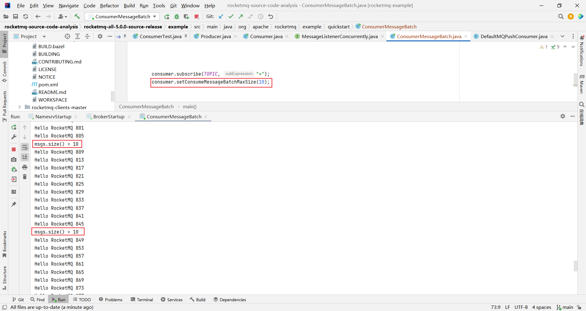

## Dashboard

主要是调用 tools模块的方法，可以说是 图形化版的 mqadmin

spring-boot 项目

Spring Boot 项目在启动后，首先会去静态资源路径（resources/static）下查找 index.html 作为首页文件。

Home Page
Static resources, including HTML and JavaScript and CSS, can be served from your Spring Boot application by dropping them into the right place in the source code. By default, Spring Boot serves static content from resources in the classpath at /static (or /public). The index.html resource is special because, if it exists, it is used as a "`welcome page

http://localhost:8080/cluster/list.query cluster page

```java
@Controller
@RequestMapping("/cluster")
@Permission
public class ClusterController {

    @Resource
    private ClusterService clusterService;

    @RequestMapping(value = "/list.query", method = RequestMethod.GET)
    @ResponseBody
    public Object list() {
        return clusterService.list();
    }

    @RequestMapping(value = "/brokerConfig.query", method = RequestMethod.GET)
    @ResponseBody
    public Object brokerConfig(@RequestParam String brokerAddr) {
        return clusterService.getBrokerConfig(brokerAddr);
    }
}

--------------
    
org.apache.rocketmq.tools.admin.DefaultMQAdminExtImpl.examineBrokerClusterInfo

--------------

    public static final int GET_BROKER_CLUSTER_INFO = 106;

--------------

    private RemotingCommand getBrokerClusterInfo(ChannelHandlerContext ctx, RemotingCommand request) {
        final RemotingCommand response = RemotingCommand.createResponseCommand(null);

        byte[] content = this.namesrvController.getRouteInfoManager().getAllClusterInfo().encode();
        response.setBody(content);

        response.setCode(ResponseCode.SUCCESS);
        response.setRemark(null);
        return response;
    }
    
------------

private final Map<String/* brokerName */, BrokerData> brokerAddrTable;
private final Map<String/* clusterName */, Set<String/* brokerName */>> clusterAddrTable;
    
```

## 路由相关源码位置

1. Broker 启动时以及每隔30秒向NameServer提供路由信息 源码位置

   org.apache.rocketmq.broker.BrokerController#start

2. Consumer 启动时以及每隔30秒向NameServer拉取路由信息 源码位置

   org.apache.rocketmq.client.impl.consumer.DefaultMQPushConsumerImpl#updateTopicSubscribeInfoWhenSubscriptionChanged

   org.apache.rocketmq.client.impl.factory.MQClientInstance#startScheduledTask

3. Producer 发送消息没路由时以及每隔30秒向NameServer拉取路由信息 源码位置

   org.apache.rocketmq.client.impl.producer.DefaultMQProducerImpl#tryToFindTopicPublishInfo

   org.apache.rocketmq.client.impl.factory.MQClientInstance#startScheduledTask

## 信息发送 sync、async、one-way

**sync 同步发送**

发送消息采用同步模式，这种方式只有在消息完全发送完成之后才返回结果，此方式存在需要同步等待发送结果的时间代价。

原理：同步发送是指消息发送方发出数据后，会在收到接收方发回响应之后才发下一个数据包的通讯方式。  
应用场景：此种方式应用场景非常广泛，例如重要通知邮件、报名短信通知、营销短信系统等。

```text
        // 发送消息，只要不抛异常就是成功
        SendResult sendResult = producer.send(msg);
```

**async 异步发送**

发送消息采用异步发送模式，消息发送后立刻返回，当消息完全完成发送后，会调用回调函数sendCallback来告知发送者本次发送是成功或者失败。异步模式通常用于响应时间敏感业务场景，即承受不了同步发送消息时等待返回的耗时代价。

原理：异步发送是指发送方发出数据后，不等接收方发回响应，接着发送下个数据包的通讯方式。MQ 的异步发送，需要用户实现异步发送回调接口（SendCallback），在执行消息的异步发送时，应用不需要等待服务器响应即可直接返回，通过回调接口接收务器响应，并对服务器的响应结果进行处理。  
应用场景：异步发送一般用于链路耗时较长，对 RT 响应时间较为敏感的业务场景，例如用户视频上传后通知启动转码服务，转码完成后通知推送转码结果等。

```text
        producer.sendAsync(msg, new SendCallback() {
            public void onSuccess(final SendResult sendResult) {
                // 消费发送成功
                System.out.println("");
            }
            public void onException(OnExceptionContext context) {
                // 消息发送失败
                System.out.println("");
            }
        });
```

**one-way 单向发送**

采用one-way发送模式发送消息的时候，发送端发送完消息后会立即返回，不会等待来自broker的ack来告知本次消息发送是否完全完成发送。这种方式吞吐量很大，但是存在消息丢失的风险，所以其适用于不重要的消息发送，比如日志收集。

适用于某些耗时非常短，但对可靠性要求并不高的场景，例如日志收集。  
只发送消息，不等待服务器响应，只发送请求不等待应答。此方式发送消息的过程耗时非常短，一般在微秒级别。

原理：单向（Oneway）发送特点为只负责发送消息，不等待服务器回应且没有回调函数触发，即只发送请求不等待应答。此方式发送消息的过程耗时非常短，一般在微秒级别。  
应用场景：适用于某些耗时非常短，但对可靠性要求并不高的场景，例如日志收集。

```text
        // oneway发送消息，只要不抛异常就是成功
        producer.sendOneway(msg);
```

one-way adjective  /ˌwʌnˈweɪ/ travelling or allowing travel in only one direction 单程的；单向的，单行的

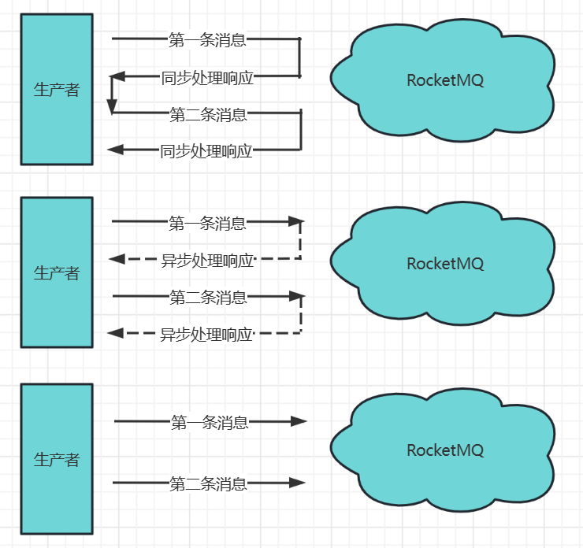

## NameServer 路由注册、路由剔除

Broker启动时会，把Broker所有信息，发请求给 NameServer，进行注册，然后每30秒再注册一次

NameServer有定时任务，scanNotActiveBroker，发现120秒都没Broker的心跳包，则剔除该Broker的路由信息。

如果Broker正常关闭，NameServer能快速感知，不需要120秒以后。

## VM选项

三种：

```text
-  : 标准VM选项，VM规范的选项
-X : 非标准VM选项，不保证所有VM支持
-XX: 高级选项，高级特性，但属于不稳定的选项

再说这几个参数，其语义分别是：
-Xmx: 堆的最大内存数，等同于-XX:MaxHeapSize-Xms: 堆的初始化初始化大小-Xmn: 堆中新生代初始及最大大小，如果需要进一步细化，初始化大小用-XX:NewSize，最大大小用-XX:MaxNewSize -Xss: 线程栈大小，等同于-XX:ThreadStackSize

命名应该非简称，助记的话： memory maximum, memory startup, memory nursery/new, stack size. 

X可以是希腊字母X，文化里代表着未知数，代表着可被赋予值的任意数，
M可以是memory，也可以是 maximum，
S可以是size，也可以是 startup和 stack ，
n则可以是 nursery，也可以是new。

对于具体含义的猜测：
最开始只有 -Xms 的参数，表示 `初始` memory size(m表示memory，s表示size)；
紧接是参数 -Xms，为了对齐三字符，压缩了其表示形式，采用计算机中约定表示方式: 用 x 表示 “大”，因此 -Xmx 中的 m 应当还是 memory。既然有了最大内存的概念，那么一开始的 -Xms 所表示的 `初始` 内存也就有了一个 `最小` 内存的概念（其实常用的做法中初始内存采用的也就是最小内存）。如果不对齐参数长度的话，其表示应当是 -Xmsx
```

## JVM 参数

JAVA_OPT="${JAVA_OPT} -server -Xms4g -Xmx4g -Xmn2g -XX:MetaspaceSize=128m -XX:MaxMetaspaceSize=320m"

https://docs.oracle.com/javase/8/
https://docs.oracle.com/javase/8/docs/technotes/tools/unix/java.html#BGBCIEFC
https://docs.oracle.com/javase/8/docs/technotes/guides/vm/server-class.html

jps、jinfo -flags ...

JAVA_OPT="${JAVA_OPT} -server -Xms256m -Xmx256m -Xmn128m -XX:MetaspaceSize=128m -XX:MaxMetaspaceSize=320m"

```text
-XX:MaxMetaspaceSize=size
    最大本地内存可以分配给类元数据的空间大小 默认 大小无限制
    Sets the maximum amount of native memory that can be allocated for class metadata. By default, the size is not limited. 
    元数据大小 根据应用本身、其他运行的应用和系统可用内存 决定
    The amount of metadata for an application depends on the application itself, other running applications, and the amount of memory available on the system.
    
    The following example shows how to set the maximum class metadata size to 256 MB:
    
    -XX:MaxMetaspaceSize=256m

-XX:MetaspaceSize=size
     类元数据空间大小 空间溢出会第一时间触发垃圾回收 
    Sets the size of the allocated class metadata space that will trigger a garbage collection the first time it is exceeded. 
    垃圾回收的阈值会增加或减少 依赖元数据使用数量
    This threshold for a garbage collection is increased or decreased depending on the amount of metadata used. 
    默认大小根据平台
    The default size depends on the platform.

-Xmnsize
     新生代 初始和最大堆大小 
    Sets the initial and maximum size (in bytes) of the heap for the young generation (nursery). Append the letter k or K to indicate kilobytes, m or M to indicate megabytes, g or G to indicate gigabytes.
    新生代区域 给新对象使用 GC处理这块区域 比其他区域跟频繁
    The young generation region of the heap is used for new objects. GC is performed in this region more often than in other regions. 
    如果新生代大小太小 minor 垃圾回收 会被执行很多次
    如果新生代大小太大 只有 full 垃圾回收会被执行 这会花费很长时间去完成垃圾回收
    If the size for the young generation is too small, then a lot of minor garbage collections will be performed. If the size is too large, then only full garbage collections will be performed, which can take a long time to complete. 
    Oracle推荐 让新生代大小保持在 总堆大小的1/2和1/4之间
    Oracle recommends that you keep the size for the young generation between a half and a quarter of the overall heap size.
    
    The following examples show how to set the initial and maximum size of young generation to 256 MB using various units: 
    -Xmn256m
    -Xmn262144k
    -Xmn268435456
    除了使用 -Xmn 设置 初始化和最大新生代堆大小 还可以使用-XX:NewSize设置初始化 -XX:MaxNewSize设置最大大小
    Instead of the -Xmn option to set both the initial and maximum size of the heap for the young generation, you can use -XX:NewSize to set the initial size and -XX:MaxNewSize to set the maximum size.

-Xmxsize          
    最大内存分配池大小 必须是1024的倍数并大于2MB
    Specifies the maximum size (in bytes) of the memory allocation pool in bytes. This value must be a multiple of 1024 and greater than 2 MB. Append the letter k or K to indicate kilobytes, m or M to indicate megabytes, g or G to indicate gigabytes. 
    默认值 运行时基于系统配置选择 对于服务端发布 -Xms 和 -Xmx 通常设置为相同值
    The default value is chosen at runtime based on system configuration. For server deployments, -Xms and -Xmx are often set to the same value. See the section "Ergonomics" in Java SE HotSpot Virtual Machine Garbage Collection Tuning Guide at http://docs.oracle.com/javase/8/docs/technotes/guides/vm/gctuning/index.html.
    
    The following examples show how to set the maximum allowed size of allocated memory to 80 MB using various units:
    -Xmx83886080
    -Xmx81920k
    -Xmx80m
    等同于-XX:MaxHeapSize
    The -Xmx option is equivalent to -XX:MaxHeapSize.

-Xmssize             

    最小/初始化堆内存大小 必须是1024的倍数并且大于1MB  
    Sets the minimum and the initial size (in bytes) of the heap. This value must be a multiple of 1024 and greater than 1 MB. Append the letter k or K to indicate kilobytes, m or M to indicate megabytes, g or G to indicate gigabytes.
    
    The following examples show how to set the size of allocated memory to 6 MB using various units:
    -Xms6291456
    -Xms6144k
    -Xms6m
    如果不设置这个选项 初始化大小会被设置为跟 老年代+新生代 的大小
    新生代堆内存可使用 -Xmn或-XX:NewSize 选项进行设置
    If you do not set this option, then the initial size will be set as the sum of the sizes allocated for the old generation and the young generation. The initial size of the heap for the young generation can be set using the -Xmn option or the -XX:NewSize option.
    注意 -XX:InitalHeapSize 选项也能被用来设置初始化堆大小 如果它出现在-Xms之后，那么初始化堆大小会被设置为 -XX:InitalHeapSize的大小
    Note that the -XX:InitalHeapSize option can also be used to set the initial heap size. If it appears after -Xms on the command line, then the initial heap size gets set to the value specified with -XX:InitalHeapSize.

-client
    Selects the Java HotSpot Client VM. The 64-bit version of the Java SE Development Kit (JDK) currently ignores this option and instead uses the Server JVM.
    
    For default JVM selection, see Server-Class Machine Detection at
    http://docs.oracle.com/javase/8/docs/technotes/guides/vm/server-class.html
    
-server
    Selects the Java HotSpot Server VM. The 64-bit version of the JDK supports only the Server VM, so in that case the option is implicit.
    
    For default JVM selection, see Server-Class Machine Detection at
    http://docs.oracle.com/javase/8/docs/technotes/guides/vm/server-class.html
    
可以通过-server或-client设置jvm的运行参数。
它们的区别是Server VM的初始堆空间会大一些，默认使用的是并行垃圾回收器，启动慢运行快。
Client VM相对来讲会保守一些，初始堆空间会小一些，使用串行的垃圾回收器，它的目标是为了让JVM的启动速度更快，但运行速度会比Serverm模式慢些。
JVM在启动的时候会根据硬件和操作系统自动选择使用Server还是Client类型的 JVM。

32位操作系统

    如果是Windows系统，不论硬件配置如何，都默认使用Client类型的JVM。
    如果是其他操作系统上，机器配置有2GB以上的内存同时有2个以上CPU的话默认使用server模式，否则使用client模式。

64位操作系统

    只有server类型，不支持client类型。
```

Server-Class Machine Detection
Starting with Java SE 5.0, when an application starts up, the launcher can attempt to detect whether the application is running on a "server-class" machine and, if so, use the Java HotSpot Server Virtual Machine (server VM) instead of the Java HotSpot Client Virtual Machine (client VM). The aim is to improve performance even if no one configures the VM to reflect the application it's running. In general, the server VM starts up more slowly than the client VM, but over time runs more quickly.


## Java 系统属性 System Properties 

https://docs.oracle.com/javase/tutorial/essential/environment/sysprop.html

...
"user.dir"	User working directory
"user.home"	User home directory
"user.name"	User account name

修改 user.home，临时修改，当次启动有效

java -Duser.home=... ...

## trap 捕获信号

## SIGHUP

SIGHUP，hang up ，挂断。本信号在用户终端连接(正常或非正常)结束时发出, 通常是在终端的控制进程结束时, 通知同一session内的各个作业, 这时它们与控制终端不再关联。
登录Linux时，系统会分配给登录用户一个终端(Session)。在这个终端运行的所有程序，包括前台进程组和 后台进程组，一般都属于这个 Session。当用户退出Linux登录时，前台进程组和后台有对终端输出的进程将会收到SIGHUP信号。这个信号的默认操作为终止进程，因此前台进 程组和后台有终端输出的进程就会中止。不过可以捕获这个信号，比如wget能捕获SIGHUP信号，并忽略它，这样就算退出了Linux登录，wget也 能继续下载。
此外，对于与终端脱离关系的守护进程，这个信号用于通知它重新读取配置文件。

## Broker崩溃以后有什么影响？

1）Master节点崩溃

消息不能再发送到该 Broker 集群，但是如果您有另一个可用的 Broker 集群，那么在主题存在的条件下仍然可以发送消息。消息仍然可以从 Slave 节点消费。

2）一些Slave节点崩溃

只要有另一个工作的 Slave，就不会影响发送消息。 对消费消息也不会产生影响，除非消费者组设置为优先从该Slave消费。 **默认情况下，消费者组从 Master 消费。**

3）所有 Slave 节点崩溃

向 Master 发送消息不会有任何影响，但是，如果 Master是 SYNC_MASTER，Producer会得到一个 SLAVE_NOT_AVAILABLE ，表示消息没有发送给任何 Slave。 对消费消息也没有影响，除非消费者组设置为优先从 Slave 消费。 默认情况下，消费者组从 Master 消费。

## 软件开发

研究表明软件开发的 80% 时间用于软件维护，包括源码解读，源码重构，源码维护等。

约定并强制推行编码规范和编码指南，有助于提高代码的可读性，维护开发团队代码所有权，

帮助工程师快速深入理解新增代码，并简化维护成本。

## 消费进度原理

**消息位点（Offset）**

https://rocketmq.apache.org/zh/docs/featureBehavior/09consumerprogress

参考 Apache RocketMQ 主题和队列的定义，消息是按到达服务端的先后顺序存储在指定主题的多个队列中，每条消息在队列中都有一个唯一的Long类型坐标，这个坐标被定义为消息位点。
任意一个消息队列在逻辑上都是无限存储，即消息位点会从0到Long.MAX无限增加。通过**主题、队列和位点**就可以定位任意一条消息的位置，具体关系如下图所示：

Apache RocketMQ 定义队列中最早一条消息的位点为最小消息位点（MinOffset）；最新一条消息的位点为最大消息位点（MaxOffset）。虽然消息队列逻辑上是无限存储，但由于服务端物理节点的存储空间有限， Apache RocketMQ 会**滚动删除队列中存储最早**的消息。因此，消息的最小消费位点和最大消费位点会**一直递增变化**。

**消费位点（ConsumerOffset）**

Apache RocketMQ 领域模型为发布订阅模式，每个主题的队列都可以被多个消费者分组订阅。若某条消息被某个消费者消费后直接被删除，则其他订阅了该主题的消费者将无法消费该消息。

因此，Apache RocketMQ 通过消费位点管理消息的消费进度。每条消息被某个消费者消费完成后不会立即在队列中删除，Apache RocketMQ 会基于每个消费者分组维护一份消费记录，该记录指定消费者分组消费某一个队列时，消费过的最新一条消息的位点，即消费位点。

当消费者客户端离线，又再次重新上线时，会严格按照服务端保存的消费进度继续处理消息。如果服务端保存的历史位点信息已过期被删除，此时消费位点向前移动至服务端存储的最小位点。

信息

消费位点的保存和恢复是基于 Apache RocketMQ 服务端的存储实现，和任何消费者无关。因此 Apache RocketMQ 支持跨消费者的消费进度恢复。

队列中消息位点MinOffset、MaxOffset和每个消费者分组的消费位点ConsumerOffset的关系如下：消费进度

ConsumerOffset≤MaxOffset：

当消费速度和生产速度一致，且全部消息都处理完成时，最大消息位点和消费位点相同，即ConsumerOffset=MaxOffset。
当消费速度较慢小于生产速度时，队列中会有部分消息未消费，此时消费位点小于最大消息位点，即ConsumerOffset<MaxOffset，两者之差就是该队列中堆积的消息量。

ConsumerOffset≥MinOffset：正常情况下有效的消费位点ConsumerOffset必然大于等于最小消息位点MinOffset。消费位点小于最小消息位点时是无效的，相当于消费者要消费的消息已经从队列中删除了，是无法消费到的，此时服务端会将消费位点强制纠正到合法的消息位点。

**消费位点初始值**

消费位点初始值指的是消费者分组首次启动消费者消费消息时，服务端保存的消费位点的初始值。

Apache RocketMQ 定义消费位点的初始值为消费者首次获取消息时，该时刻队列中的最大消息位点。相当于消费者将从队列中最新的消息开始消费。

## 消息幂等

如果客户端发送消息给服务端，服务端处理的很慢，此时客户端请求超时，重发消息，那么这时候一个消息其实被发了两次。

那么这时候需要消费者进行消息幂等处理。RocketMQ Broker不会对重复消息进行处理。

## 消费者负载均衡

https://rocketmq.apache.org/zh/docs/featureBehavior/08consumerloadbalance/

5.x 4.x 差别很大

4.x 是队列粒度负载均衡 多个消费者不能同时消费一个队列 

5.x 是消息粒度负载均衡 多个消费者可以同时消费一个队列，但一个消息分配给一个消费者后，服务端会加锁，保证对其他消费者不可见。

客户端接收到消息，处理完，提交消息状态为成功，服务端会把消息标记为已消费。如果提交消息为失败，服务端会把消息重新对消费者可见，进行消息重试。

## 普通信息生命周期

普通消息生命周期

+ 初始化：消息被生产者构建并完成初始化，待发送到服务端的状态。
+ 待消费：消息被发送到服务端，对消费者可见，等待消费者消费的状态。
+ 消费中：消息被消费者获取，并按照消费者本地的业务逻辑进行处理的过程。 此时服务端会等待消费者完成消费并提交消费结果，如果一定时间后没有收到消费者的响应，Apache RocketMQ会对消息进行重试处理。具体信息，请参见消费重试。
+ 消费提交：消费者完成消费处理，并向服务端提交消费结果，服务端标记当前消息已经被处理（包括消费成功和失败）。 Apache RocketMQ默认支持保留所有消息，此时消息数据并不会立即被删除，只是逻辑标记已消费。消息在保存时间到期或存储空间不足被删除前，消费者仍然可以回溯消息重新消费。
+ 消息删除：Apache RocketMQ按照消息保存机制滚动清理最早的消息数据，将消息从物理文件中删除。更多信息，请参见消息存储和清理机制。

## 不建议频繁创建和销毁生产者

Apache RocketMQ 的生产者是可以重复利用的底层资源，类似数据库的连接池。因此不需要在每次发送消息时动态创建生产者，且在发送结束后销毁生产者。这样频繁的创建销毁会在服务端产生大量短连接请求，严重影响系统性能。

正确示例

```
Producer p = ProducerBuilder.build();
for (int i =0;i<n;i++){
    Message m= MessageBuilder.build();
    p.send(m);
}
p.shutdown();
```

典型错误示例

```
for (int i =0;i<n;i++){
    Producer p = ProducerBuilder.build();
    Message m= MessageBuilder.build();
    p.send(m);
    p.shutdown();
}
```

## 生产者分组

Apache RocketMQ 服务端5.x版本开始，生产者是匿名的，无需管理生产者分组（ProducerGroup）

## IP地址 vs 域名

建议使用域名，避免使用IP地址，防止节点变更无法进行热点迁移。

## 系统默认消息大小

系统默认的消息最大限制如下：

+ 普通和顺序消息：4 MB
+ 事务和定时或延时消息：64 KB

## 消息模型特点

Apache RocketMQ 的消息模型具备如下特点：

+ 消息不可变性

消息本质上是已经产生并确定的事件，一旦产生后，消息的内容不会发生改变。即使经过传输链路的控制也不会发生变化，消费端获取的消息都是只读消息视图。

+ 消息持久化

Apache RocketMQ 会默认对消息进行**持久化**，即将接收到的消息存储到 Apache RocketMQ 服务端的**存储文件**中，保证消息的**可回溯性和系统故障场景下的可恢复性**。

## 队列读写权限

定义：当前队列是否可以读写数据。

取值：由服务端定义，枚举值如下

+ 6：读写状态，当前队列允许读取消息和写入消息。
+ 4：只读状态，当前队列只允许读取消息，不允许写入消息。
+ 2：只写状态，当前队列只允许写入消息，不允许读取消息。
+ 0：不可读写状态，当前队列不允许读取消息和写入消息。

约束：队列的读写权限属于运维侧操作，不建议频繁修改。

## 队列模型关系

Apache RocketMQ 默认提供消息可靠存储机制，所有发送成功的消息都被**持久化存储**到队列中，配合生产者和消费者客户端的调用可实现至少投递一次的可靠性语义。

Apache RocketMQ 队列模型和Kafka的分区（Partition）模型类似。在 Apache RocketMQ 消息收发模型中，队列属于主题的一部分，虽然所有的消息资源以主题粒度管理，但**实际的操作实现是面向队列**。例如，生产者指定某个主题，向主题内发送消息，**但实际消息发送到该主题下的某个队列中**。

Apache RocketMQ 中通过修改队列数量，以此实现横向的水平扩容和缩容。

## 队列 主要作用

队列的主要作用如下：

+ 存储顺序性

队列天然具备顺序性，即消息按照进入队列的顺序写入存储，同一队列间的消息天然存在顺序关系，队列头部为最早写入的消息，队列尾部为最新写入的消息。消息在队列中的位置和消息之间的顺序通过位点（Offset）进行标记管理。

+ 流式操作语义

Apache RocketMQ 基于队列的存储模型可确保消息从任意位点读取任意数量的消息，以此实现类似聚合读取、回溯读取等特性，这些特性是RabbitMQ、ActiveMQ等非队列存储模型不具备的。

## 主题管理尽量避免自动化机制

在 Apache RocketMQ 架构中，主题属于顶层资源和容器，拥有独立的权限管理、可观测性指标采集和监控等能力，创建和管理主题会占用一定的系统资源。因此，生产环境需要严格管理主题资源，请勿随意进行增、删、改、查操作。

Apache RocketMQ 虽然提供了自动创建主题的功能，但是建议仅在测试环境使用，生产环境请勿打开，避免产生大量垃圾主题，无法管理和回收并浪费系统资源。

## 主题 消息类型

消息类型

定义：主题所支持的消息类型。

取值：创建主题时选择消息类型。Apache RocketMQ 支持的主题类型如下：

+ Normal：普通消息，消息本身无特殊语义，消息之间也没有任何关联。
+ FIFO：顺序消息，Apache RocketMQ 通过消息分组MessageGroup标记一组特定消息的先后顺序，可以保证消息的投递顺序严格按照消息发送时的顺序。
+ Delay：定时/延时消息，通过指定延时时间控制消息生产后不要立即投递，而是在延时间隔后才对消费者可见。
+ Transaction：事务消息，Apache RocketMQ 支持分布式事务消息，支持应用数据库更新和消息调用的事务一致性保障。

约束：每个主题只支持一种消息类型。

## Broker 暂不可用 

隔离策略 

兜底方案 最坏情况发生时仍然能够从容应对

## 消息生命周期


https://rocketmq.apache.org/zh/docs/domainModel/01main

如上图所示，Apache RocketMQ 中消息的生命周期主要分为消息生产、消息存储、消息消费这三部分。

生产者生产消息并发送至 Apache RocketMQ 服务端，消息被存储在服务端的主题中，消费者通过订阅主题消费消息。

消息生产

生产者（Producer）：

Apache RocketMQ 中用于产生消息的运行实体，一般集成于业务调用链路的上游。生产者是轻量级匿名无身份的。

消息存储

主题（Topic）：

Apache RocketMQ 消息传输和存储的分组容器，主题内部由多个队列组成，消息的存储和水平扩展实际是通过主题内的队列实现的。

队列（MessageQueue）：

Apache RocketMQ 消息传输和存储的实际单元容器，类比于其他消息队列中的分区。 Apache RocketMQ 通过流式特性的无限队列结构来存储消息，消息在队列内具备顺序性存储特征。

消息（Message）：

Apache RocketMQ 的最小传输单元。消息具备不可变性，在初始化发送和完成存储后即不可变。

消息消费

消费者分组（ConsumerGroup）：

Apache RocketMQ 发布订阅模型中定义的独立的消费身份分组，用于统一管理底层运行的多个消费者（Consumer）。同一个消费组的多个消费者必须保持消费逻辑和配置一致，共同分担该消费组订阅的消息，实现消费能力的水平扩展。

消费者（Consumer）：

Apache RocketMQ 消费消息的运行实体，一般集成在业务调用链路的下游。消费者必须被指定到某一个消费组中。

订阅关系（Subscription）：

Apache RocketMQ 发布订阅模型中消息过滤、重试、消费进度的规则配置。订阅关系以消费组粒度进行管理，消费组通过定义订阅关系控制指定消费组下的消费者如何实现消息过滤、消费重试及消费进度恢复等。

Apache RocketMQ 的订阅关系除过滤表达式之外都是持久化的，即服务端重启或请求断开，订阅关系依然保留。

## 消息编码格式 序列化格式 通讯协议

不定长消息 

1. 前四字节 消息总长度
2. 一字节 协议类型
3. 三字节 消息头长度
4. 消息头 数据 (header data: 协议的头，数据是序列化后的json。)
5. 消息体 数据 (body data: 请求的二进制实际数据)

RocketMQ的通信协议  
（1）第一部分是大端4个字节整数，值等于第二，三，四部分长度总和   
（2）第二部分是大端4个字节整数，值等于第三部分的长度   
（3）第三部分是通过json 序列化的数据   
（4）第四部分是通过应用自定义二进制序列化的数据  

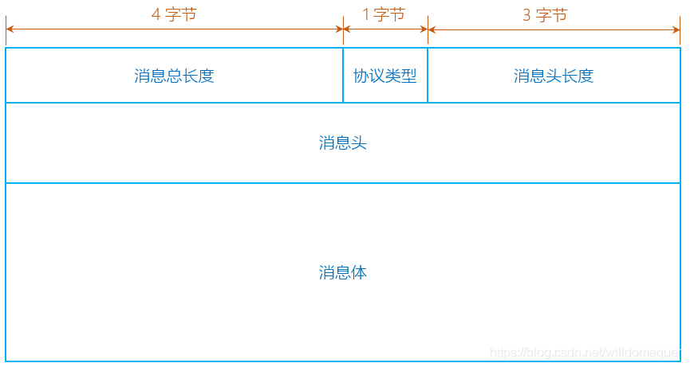

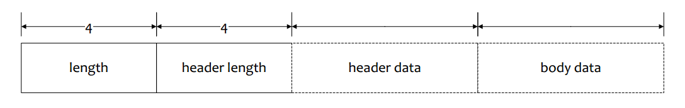

其中协议类型的定义在 SerializeType 中，目前支持两种：0 — JSON、1 — ROCKETMQ ；缺省值为 JSON。

+ RemotingCommand.decode() 负责消息的解码
+ RemotingCommand.encode() 负责消息的编码

协议header具体标识整个通讯请求的元数据，如请求什么，怎样的方式请求（异步/oneway）请求客户端的版本，语言，请求的具体参数等。

```text
Header详解：
code:
请求/响应码。所有的请求码参考代码RequestCode.java。响应码则在ResponseCode.java中。
language:
由于要支持多语言，所以这一字段可以给通信双方知道对方通信层锁使用的开发语言。
version:
给通信层知道对方的版本号，响应方可以以此做兼容老版本等的特殊操作。
opaque:
请求标识码。在Java版的通信层中，这个只是一个不断自增的整形，为了收到应答方响应的的时候找到对应的请求。
flag： 按位(bit)解释。
第0位标识是这次通信是request还是response，0标识request, 1 标识response。
第1位标识是否是oneway请求，1标识oneway。应答方在处理oneway请求的时候，不会做出响应，请求方也无序等待应答方响应。
remark:
附带的文本信息。常见的如存放一些broker/nameserver返回的一些异常信息，方便开发人员定位问题。
extFields：
这个字段不通的请求/响应不一样，完全自定义。数据结构上是java的hashmap。在Java的每个RemotingCammand中，其实都带有一个CommandCustomHeader的属性成员，可以认为他是一个强类型的extFields，再最后传输的时候，这个CommandCustomHeader会被忽略，而传输前会把其中的所有字段全部都原封不动塞到extFields中，以作传输。
```

以发送消息为例(code=310)，发送消息的自定义header是SendMessageRequestHeaderV2（只是字段名对比SendMessageRequestHeader压缩了）

发送消息的请求header

```json
{  
    "code":310,
    "extFields":{  
        "f":"0",
        "g":"1482158310125",
        "d":"4",
        "e":"0",
        "b":"TopicTest",
        "c":"TBW102",
        "a":"please_rename_unique_group_name",
        "j":"0",
        "k":"false",
        "h":"0",
        "i":"TAGS\u0001TagA\u0002WAIT\u0001true\u0002"
    },
    "flag":0,
    "language":"JAVA",
    "opaque":206,
    "version":79
} 
```

注：其中fastjson把值为null的remark过滤了。

## nohup

hang up 挂断电话

no hang-up 不挂断电话

`man nohup`

## . source (command)

4.1 Bourne Shell Builtins

. (a period)

`. filename [arguments]`

Read and execute commands from the filename argument in the current shell context. If filename does not contain a slash, the PATH variable is used to find filename, but filename does not need to be executable. When Bash is not in POSIX mode, it searches the current directory if filename is not found in $PATH. If any arguments are supplied, they become the positional parameters when filename is executed. Otherwise the positional parameters are unchanged. If the -T option is enabled, . inherits any trap on DEBUG; if it is not, any DEBUG trap string is saved and restored around the call to ., and . unsets the DEBUG trap while it executes. If -T is not set, and the sourced file changes the DEBUG trap, the new value is retained when . completes. The return status is the exit status of the last command executed, or zero if no commands are executed. If filename is not found, or cannot be read, the return status is non-zero. This builtin is equivalent to source.

## & (control operator)

https://www.gnu.org/software/bash/manual/bash.html

If a command is terminated by the control operator ‘&’, the shell executes the command asynchronously in a subshell. This is known as executing the command in the background, and these are referred to as asynchronous commands. The shell does not wait for the command to finish, and the return status is 0 (true). When job control is not active (see Job Control), the standard input for asynchronous commands, in the absence of any explicit redirections, is redirected from /dev/null.

A subshell is a copy of the shell process.

subshell shell子进程

If a command is followed by a ‘&’ and job control is not active, the default standard input for the command is the empty file /dev/null. Otherwise, the invoked command inherits the file descriptors of the calling shell as modified by redirections.

https://www.gnu.org/software/bash/manual/bash.html#Job-Control-Builtins

## PTS

```shell
# 会话1
[root@centos /opt/rmq]# sh count.sh 
1
2
3
# 会话2
[root@centos /opt/rmq]# sh count.sh 
1
2
3
# 会话3
[root@centos /root]# ps -ef | grep count.sh
root      45773  43956  0 02:49 pts/0    00:00:00 sh count.sh
root      47843  44554  0 03:06 pts/1    00:00:00 sh count.sh
root      47948  47859  0 03:06 pts/2    00:00:00 grep --color=auto count.sh
[root@centos /root]# ll /proc/45773/fd
total 0
lrwx------. 1 root root 64 Mar  1 02:49 0 -> /dev/pts/0
lrwx------. 1 root root 64 Mar  1 02:49 1 -> /dev/pts/0
lrwx------. 1 root root 64 Mar  1 02:49 2 -> /dev/pts/0
lr-x------. 1 root root 64 Mar  1 02:49 255 -> /opt/rmq/count.sh
[root@centos /root]# ll /proc/47843/fd
total 0
lrwx------. 1 root root 64 Mar  1 03:07 0 -> /dev/pts/1
lrwx------. 1 root root 64 Mar  1 03:07 1 -> /dev/pts/1
lrwx------. 1 root root 64 Mar  1 03:06 2 -> /dev/pts/1
lr-x------. 1 root root 64 Mar  1 03:07 255 -> /opt/rmq/count.sh
```

/dev/pts/0 会话1伪终端
/dev/pts/1 会话2伪终端
/dev/pts/...

```text
Nothing is stored in /dev/pts. This filesystem lives purely in memory.

Entries in /dev/pts are pseudo-terminals (pty for short). Unix kernels have a generic notion of terminals. A terminal provides a way for applications to display output and to receive input through a terminal device. A process may have a controlling terminal — for a text mode application, this is how it interacts with the user.

Terminals can be either hardware terminals (“tty”, short for “teletype”) or pseudo-terminals (“pty”). Hardware terminals are connected over some interface such as a serial port (ttyS0, …) or USB (ttyUSB0, …) or over a PC screen and keyboard (tty1, …). Pseudo-terminals are provided by a terminal emulator, which is an application. Some types of pseudo-terminals are:

GUI applications such as xterm, gnome-terminal, konsole, … transform keyboard and mouse events into text input and display output graphically in some font.
Multiplexer applications such as screen and tmux relay input and output from and to another terminal, to decouple text mode applications from the actual terminal.
Remote shell applications such as sshd, telnetd, rlogind, … relay input and output between a remote terminal on the client and a pty on the server.
If a program opens a terminal for writing, the output from that program appears on the terminal. It is common to have several programs outputting to a terminal at the same time, though this can be confusing at times as there is no way to tell which part of the output came from which program. Background processes that try to write to their controlling terminal may be automatically suspended by a SIGTTOU signal.

If a program opens a terminal for reading, the input from the user is passed to that program. If multiple programs are reading from the same terminal, each character is routed independently to one of the programs; this is not recommended. Normally there is only a single program actively reading from the terminal at a given time; programs that try to read from their controlling terminal while they are not in the foreground are automatically suspended by a SIGTTIN signal.

To experiment, run tty in a terminal to see what the terminal device is. Let's say it's /dev/pts/42. In a shell in another terminal, run echo hello >/dev/pts/42: the string hello will be displayed on the other terminal. Now run cat /dev/pts/42 and type in the other terminal. To kill that cat command (which will make the other terminal hard to use), press Ctrl+C.

Writing to another terminal is occasionally useful to display a notification; for example the write command does that. Reading from another terminal is not normally done.
```

## 重定向测试

```shell
# 会话1
[root@centos /opt/rmq]# sh count.sh 
1
2
3
# 会话2
[root@centos /opt/rmq]# ps -ef | grep count.sh
root      45773  43956  0 02:49 pts/0    00:00:00 sh count.sh
root      45820  44554  0 02:49 pts/1    00:00:00 grep --color=auto count.sh
[root@centos /opt/rmq]# ll /proc/45773/fd
total 0
lrwx------. 1 root root 64 Mar  1 02:49 0 -> /dev/pts/0
lrwx------. 1 root root 64 Mar  1 02:49 1 -> /dev/pts/0
lrwx------. 1 root root 64 Mar  1 02:49 2 -> /dev/pts/0
lr-x------. 1 root root 64 Mar  1 02:49 255 -> /opt/rmq/count.sh
```

```shell
# 会话1
[root@centos /opt/rmq]# sh count.sh > count.txt
# 会话2
[root@centos /opt/rmq]# tail -f count.txt 
73
74
75
76
77
78
79
80
81
82
83
84
^C
[root@centos /opt/rmq]# ps -ef | grep count.sh
root      44844  43956  0 02:41 pts/0    00:00:00 sh count.sh
root      45045  44554  0 02:42 pts/1    00:00:00 grep --color=auto count.sh
[root@centos /opt/rmq]# ll /proc/44844/fd
total 0
lrwx------. 1 root root 64 Mar  1 02:44 0 -> /dev/pts/0
l-wx------. 1 root root 64 Mar  1 02:44 1 -> /opt/rmq/count.txt
lrwx------. 1 root root 64 Mar  1 02:42 2 -> /dev/pts/0
lr-x------. 1 root root 64 Mar  1 02:44 255 -> /opt/rmq/count.sh
```

```shell
# 会话1
[root@centos /opt/rmq]# sh count.sh > count.txt 2>&1
# 会话2
[root@centos /opt/rmq]# ps -ef | grep count.sh
root      45319  43956  0 02:45 pts/0    00:00:00 sh count.sh
root      45453  44554  0 02:46 pts/1    00:00:00 grep --color=auto count.sh
[root@centos /opt/rmq]# ll /proc/45319/fd
total 0
lrwx------. 1 root root 64 Mar  1 02:46 0 -> /dev/pts/0
l-wx------. 1 root root 64 Mar  1 02:46 1 -> /opt/rmq/count.txt
l-wx------. 1 root root 64 Mar  1 02:46 2 -> /opt/rmq/count.txt
lr-x------. 1 root root 64 Mar  1 02:46 255 -> /opt/rmq/count.sh
```

```shell
# 会话1
[root@centos /opt/rmq]# sh count.sh 2>&1 > count.txt
# 会话2
[root@centos /opt/rmq]# ps -ef | grep count.sh
root      45559  43956  0 02:47 pts/0    00:00:00 sh count.sh
root      45575  44554  0 02:47 pts/1    00:00:00 grep --color=auto count.sh
[root@centos /opt/rmq]# ll /proc/45559/fd
total 0
lrwx------. 1 root root 64 Mar  1 02:47 0 -> /dev/pts/0
l-wx------. 1 root root 64 Mar  1 02:47 1 -> /opt/rmq/count.txt
lrwx------. 1 root root 64 Mar  1 02:47 2 -> /dev/pts/0
lr-x------. 1 root root 64 Mar  1 02:47 255 -> /opt/rmq/count.sh
```

## 重定向 redirections 

redirection operator

```text
< 默认标准输入 0
> 默认标准输出 1

重定向输入 [n]<word
重定向输出 [n]>[|]word
```

https://www.gnu.org/software/bash/manual/html_node/Redirections.html

https://837468220.gitbooks.io/man_bash_chinese/content/zhong_ding_541128_redirection/duplicating_file_descriptors_fu_zhi_wen_jian_miao_.html

2>&1表明将文件描述2（标准错误输出）的内容重定向到文件描述符1（标准输出），为什么1前面需要&？当没有&时，1会被认为是一个普通的文件，有&表示重定向的目标不是一个文件，而是一个文件描述符。

类似 C语言 解引用 

/dev/null黑洞文件，Linux系统的回收站和垃圾箱

程序通过描述符访问文件，可以是常规文件，也可以是设备文件。

FD file descriptors ，文件描述符，又称文件句柄  
进程使用文件描述符来管理打开的文件。  
FD是从0-255， 0代表stdin标准输入、1代表stdout标准输出、2代表stderr标准错误；3-255代表用户编辑的文件的绝对路径。  

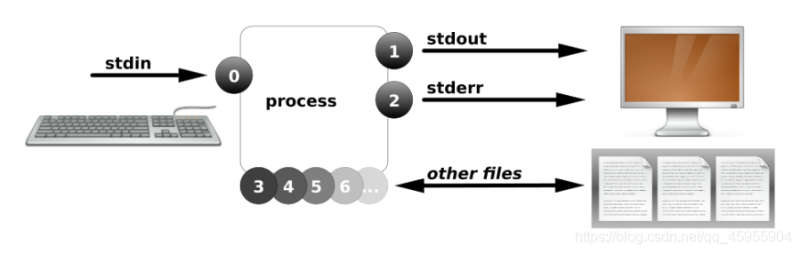


总结  
FD是访问文件的标识，即链接文件，它代表着文件的绝对路径，使程序在使用文件时直接调用FD，从而省去了冗余的绝对路径。  

```shell
示例
1）通过一个终端，打开一个文本。
[root@localhost ~]# vim 1.txt
2）通过另一个终端，查询文本程序的进程号
[root@localhost ~]# ps aux| grep vim
root 3906 1.0 0.2 149748 5484 pts/0 S+ 21:02 0:00 vim 1.txt
3）在/proc目录中查看文本程序的FD
[root@localhost ~]# ls /proc/3906/fd/
0 1 2 3
[root@localhost ~]# ls -l /proc/3906/fd/
总用量 0
lrwx------. 1 root root 64 12月 4 21:04 0 -> /dev/pts/0
lrwx------. 1 root root 64 12月 4 21:04 1 -> /dev/pts/0
lrwx------. 1 root root 64 12月 4 21:03 2 -> /dev/pts/0
lrwx------. 1 root root 64 12月 4 21:04 3 -> /root/.1.txt.swp
4）总结
0 -> /dev/pts/0 标椎输入
1 -> /dev/pts/0 标准输出
2 -> /dev/pts/0 标准错误
3 -> /root/.1.txt.swp 常规文件
```


3.6 重定向

在执行命令之前，它的输入和输出可能会 使用由 shell 解释的特殊符号来 重定向。重定向允许复制、打开、关闭命令的文件句柄，使之指向不同的文件，并且可以更改命令读取和写入的文件。重定向也可用于修改当前 shell 执行环境中的文件句柄。以下重定向运算符可以在简单命令之前或出现在任何地方，也可以在命令之后。重定向按照它们出现的顺序从左到右处理。

每个可能以文件描述符编号开头的重定向都可以以 { varname } 形式的单词开头。在这种情况下，对于除 >&- 和 <&- 之外的每个重定向运算符，shell 将分配一个大于 10 的文件描述符并将其分配给 { varname }。如果 >&- 或 <&- 前面有 { varname }，则varname的值定义要关闭的文件描述符。如果提供了 { varname }，重定向将持续超出命令的范围，允许 shell 程序员手动管理文件描述符的生命周期。shellvarredir_close选项管理此行为（请参阅The Shopt Builtin）。

在下面的描述中，如果省略文件描述符编号，并且重定向操作符的第一个字符是'<'，重定向指向标准输入（文件描述符 0）。如果重定向运算符的第一个字符是 '>'，重定向指向标准输出（文件描述符 1）。

以下描述中重定向运算符后面的词，除非另有说明，否则会进行大括号扩展、波浪符扩展、参数扩展、命令替换、算术扩展、引号删除、文件名扩展和分词。如果扩展到多个单词，Bash 会报告错误。

## Push Consumer PullCallback

```text
        PullCallback pullCallback = new PullCallback() {
            @Override
            public void onSuccess(PullResult pullResult) {
                if (pullResult != null) {
                    pullResult = DefaultMQPushConsumerImpl.this.pullAPIWrapper.processPullResult(pullRequest.getMessageQueue(), pullResult,
                        subscriptionData);

                    switch (pullResult.getPullStatus()) {
                        case FOUND:
                            long prevRequestOffset = pullRequest.getNextOffset();
                            pullRequest.setNextOffset(pullResult.getNextBeginOffset());
                            long pullRT = System.currentTimeMillis() - beginTimestamp;
                            DefaultMQPushConsumerImpl.this.getConsumerStatsManager().incPullRT(pullRequest.getConsumerGroup(),
                                pullRequest.getMessageQueue().getTopic(), pullRT);

                            long firstMsgOffset = Long.MAX_VALUE;
                            if (pullResult.getMsgFoundList() == null || pullResult.getMsgFoundList().isEmpty()) {
                                DefaultMQPushConsumerImpl.this.executePullRequestImmediately(pullRequest);
                            } else {
                                firstMsgOffset = pullResult.getMsgFoundList().get(0).getQueueOffset();

                                DefaultMQPushConsumerImpl.this.getConsumerStatsManager().incPullTPS(pullRequest.getConsumerGroup(),
                                    pullRequest.getMessageQueue().getTopic(), pullResult.getMsgFoundList().size());

                                boolean dispatchToConsume = processQueue.putMessage(pullResult.getMsgFoundList());
                                DefaultMQPushConsumerImpl.this.consumeMessageService.submitConsumeRequest(
                                    pullResult.getMsgFoundList(),
                                    processQueue,
                                    pullRequest.getMessageQueue(),
                                    dispatchToConsume);

                                if (DefaultMQPushConsumerImpl.this.defaultMQPushConsumer.getPullInterval() > 0) {
                                    DefaultMQPushConsumerImpl.this.executePullRequestLater(pullRequest,
                                        DefaultMQPushConsumerImpl.this.defaultMQPushConsumer.getPullInterval());
                                } else {
                                    DefaultMQPushConsumerImpl.this.executePullRequestImmediately(pullRequest);
                                }
                            }

                            if (pullResult.getNextBeginOffset() < prevRequestOffset
                                || firstMsgOffset < prevRequestOffset) {
                                log.warn(
                                    "[BUG] pull message result maybe data wrong, nextBeginOffset: {} firstMsgOffset: {} prevRequestOffset: {}",
                                    pullResult.getNextBeginOffset(),
                                    firstMsgOffset,
                                    prevRequestOffset);
                            }

                            break;
                        case NO_NEW_MSG:
                        case NO_MATCHED_MSG:
                            pullRequest.setNextOffset(pullResult.getNextBeginOffset());

                            DefaultMQPushConsumerImpl.this.correctTagsOffset(pullRequest);

                            DefaultMQPushConsumerImpl.this.executePullRequestImmediately(pullRequest);
                            break;
                        case OFFSET_ILLEGAL:
                            log.warn("the pull request offset illegal, {} {}",
                                pullRequest.toString(), pullResult.toString());
                            pullRequest.setNextOffset(pullResult.getNextBeginOffset());

                            pullRequest.getProcessQueue().setDropped(true);
                            DefaultMQPushConsumerImpl.this.executeTaskLater(new Runnable() {

                                @Override
                                public void run() {
                                    try {
                                        DefaultMQPushConsumerImpl.this.offsetStore.updateOffset(pullRequest.getMessageQueue(),
                                            pullRequest.getNextOffset(), false);

                                        DefaultMQPushConsumerImpl.this.offsetStore.persist(pullRequest.getMessageQueue());

                                        DefaultMQPushConsumerImpl.this.rebalanceImpl.removeProcessQueue(pullRequest.getMessageQueue());

                                        log.warn("fix the pull request offset, {}", pullRequest);
                                    } catch (Throwable e) {
                                        log.error("executeTaskLater Exception", e);
                                    }
                                }
                            }, 10000);
                            break;
                        default:
                            break;
                    }
                }
            }

            @Override
            public void onException(Throwable e) {
                if (!pullRequest.getMessageQueue().getTopic().startsWith(MixAll.RETRY_GROUP_TOPIC_PREFIX)) {
                    log.warn("execute the pull request exception", e);
                }

                DefaultMQPushConsumerImpl.this.executePullRequestLater(pullRequest, pullTimeDelayMillsWhenException);
            }
        };
```

## Push Consumer vs POP Consumer (5.0)

```text
 public void run() {
        log.info(this.getServiceName() + " service started");

        while (!this.isStopped()) {
            try {
                MessageRequest messageRequest = this.messageRequestQueue.take();
                if (messageRequest.getMessageRequestMode() == MessageRequestMode.POP) {
                    this.popMessage((PopRequest)messageRequest);
                } else {
                    this.pullMessage((PullRequest)messageRequest);
                }
            } catch (InterruptedException ignored) {
            } catch (Exception e) {
                log.error("Pull Message Service Run Method exception", e);
            }
        }

        log.info(this.getServiceName() + " service end");
    }
```

## Controller

NameServer Broker 源码中都有一个 Controller

用来管理 NameServer Broker 里面的相关组件的生命周期 启动 关闭 等等

## Long Polling 长轮询

消费 push 模式 本质上是 pull 模式 

客户端发送 pull message 请求 如果服务端没消息响应 则维持 请求连接 一定时间，如果这段时间内有 消息 响应，
那么马上响应 客户端 拉消息请求

在客户端代码中，看起来像是 服务端 推数据 给客户端 所以叫 推模式

参考 HTTP Long Polling

HTTP Long Polling is a variation of standard polling that emulates a server pushing messages to a client (or browser) efficiently. Long polling was one of the first techniques developed to allow a server to ‘push’ data to a client and because of its longevity, it has near-ubiquitous support in all browsers and web technologies.

## ConsumeFromWhere

```text
    /**
     * Consuming point on consumer booting.
     * </p>
     *
     * There are three consuming points:
     * <ul>
     * <li>
     * <code>CONSUME_FROM_LAST_OFFSET</code>: consumer clients pick up where it stopped previously.
     * If it were a newly booting up consumer client, according aging of the consumer group, there are two
     * cases:
     * <ol>
     * <li>
     * if the consumer group is created so recently that the earliest message being subscribed has yet
     * expired, which means the consumer group represents a lately launched business, consuming will
     * start from the very beginning;
     * </li>
     * <li>
     * if the earliest message being subscribed has expired, consuming will start from the latest
     * messages, meaning messages born prior to the booting timestamp would be ignored.
     * </li>
     * </ol>
     * </li>
     * <li>
     * <code>CONSUME_FROM_FIRST_OFFSET</code>: Consumer client will start from earliest messages available.
     * </li>
     * <li>
     * <code>CONSUME_FROM_TIMESTAMP</code>: Consumer client will start from specified timestamp, which means
     * messages born prior to {@link #consumeTimestamp} will be ignored
     * </li>
     * </ul>
     */
    private ConsumeFromWhere consumeFromWhere = ConsumeFromWhere.CONSUME_FROM_LAST_OFFSET;
```

## 消费 集群模式 vs 广播模式

```text
    /**
     * Message model defines the way how messages are delivered to each consumer clients.
     * </p>
     *
     * RocketMQ supports two message models: clustering and broadcasting. If clustering is set, consumer clients with
     * the same {@link #consumerGroup} would only consume shards of the messages subscribed, which achieves load
     * balances; Conversely, if the broadcasting is set, each consumer client will consume all subscribed messages
     * separately.
     * </p>
     *
     * This field defaults to clustering.
     */
    private MessageModel messageModel = MessageModel.CLUSTERING;
```

## 消费 并发消费模式 vs 顺序消费模式

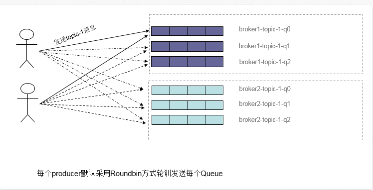

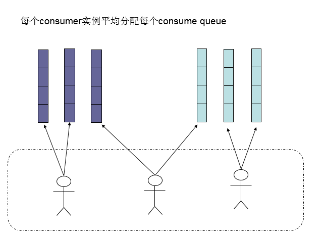

1. 注册的消息监听不同
    
    并发消费：consumer.registerMessageListener(new MessageListenerConcurrently() {}
    顺序消费：consumer.registerMessageListener(new MessageListenerOrderly() {}

2. 返回状态码不同

3. 消息重新消费的逻辑不同

    并发消费（重新消费的消息由Broker复制原消息，并丢入重试队列）：
    消费者返回ConsumeConcurrentlyStatus.RECONSUME_LATER时， Broker会创建一条与原先消息属性相同的消息，并分配新的唯一的msgId，另外存储原消息的msgId，新消息会存入到commitLog文件中，并进入重试队列，拥有一个全新的队列偏移量，延迟5s后重新消费。如果消费者仍然返回RECONSUME_LATER，那么会重复上面的操作，直到重新消费maxReconsumerTimes次，当重新消费次数超过最大次数时，进入死信队列，消息消费成功。
    顺序消费（重新消费不涉及Broker）：
    消费者返回ConsumeOrderlyStatus.SUSPEND_CURRENT_QUEUE_A_MOMENT时，当前队列会挂起（此消息后面的消息停止消费，直到此消息完成消息重新消费的整个过程），然后此消息会在消费者的线程池中重新消费，即不需要Broker重新创建新的消息（不涉及重试队列），如果消息重新消费超过maxReconsumerTimes最大次数时，进入死信队列。当消息放入死信队列时，Broker服务器认为消息时消费成功的，继续消费该队列后续消息。

4. 顺序消费设置自动提交

5. 涉及的主题不同

    RocketMQ有三种主题：NORMAL、RETRY、DLQ
    并发消费：NORMAL、RETRY、DLQ
    顺序消费：NORMAL、DLQ

6. 顺序消费在拉取任务时需要在Broker服务器上锁定该消息队列

## 消费 Push模式 vs Pull模式

RocketMQ推拉模式

消费者客户端有两种方式从消息中间件获取消息并消费。严格意义上来讲，RocketMQ并没有实现PUSH模式，而是对拉模式进行一层包装，名字虽然是 Push 开头，实际在实现时，使用 Pull 方式实现。通过 Pull 不断轮询 Broker 获取消息。当不存在新消息时，Broker 会挂起请求，直到有新消息产生，取消挂起，返回新消息。

1、概述

1.1、PULL方式

由消费者客户端主动向消息中间件（MQ消息服务器代理）拉取消息；采用Pull方式，如何设置Pull消息的拉取频率需要重点去考虑，举个例子来说，可能1分钟内连续来了1000条消息，然后2小时内没有新消息产生（概括起来说就是“消息延迟与忙等待”）。如果每次Pull的时间间隔比较久，会增加消息的延迟，即消息到达消费者的时间加长，MQ中消息的堆积量变大；若每次Pull的时间间隔较短，但是在一段时间内MQ中并没有任何消息可以消费，那么会产生很多无效的Pull请求的RPC开销，影响MQ整体的网络性能；

1.2、PUSH方式

由消息中间件（MQ消息服务器代理）主动地将消息推送给消费者；采用Push方式，可以尽可能实时地将消息发送给消费者进行消费。但是，在消费者的处理消息的能力较弱的时候(比如，消费者端的业务系统处理一条消息的流程比较复杂，其中的调用链路比较多导致消费时间比较久。概括起来地说就是“慢消费问题”)，而MQ不断地向消费者Push消息，消费者端的缓冲区可能会溢出，导致异常；

## 消息消费

消息消费以组的模式开展，一个消费组内可以包含多个消费者，每一个消费组可订阅多个主题，消费组之间有集群模式与广播模式两种消费模式。集群模式，主题下的同一条消息只允许被其中一个消费者消费。广播模式，主题下的同一条消息将被集群内的所有消费者消费一次。消息服务器与消费者之间的消息传送也有两种方式:推模式、拉模式。所谓的拉模式，是消费端主动发起拉消息请求，而推模式是消息到达消息服务器后，推送给消息消费者。RocketMQ 消息推模式的实现基于拉模式，在拉模式上包装一层，一个拉取任务完成后开始下一个拉取任务。

消息队列负载机制遵循一个通用的思想: 一个消息队列同一时间只允许被一个消费者消费，一个消费者可以消费多个消息队列。

RocketMQ 支持局部顺序消息消费，也就是保证同一个消息队列上的消息顺序消费。不支持消息全局顺序消费，如果要实现某一主题的全局顺序消息消费，可以将该主题的队列数设置为 1，牺牲高可用性。

RocketMQ 支持两种消息过滤模式:表达式(TAG、SQL92)与类过滤模式。

集群模式 vs 广播模式

## 消息消费 rebalance

假设一个主题四个队列，同一个消费者组的消费者是一个一个启动的。

+ 启动第一个消费者，负责四个队列的消费
+ 启动第二个消费者，消费再平衡，两个消费者，分别消费两个队列
+ 启动第三个消费者，消费再平衡，第一个消费者消费两个队列，第二、第三消费一个队列
+ 启动第四个消费者，消费再平衡，四个消费者，分别消费一个队列
+ 启动第五个消费者，闲置状态，不会分配队列给这个消费者

再平衡由客户端实现，使用相同的算法，保证消费分配最终一致性

不同Kafka，会选出一个消费者Leader进行重新分配。

## MQClientInstance brokerAddrTable

brokerAddrTable (ConcurrentHashMap) 

key: brokerName
value: (HashMap) 
    key: brokerId
    value: brokerAddress (IP:PORT)

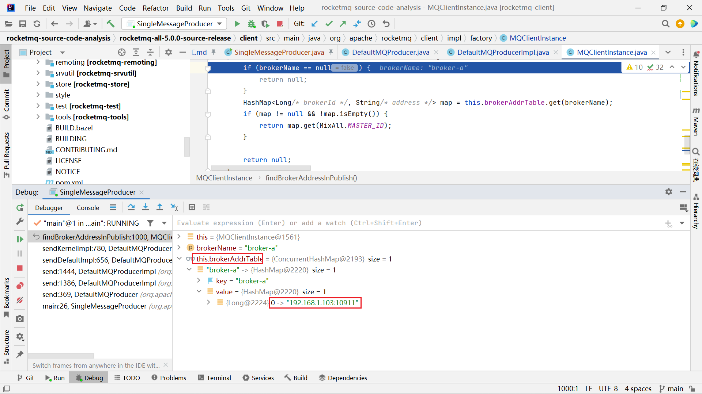

## ThreadLocal<Integer>

private final ThreadLocal<Integer> threadLocalIndex = new ThreadLocal<Integer>();

## DefaultMQProducerImpl topicPublishInfoTable (ConcurrentHashMap)

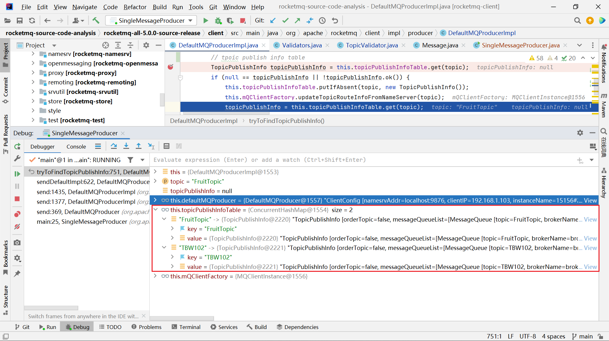

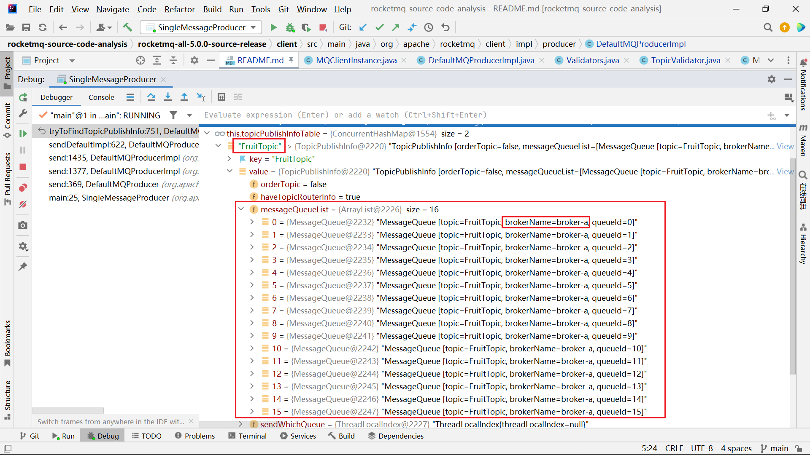

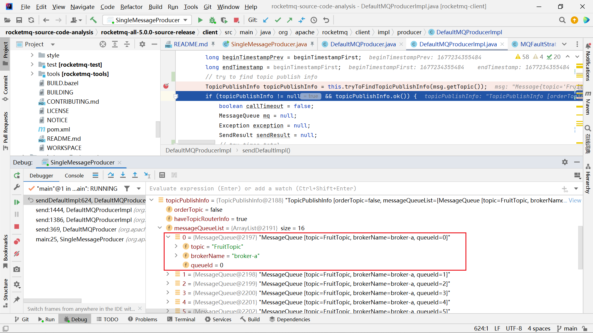

topicPublishInfo -> topic、brokerName、queueId (no broker address)

## MQ客户端实例

```text
        // update topic route info from name server
        this.scheduledExecutorService.scheduleAtFixedRate(() -> {
            try {
                MQClientInstance.this.updateTopicRouteInfoFromNameServer();
            } catch (Exception e) {
                log.error("ScheduledTask updateTopicRouteInfoFromNameServer exception", e);
            }
        }, 10, this.clientConfig.getPollNameServerInterval(), TimeUnit.MILLISECONDS);
```

## 生产组

```text
    /**
     * Producer group conceptually aggregates all producer instances of exactly same role, which is particularly
     * important when transactional messages are involved. </p>
     *
     * For non-transactional messages, it does not matter as long as it's unique per process. </p>
     *
     * See <a href="http://rocketmq.apache.org/docs/core-concept/">core concepts</a> for more discussion.
     */
    private String producerGroup;
```

## 4.x client two kinds of MQProducer

DefaultMQProducer TransactionMQProducer

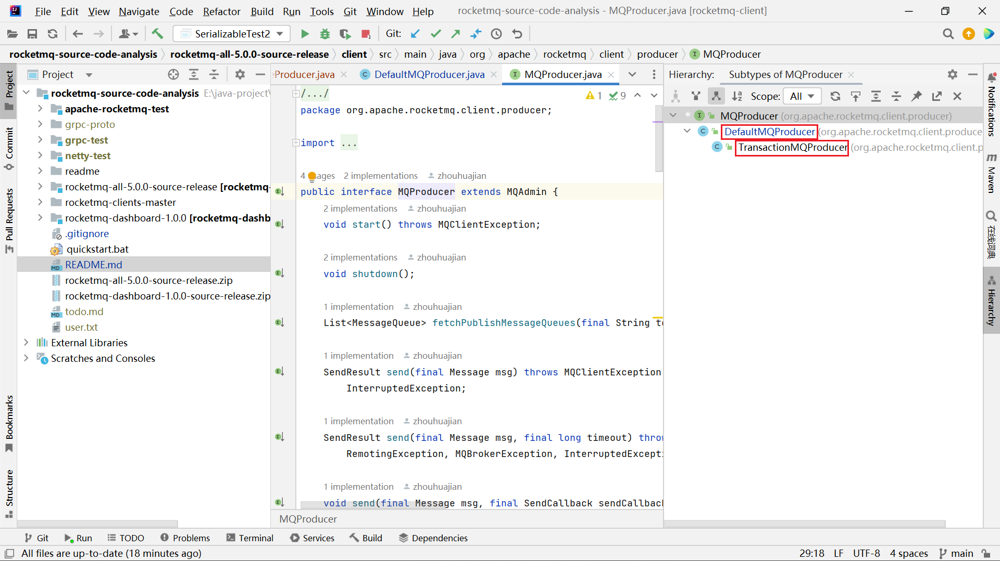

## serializable interface

## single message send test

```text
// SendResult对象
// sendStatus=SEND_OK, msgID=...., offsetMsgId=..., messageQueue=MessageQueue对象 MessageQueue [topic=FruitTopic, brokerName=broker-a， queueId=15], queueOffset=0
SendResult [sendStatus=SEND_OK, msgId=7F000001141818B4AAC279F55F090000, offsetMsgId=C0A8016700002A9F0000000000180007, messageQueue=MessageQueue [topic=FruitTopic, brokerName=broker-a, queueId=15], queueOffset=0]
// 说明netty客户端有服务端两个连接
// 1. 和NameServer 9876端口的连接 (name server 默认端口)
// 2. 和Broker 10911端口的连接 （broker remoting server默认端口，10911+1 HaServer端口，10909 fast remoting server端口）
16:22:04.015 [NettyClientSelector_1] INFO RocketmqRemoting - closeChannel: close the connection to remote address[127.0.0.1:9876] result: true
16:22:04.018 [NettyClientSelector_1] INFO RocketmqRemoting - closeChannel: close the connection to remote address[192.168.1.103:10911] result: true
```

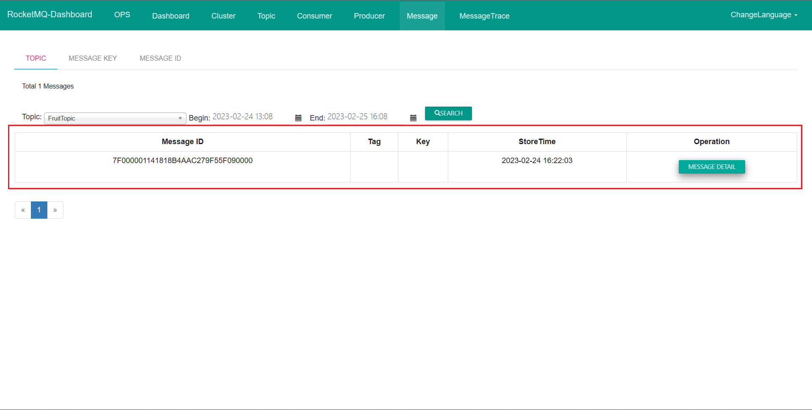

## change default broker name in source code

```
public class BrokerIdentity {
    private static final String DEFAULT_CLUSTER_NAME = "DefaultCluster";
    // broker name local host name
    @ImportantField
    // private String brokerName = localHostName();
    private String brokerName = 'broker-a';
    ...
```

The broker[broker-a, 192.168.1.103:10911] boot success. serializeType=JSON and name server is localhost:9876


## RocketMQ Proxy 处理请求

RocketMQ Proxy处理请求主要分为两步。
• 第一步， 客户端通过grpc协议访问RocketMQ Proxy。这个是由既定的协议确认的, 接口定义在 
  https://github.com/apache/rocketmq-apis/tree/main/apache/rocketmq/v2
• 第二步，Proxy内部封装调用。从GrpcMessagingApplication到XXXXX Service。这里面是典型的接口实现方式，代码也非常简单。
• 第三步，XXXXX Service调用Broker。
• 如果Proxy启动Local模式， 则是通过BrokerController对象调用Broker的方法实现发送、消费等业务；
• 如果Proxy启动Cluster模式，则是通过RemotingClient访问Broker实现发送、消费等业务。

_from internet_

## RocketMQ Proxy

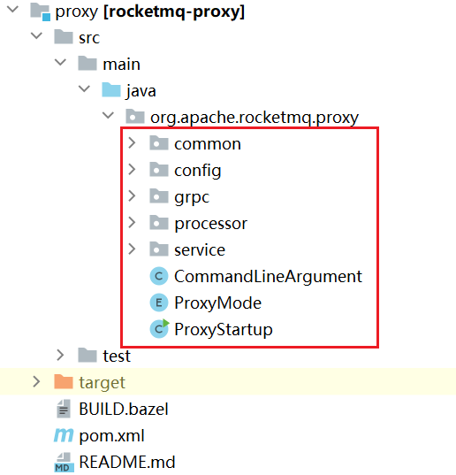

RocketMQ Proxy是一个RocketMQ Broker的代理服务，支持客户端用GRPC协议访问Broker。
RocketMQ Proxy主要解决了4.9.X版本客户端多语言客户端
（c/c++, golang, csharp,rust,python, nodejs）
实现Remoting协议难度大、复杂、功能不一致、维护工作大的问题。
RocketMQ Proxy使用业界熟悉的GRPC协议， 各个语言代码统一、简单，使得多语言使用RocketMQ更方便、容易。

启动一个RocketMQ Proxy。
sh bin/mqbroker -n localhost:9876 --enable-proxy
启动了一个Namesrv、一个Proxy、一个Dashboard
启动后，没有Broker进程， 但是有一个Broker可以注册到Namesrv:

启动入口类是 : org.apache.rocketmq.proxy.ProxyStartup
• 初始化命令行参数。将命令行参数转化为配置对象，包含Proxy配置、环境变量、日志配置、延迟级别配置。
• 初始化GRPC Server线程池和线程池监控。
• 初始化一个业务处理器、GRPC Server，并添加到PROXY_START_AND_SHUTDOWN列表中统一管理。 
  如果是本地模式，这里面会引用Broker模块，使用BrokerStartup启动一个内嵌Broker。（Proxy和Broker同进程)。

MessagingProcessor就是一个处理器接口，里面定义了Pop消息方法、发送消息方法等

_from internet_

## broker proxy

grpc server

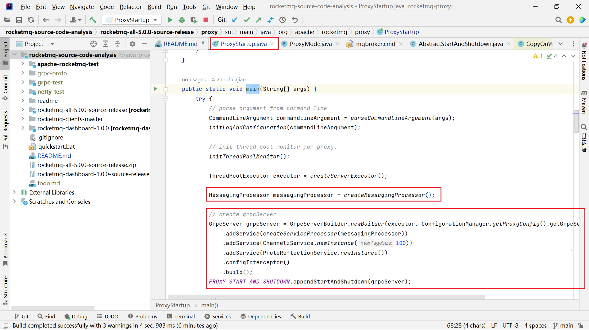

org.apache.rocketmq.broker.BrokerStartup.createBrokerController

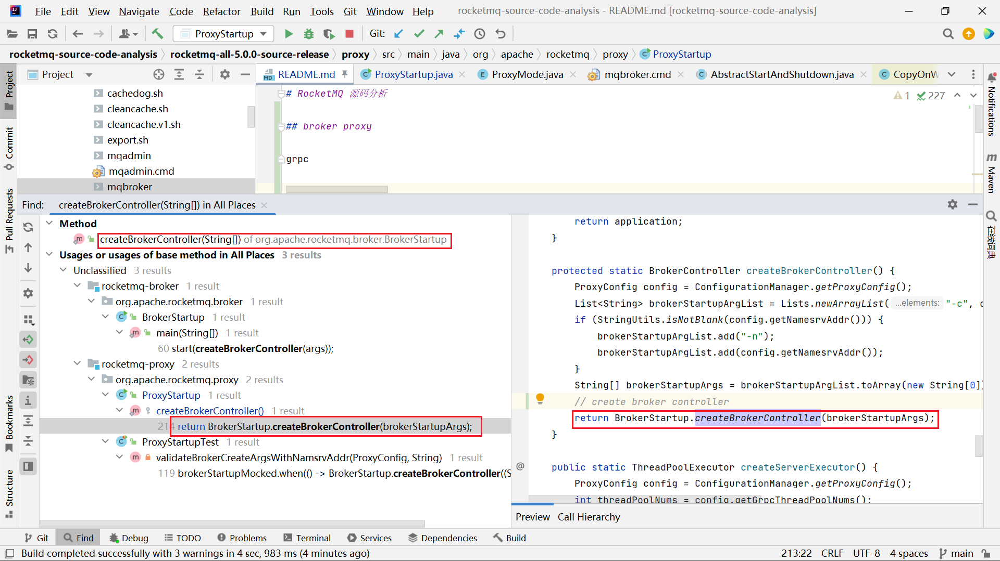

```text
    public static void main(String[] args) {
        try {
            // parse argument from command line
            CommandLineArgument commandLineArgument = parseCommandLineArgument(args);
            initLogAndConfiguration(commandLineArgument);

            // init thread pool monitor for proxy.
            initThreadPoolMonitor();

            ThreadPoolExecutor executor = createServerExecutor();

            MessagingProcessor messagingProcessor = createMessagingProcessor();

            // create grpcServer
            GrpcServer grpcServer = GrpcServerBuilder.newBuilder(executor, ConfigurationManager.getProxyConfig().getGrpcServerPort())
                .addService(createServiceProcessor(messagingProcessor))
                .addService(ChannelzService.newInstance(100))
                .addService(ProtoReflectionService.newInstance())
                .configInterceptor()
                .build();
            PROXY_START_AND_SHUTDOWN.appendStartAndShutdown(grpcServer);

            // start servers one by one.
            PROXY_START_AND_SHUTDOWN.start();

            Runtime.getRuntime().addShutdownHook(new Thread(() -> {
                log.info("try to shutdown server");
                try {
                    PROXY_START_AND_SHUTDOWN.shutdown();
                } catch (Exception e) {
                    log.error("err when shutdown rocketmq-proxy", e);
                }
            }));
        } catch (Exception e) {
            System.err.println("find an unexpect err." + e);
            e.printStackTrace();
            log.error("find an unexpect err.", e);
            System.exit(1);
        }

        System.out.printf("%s%n", new Date() + " rocketmq-proxy startup successfully");
        log.info(new Date() + " rocketmq-proxy startup successfully");
    }

```

## broker route register

实际路由注册 org.apache.rocketmq.broker.out.BrokerOuterAPI#registerBrokerAll

every 30 seconds

```text
    if (!isIsolated && !this.messageStoreConfig.isEnableDLegerCommitLog() && !this.messageStoreConfig.isDuplicationEnable()) {
            changeSpecialServiceStatus(this.brokerConfig.getBrokerId() == MixAll.MASTER_ID);
            this.registerBrokerAll(true, false, true);
        }

        scheduledFutures.add(this.scheduledExecutorService.scheduleAtFixedRate(new AbstractBrokerRunnable(this.getBrokerIdentity()) {
            @Override
            public void run2() {
                try {
                    if (System.currentTimeMillis() < shouldStartTime) {
                        BrokerController.LOG.info("Register to namesrv after {}", shouldStartTime);
                        return;
                    }
                    if (isIsolated) {
                        BrokerController.LOG.info("Skip register for broker is isolated");
                        return;
                    }
                    BrokerController.this.registerBrokerAll(true, false, brokerConfig.isForceRegister());
                } catch (Throwable e) {
                    BrokerController.LOG.error("registerBrokerAll Exception", e);
                }
            }
        }, 1000 * 10, Math.max(10000, Math.min(brokerConfig.getRegisterNameServerPeriod(), 60000)), TimeUnit.MILLISECONDS));


  public List<RegisterBrokerResult> registerBrokerAll(
            final String clusterName,
            final String brokerAddr,
            final String brokerName,
            final long brokerId,
            final String haServerAddr,
            final TopicConfigSerializeWrapper topicConfigWrapper,
            final List<String> filterServerList,
            final boolean oneway,
            final int timeoutMills,
            final boolean enableActingMaster,
            final boolean compressed,
            final Long heartbeatTimeoutMillis,
            final BrokerIdentity brokerIdentity) {

        final List<RegisterBrokerResult> registerBrokerResultList = new CopyOnWriteArrayList<>();
        List<String> nameServerAddressList = this.remotingClient.getAvailableNameSrvList();
        if (nameServerAddressList != null && nameServerAddressList.size() > 0) {
            // header
            final RegisterBrokerRequestHeader requestHeader = new RegisterBrokerRequestHeader();
            requestHeader.setBrokerAddr(brokerAddr);
            requestHeader.setBrokerId(brokerId);
            requestHeader.setBrokerName(brokerName);
            requestHeader.setClusterName(clusterName);
            requestHeader.setHaServerAddr(haServerAddr);
            requestHeader.setEnableActingMaster(enableActingMaster);
            requestHeader.setCompressed(false);
            if (heartbeatTimeoutMillis != null) {
                requestHeader.setHeartbeatTimeoutMillis(heartbeatTimeoutMillis);
            }
            // body
            RegisterBrokerBody requestBody = new RegisterBrokerBody();
            requestBody.setTopicConfigSerializeWrapper(TopicConfigAndMappingSerializeWrapper.from(topicConfigWrapper));
            requestBody.setFilterServerList(filterServerList);
            final byte[] body = requestBody.encode(compressed);
            final int bodyCrc32 = UtilAll.crc32(body);
            requestHeader.setBodyCrc32(bodyCrc32);
            final CountDownLatch countDownLatch = new CountDownLatch(nameServerAddressList.size());
            // for namesrv addr: name server address list
            for (final String namesrvAddr : nameServerAddressList) {
                brokerOuterExecutor.execute(new AbstractBrokerRunnable(brokerIdentity) {
                    @Override
                    public void run2() {
                        try {
                            RegisterBrokerResult result = registerBroker(namesrvAddr, oneway, timeoutMills, requestHeader, body);
                            if (result != null) {
                                registerBrokerResultList.add(result);
                            }

                            LOGGER.info("Registering current broker to name server completed. TargetHost={}", namesrvAddr);
                        } catch (Exception e) {
                            LOGGER.error("Failed to register current broker to name server. TargetHost={}", namesrvAddr, e);
                        } finally {
                            countDownLatch.countDown();
                        }
                    }
                });
            }

            try {
                if (!countDownLatch.await(timeoutMills, TimeUnit.MILLISECONDS)) {
                    LOGGER.warn("Registration to one or more name servers does NOT complete within deadline. Timeout threshold: {}ms", timeoutMills);
                }
            } catch (InterruptedException ignore) {
            }
        }

        return registerBrokerResultList;
    }
```

## broker controller

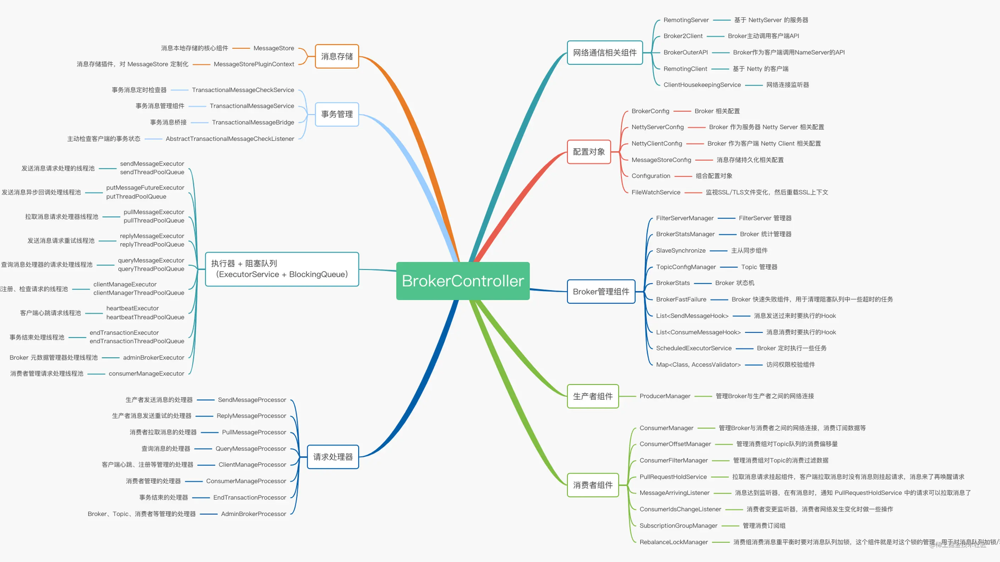

_from internet_

## broker scheduled task

```text
    protected void initializeScheduledTasks() {

        initializeBrokerScheduledTasks();

        this.scheduledExecutorService.scheduleAtFixedRate(new Runnable() {
            @Override
            public void run() {
                try {
                    BrokerController.this.brokerOuterAPI.refreshMetadata();
                } catch (Exception e) {
                    LOG.error("ScheduledTask refresh metadata exception", e);
                }
            }
        }, 10, 5, TimeUnit.SECONDS);

        if (this.brokerConfig.getNamesrvAddr() != null) {
            this.brokerOuterAPI.updateNameServerAddressList(this.brokerConfig.getNamesrvAddr());
            LOG.info("Set user specified name server address: {}", this.brokerConfig.getNamesrvAddr());
            // also auto update namesrv if specify
            this.scheduledExecutorService.scheduleAtFixedRate(new Runnable() {
                @Override
                public void run() {
                    try {
                        BrokerController.this.brokerOuterAPI.updateNameServerAddressList(BrokerController.this.brokerConfig.getNamesrvAddr());
                    } catch (Throwable e) {
                        LOG.error("Failed to update nameServer address list", e);
                    }
                }
            }, 1000 * 10, 1000 * 60 * 2, TimeUnit.MILLISECONDS);
        } else if (this.brokerConfig.isFetchNamesrvAddrByAddressServer()) {
            this.scheduledExecutorService.scheduleAtFixedRate(new Runnable() {

                @Override
                public void run() {
                    try {
                        BrokerController.this.brokerOuterAPI.fetchNameServerAddr();
                    } catch (Throwable e) {
                        LOG.error("Failed to fetch nameServer address", e);
                    }
                }
            }, 1000 * 10, 1000 * 60 * 2, TimeUnit.MILLISECONDS);
        }
    }
```

## Broker 3 listen ports and remoting server vs. fast remoting server

```text
    protected void initializeRemotingServer() throws CloneNotSupportedException {
        this.remotingServer = new NettyRemotingServer(this.nettyServerConfig, this.clientHousekeepingService);
        NettyServerConfig fastConfig = (NettyServerConfig) this.nettyServerConfig.clone();
        // neety server config get listen port -2
        int listeningPort = nettyServerConfig.getListenPort() - 2;
        if (listeningPort < 0) {
            listeningPort = 0;
        }
        fastConfig.setListenPort(listeningPort);
        // fast remoting server
        this.fastRemotingServer = new NettyRemotingServer(fastConfig, this.clientHousekeepingService);
    }
```

```text
本文主要介绍RocketMQ的多端口监听机制，通过本文，
你可以了解到Broker端源码中remotingServer和fastRemotingServer的区别，
以及客户端配置中，vipChannelEnabled的作用。

1 多端口监听

在RocketMQ中，可以通过broker.conf配置文件中指定listenPort配置项来指定Broker监听客户端请求的端口，
如果不指定，默认监听10911端口。listenPort=10911
不过，Broker启动时，实际上会监听3个端口：10909、10911、10912，如下所示：$ lsof -iTCP -nP | grep LISTEN

java  1892656 .   96u  IPv6 14889281  0t0  TCP *:10912 (LISTEN)
java  1892656 .  101u  IPv6 14889285  0t0  TCP *:10911 (LISTEN)
java  1892656 .  102u  IPv6 14889288  0t0  TCP *:10909 (LISTEN)

而其他两个端口是根据listenPort的值，动态计算出来的。这三个端口由Broker内部不同的组件使用，作用分别如下：
remotingServer：监听listenPort配置项指定的监听端口，默认10911
fastRemotingServer：监听端口值listenPort-2，即默认为10909
HAService：监听端口为值为listenPort+1，即10912，该端口用于Broker的主从同步

本文主要聚焦于remotingServer和fastRemotingServer的区别：
Broker端：remotingServer可以处理客户端所有请求，如：生产者发送消息的请求，消费者拉取消息的请求。fastRemotingServer功能基本与remotingServer相同，唯一不同的是不可以处理消费者拉取消息的请求。Broker在向NameServer注册时，只会上报remotingServer监听的listenPort端口。
```

_From Internet_

## Broker 配置文件路径

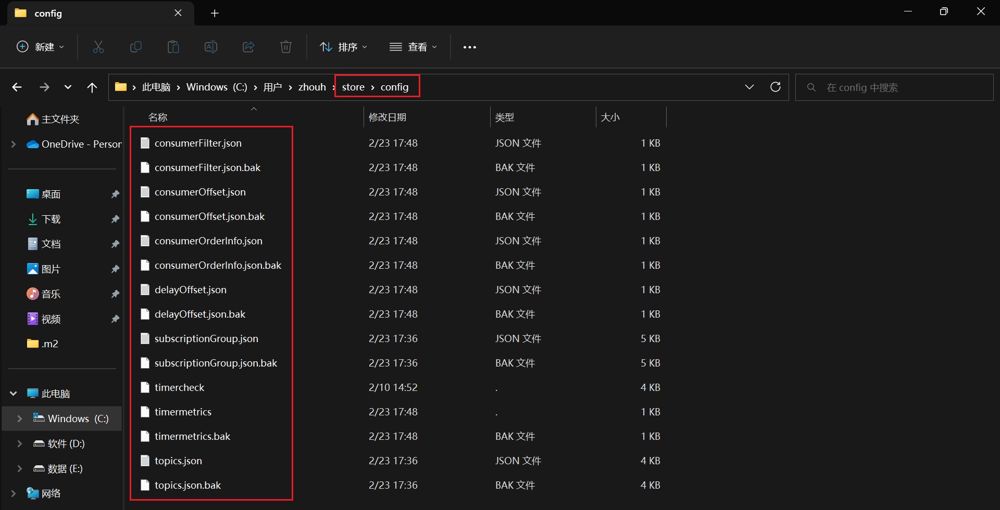

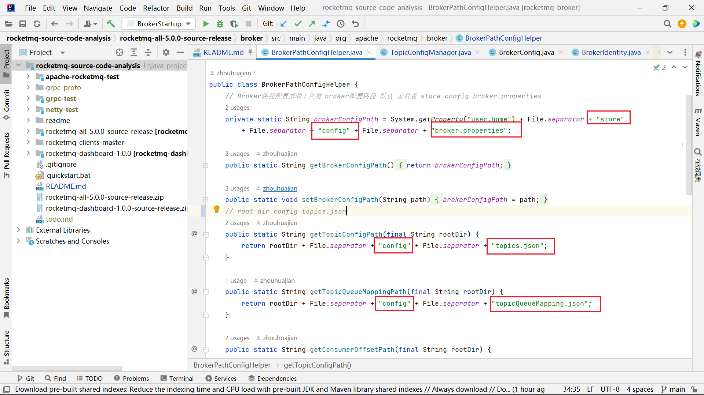

```java
public class BrokerPathConfigHelper {
    // Broker路径配置帮助工具类 broker配置路径 默认 家目录 store config broker.properties
    private static String brokerConfigPath = System.getProperty("user.home") + File.separator + "store"
        + File.separator + "config" + File.separator + "broker.properties";

    public static String getBrokerConfigPath() {
        return brokerConfigPath;
    }

    public static void setBrokerConfigPath(String path) {
        brokerConfigPath = path;
    }
    // root dir config topics.json
    public static String getTopicConfigPath(final String rootDir) {
        return rootDir + File.separator + "config" + File.separator + "topics.json";
    }

    public static String getTopicQueueMappingPath(final String rootDir) {
        return rootDir + File.separator + "config" + File.separator + "topicQueueMapping.json";
    }

    public static String getConsumerOffsetPath(final String rootDir) {
        return rootDir + File.separator + "config" + File.separator + "consumerOffset.json";
    }

    public static String getLmqConsumerOffsetPath(final String rootDir) {
        return rootDir + File.separator + "config" + File.separator + "lmqConsumerOffset.json";
    }

    public static String getConsumerOrderInfoPath(final String rootDir) {
        return rootDir + File.separator + "config" + File.separator + "consumerOrderInfo.json";
    }

    public static String getSubscriptionGroupPath(final String rootDir) {
        return rootDir + File.separator + "config" + File.separator + "subscriptionGroup.json";
    }
    public static String getTimerCheckPath(final String rootDir) {
        return rootDir + File.separator + "config" + File.separator + "timercheck";
    }
    public static String getTimerMetricsPath(final String rootDir) {
        return rootDir + File.separator + "config" + File.separator + "timermetrics";
    }

    public static String getConsumerFilterPath(final String rootDir) {
        return rootDir + File.separator + "config" + File.separator + "consumerFilter.json";
    }

    public static String getMessageRequestModePath(final String rootDir) {
        return rootDir + File.separator + "config" + File.separator + "messageRequestMode.json";
    }
}
```

## Broker 系统 Topic

+ RMQ_SYS_TRANS_OP_HALF_TOPIC 用来存放半事务消息
+ SCHEDULE_TOPIC_XXXX 用来存放延时消息
+ TBW102 自动创建Topic的模板
+ RMQ_SYS_BENCHMARK_TOPIC 系统基准测试Topic
+ BrokerClusterName
+ BrokerName
+ ...

see: `org.apache.rocketmq.broker.topic.TopicConfigManager.TopicConfigManager(org.apache.rocketmq.broker.BrokerController)`

## 自动创建 Topic (copy TBW102 topic config)

生产环境下 一般禁用 自动创建 Topic 避免 Topic 被随意创建 无法统一管理

```text
    {
            // is auto create topic enable
            if (this.brokerController.getBrokerConfig().isAutoCreateTopicEnable()) {
                // public static final String AUTO_CREATE_TOPIC_KEY_TOPIC = "TBW102"; // Will be created at broker when isAutoCreateTopicEnable
                String topic = TopicValidator.AUTO_CREATE_TOPIC_KEY_TOPIC;
                TopicConfig topicConfig = new TopicConfig(topic);
                TopicValidator.addSystemTopic(topic);
                topicConfig.setReadQueueNums(this.brokerController.getBrokerConfig()
                    .getDefaultTopicQueueNums());
                topicConfig.setWriteQueueNums(this.brokerController.getBrokerConfig()
                    .getDefaultTopicQueueNums());
                int perm = PermName.PERM_INHERIT | PermName.PERM_READ | PermName.PERM_WRITE;
                topicConfig.setPerm(perm);
                this.topicConfigTable.put(topicConfig.getTopicName(), topicConfig);
            }
        }
```

Producer发送一个不存在的Topic消息时，首先会从NameServer拉取Topic路由数据，第一次拉取必然失败，第二次会直接拉取TBW102的路由数据，基于它创建TopicPublishInfo并缓存到本地，进行正常的消息发送，在Header里将defaultTopic设置为TBW102。Broker接收到消息时，先对消息做Check，检查到Topic不存在，会基于defaultTopic的配置去创建该Topic，然后注册到NameServer上，这样一个全新的Topic就被自动创建了。
_From Internet_

## 留意现象

运行 NamesrvStartup，运行 RMQ Dashboard，再运行不指定NameServer地址的BrokerStartup，Dashboard大多数数据为空

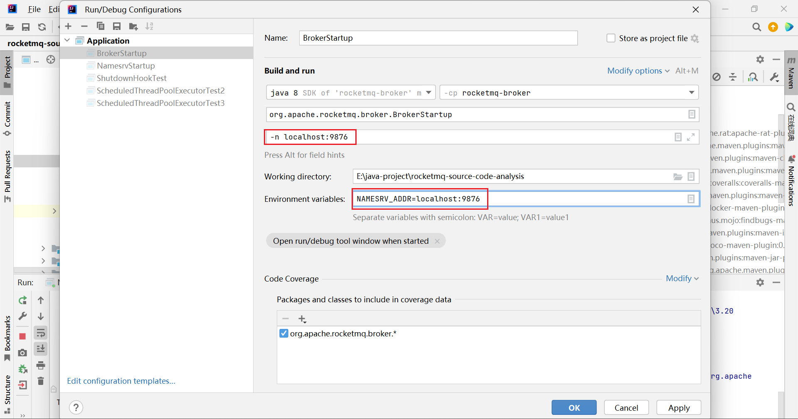

两种方式指定 namesrv_addr

对比没有namesrv_addr和有

The broker[..., 192.168.1.103:10911] boot success. serializeType=JSON
The broker[..., 192.168.1.103:10911] boot success. serializeType=JSON and name server is localhost:9876

## Spring Boot Maven Plugin 仓库

https://github.com/spring-projects/spring-boot/tree/main/spring-boot-project/spring-boot-tools/spring-boot-maven-plugin

## 消息类型

定义：主题所支持的消息类型。

取值：创建主题时选择消息类型。Apache RocketMQ 支持的主题类型如下：

1. Normal：普通消息，消息本身无特殊语义，消息之间也没有任何关联。 （无序）
2. FIFO：顺序消息，Apache RocketMQ 通过消息分组MessageGroup标记一组特定消息的先后顺序，可以保证消息的投递顺序严格按照消息发送时的顺序。
3. Delay：定时/延时消息，通过指定延时时间控制消息生产后不要立即投递，而是在延时间隔后才对消费者可见。
4. Transaction：事务消息，Apache RocketMQ 支持分布式事务消息，支持应用数据库更新和消息调用的事务一致性保障。

约束：每个主题只支持一种消息类型。

## Namesrv

```shell
D:\Java\jdk1.8.0_333\bin\java.exe 
-javaagent:C:\Users\zhouh\Desktop\ideaIC-2022.3.1.win\lib\idea_rt.jar=60832:C:\Users\zhouh\Desktop\ideaIC-2022.3.1.win\bin 
-Dfile.encoding=UTF-8 
-classpath D:\java\jdk1.8.0_333\jre\lib\charsets.jar;
D:\java\jdk1.8.0_333\jre\lib\deploy.jar;
D:\java\jdk1.8.0_333\jre\lib\ext\access-bridge-64.jar;
D:\java\jdk1.8.0_333\jre\lib\ext\cldrdata.jar;
D:\java\jdk1.8.0_333\jre\lib\ext\dnsns.jar;
D:\java\jdk1.8.0_333\jre\lib\ext\jaccess.jar;
D:\java\jdk1.8.0_333\jre\lib\ext\jfxrt.jar;
D:\java\jdk1.8.0_333\jre\lib\ext\localedata.jar;
D:\java\jdk1.8.0_333\jre\lib\ext\nashorn.jar;
D:\java\jdk1.8.0_333\jre\lib\ext\sunec.jar;
D:\java\jdk1.8.0_333\jre\lib\ext\sunjce_provider.jar;
D:\java\jdk1.8.0_333\jre\lib\ext\sunmscapi.jar;
D:\java\jdk1.8.0_333\jre\lib\ext\sunpkcs11.jar;
D:\java\jdk1.8.0_333\jre\lib\ext\zipfs.jar;
D:\java\jdk1.8.0_333\jre\lib\javaws.jar;
D:\java\jdk1.8.0_333\jre\lib\jce.jar;
D:\java\jdk1.8.0_333\jre\lib\jfr.jar;
D:\java\jdk1.8.0_333\jre\lib\jfxswt.jar;
D:\java\jdk1.8.0_333\jre\lib\jsse.jar;
D:\java\jdk1.8.0_333\jre\lib\management-agent.jar;
D:\java\jdk1.8.0_333\jre\lib\plugin.jar;
D:\java\jdk1.8.0_333\jre\lib\resources.jar;
D:\java\jdk1.8.0_333\jre\lib\rt.jar;
E:\java-project\rocketmq-source-code-analysis\rocketmq-all-5.0.0-source-release\namesrv\target\classes;
E:\java-project\rocketmq-source-code-analysis\rocketmq-all-5.0.0-source-release\controller\target\classes;
C:\Users\zhouh\.m2\repository\io\openmessaging\storage\dledger\0.3.1\dledger-0.3.1.jar;
E:\java-project\rocketmq-source-code-analysis\rocketmq-all-5.0.0-source-release\client\target\classes;
E:\java-project\rocketmq-source-code-analysis\rocketmq-all-5.0.0-source-release\common\target\classes;
C:\Users\zhouh\.m2\repository\commons-validator\commons-validator\1.7\commons-validator-1.7.jar;
C:\Users\zhouh\.m2\repository\commons-beanutils\commons-beanutils\1.9.4\commons-beanutils-1.9.4.jar;
C:\Users\zhouh\.m2\repository\commons-digester\commons-digester\2.1\commons-digester-2.1.jar;
C:\Users\zhouh\.m2\repository\commons-logging\commons-logging\1.2\commons-logging-1.2.jar;
C:\Users\zhouh\.m2\repository\commons-collections\commons-collections\3.2.2\commons-collections-3.2.2.jar;
C:\Users\zhouh\.m2\repository\com\github\luben\zstd-jni\1.5.2-2\zstd-jni-1.5.2-2.jar;
C:\Users\zhouh\.m2\repository\org\lz4\lz4-java\1.8.0\lz4-java-1.8.0.jar;
C:\Users\zhouh\.m2\repository\commons-codec\commons-codec\1.13\commons-codec-1.13.jar;
C:\Users\zhouh\.m2\repository\org\apache\commons\commons-lang3\3.12.0\commons-lang3-3.12.0.jar;
C:\Users\zhouh\.m2\repository\com\google\guava\guava\31.0.1-jre\guava-31.0.1-jre.jar;
C:\Users\zhouh\.m2\repository\com\google\guava\failureaccess\1.0.1\failureaccess-1.0.1.jar;
C:\Users\zhouh\.m2\repository\com\google\guava\listenablefuture\9999.0-empty-to-avoid-conflict-with-guava\listenablefuture-9999.0-empty-to-avoid-conflict-with-guava.jar;
C:\Users\zhouh\.m2\repository\com\google\code\findbugs\jsr305\3.0.2\jsr305-3.0.2.jar;
C:\Users\zhouh\.m2\repository\org\checkerframework\checker-qual\3.12.0\checker-qual-3.12.0.jar;
C:\Users\zhouh\.m2\repository\com\google\j2objc\j2objc-annotations\1.3\j2objc-annotations-1.3.jar;
E:\java-project\rocketmq-source-code-analysis\rocketmq-all-5.0.0-source-release\tools\target\classes;
E:\java-project\rocketmq-source-code-analysis\rocketmq-all-5.0.0-source-release\acl\target\classes;
C:\Users\zhouh\.m2\repository\org\apache\rocketmq\rocketmq-proto\2.0.0\rocketmq-proto-2.0.0.jar;
C:\Users\zhouh\.m2\repository\org\apache\tomcat\annotations-api\6.0.53\annotations-api-6.0.53.jar;
E:\java-project\rocketmq-source-code-analysis\rocketmq-all-5.0.0-source-release\logging\target\classes;
C:\Users\zhouh\.m2\repository\com\google\protobuf\protobuf-java-util\3.20.1\protobuf-java-util-3.20.1.jar;
C:\Users\zhouh\.m2\repository\com\google\protobuf\protobuf-java\3.20.1\protobuf-java-3.20.1.jar;
C:\Users\zhouh\.m2\repository\com\google\code\gson\gson\2.8.9\gson-2.8.9.jar;
C:\Users\zhouh\.m2\repository\com\alibaba\fastjson\1.2.69_noneautotype\fastjson-1.2.69_noneautotype.jar;
C:\Users\zhouh\.m2\repository\org\yaml\snakeyaml\1.30\snakeyaml-1.30.jar;
E:\java-project\rocketmq-source-code-analysis\rocketmq-all-5.0.0-source-release\srvutil\target\classes;
E:\java-project\rocketmq-source-code-analysis\rocketmq-all-5.0.0-source-release\remoting\target\classes;
C:\Users\zhouh\.m2\repository\io\netty\netty-all\4.1.65.Final\netty-all-4.1.65.Final.jar;
C:\Users\zhouh\.m2\repository\commons-cli\commons-cli\1.4\commons-cli-1.4.jar;
C:\Users\zhouh\.m2\repository\com\googlecode\concurrentlinkedhashmap\concurrentlinkedhashmap-lru\1.4.2\concurrentlinkedhashmap-lru-1.4.2.jar;
C:\Users\zhouh\.m2\repository\ch\qos\logback\logback-classic\1.2.10\logback-classic-1.2.10.jar;
C:\Users\zhouh\.m2\repository\ch\qos\logback\logback-core\1.2.10\logback-core-1.2.10.jar;
C:\Users\zhouh\.m2\repository\org\slf4j\slf4j-api\1.7.7\slf4j-api-1.7.7.jar;
C:\Users\zhouh\.m2\repository\org\bouncycastle\bcpkix-jdk15on\1.69\bcpkix-jdk15on-1.69.jar;
C:\Users\zhouh\.m2\repository\org\bouncycastle\bcprov-jdk15on\1.69\bcprov-jdk15on-1.69.jar;
C:\Users\zhouh\.m2\repository\org\bouncycastle\bcutil-jdk15on\1.69\bcutil-jdk15on-1.69.jar;
C:\Users\zhouh\.m2\repository\org\awaitility\awaitility\4.1.0\awaitility-4.1.0.jar;
C:\Users\zhouh\.m2\repository\org\hamcrest\hamcrest\2.1\hamcrest-2.1.jar 
org.apache.rocketmq.namesrv.NamesrvStartup
The Name Server boot success. serializeType=JSON
```

## 消息生产过程

1. 生产者 向 namesrv 获取 Topic 的路由表和Broker表 (生产者会每隔30秒向namesrc获取这些信息，并保存在堆区，如果发具体Topic消息，没有路由，则会向namesrc获取特定主题的路由)
2. 生产者 通过 队列选择算法 选择一个队列，并发送。

Topic路由表 是 Map，Key是TopicName，Value是QueueData列表，每个QueueData是当前主题每个Broker中的所有队列。
例如Broker-a有主题TopicTest四个队列，Broker-b有主题TopicTest四个队列，
那么TopicTest对应的QueueData列表有两个QueueData实例，第一个QueueData实例记录Broker-a里面的TopicTest四个队列，第二个QueueData实例记录Broker-b里面的TopicTest四个队列。
当然每个QueueData会记录BrokerName

Broker表，是Map，Key是BrokerName，Value是BrokerData，例如有Broker-a是一个小主从集群，有两个Broker BrokerId分别为0 1，
Broker-b也是一个小主从集群，有两个Broker BrokerId分别为 0 1
那么 Key Bronker-a对应的BrokerData有两个Broker，又是一个Map，Key是BrokerId 0，Value是Broker地址。

通过 Topic路由表 能确定往那个Broker的那个队列里面发消息，但不知道那个Broker地址是啥，所以再通过Broker表，获取Broker的Master地址。

队列选择算法 

1. 轮询算法
2. 最小延迟算法
3. ...

## IP地址掩码以及192.168.1.1/24 /16 /8

```text
IP地址：IP地址 是给互联网上的电脑一个编号。
每台Internet联网的PC电脑 手机 物联网设备 智能设备都需要有IP地址，才能正常通信。如果把“一台电脑”比作“一台电话”，那么“IP地址”就相当于“电话号码”，而Internet互联网中的路由器，就相当于电信部门的“程控式交换机”。

IP地址是一个32位的二进制数，通常被分割为4个“8位二进制数”（也就是4个字节）。
IP地址通常用“点分十进制”表示成（a.b.c.d）的形式，其中，a,b,c,d都是0~255之间的十进制整数。
例：点分十进IP地址（100.2.1.1），实际上是32位二进制数（01100100.00000010.00000001.00000001）。

A类，B类，C类，D类，E类地址

A类地址：第1个8位中的第1位始终为0 0-127.x.x.x 255.0.0.0/8
B类地址：第1个8位中的第1、2位始终为10 128-191.x.x.x 255.255.0.0/16
C类地址：第1个8位中的第1、2、3位始终为110 192-y.x.x.x 255.255.255.0/24

特殊

D类 以1110开始 用于组播
E类 以11110开始 用于科研保留

IP地址包含 网络地址+主机地址，即IP地址=网络地址+主机地址

172.16.10.33/27 中的/27
也就是说子网掩码是255.255.255.224 即27个全1
11111111 11111111 11111111 11100000
```

_From Internet_

## 私有地址空间 私有IP

3.Private Address Space

The Internet Assigned Numbers Authority (IANA) has reserved the
following three blocks of the IP address space for private internets:

     10.0.0.0        -   10.255.255.255  (10/8 prefix)  
     172.16.0.0      -   172.31.255.255  (172.16/12 prefix)  
     192.168.0.0     -   192.168.255.255 (192.168/16 prefix)  

https://www.rfc-editor.org/rfc/rfc1918

## Socket 缓冲区

每个socket被创建后，无论使用的是TCP协议还是UDP协议，都会创建自己的接收缓冲区和发送缓冲区。当我们调用write()/send() 向网络发送数据时，系统并不会 马上向网络传输数据，而是首先将数据拷贝到发送缓冲区，由系统负责择时发送数据。根据我们选用的网络协议以及阻塞模式，系统会有不同的处理。

这些socket缓冲区特性可整理如下：

1. socket缓冲区在每个套接字中单独存在；
2. socket缓冲区在创建套接字时自动生成；
3. 即使关闭套接字也会继续传送发送缓冲区中遗留的数据；
4. 关闭套接字将丢失接收缓冲区中的数据。

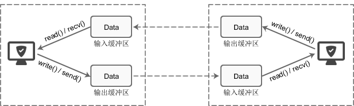

_From Internet_

## ScheduledThreadPoolExecutor

ScheduledThreadPoolExecutor 是一个使用线程池执行定时任务的类，相较于Java中提供的另一个执行定时任务的类Timer，其主要有如下两个优点：

使用多线程执行任务，不用担心任务执行时间过长而导致任务相互阻塞的情况，Timer是单线程执行的，因而会出现这个问题；
不用担心任务执行过程中，如果线程失活，其会新建线程执行任务，Timer类的单线程挂掉之后是不会重新创建线程执行后续任务的。

_来自网络_

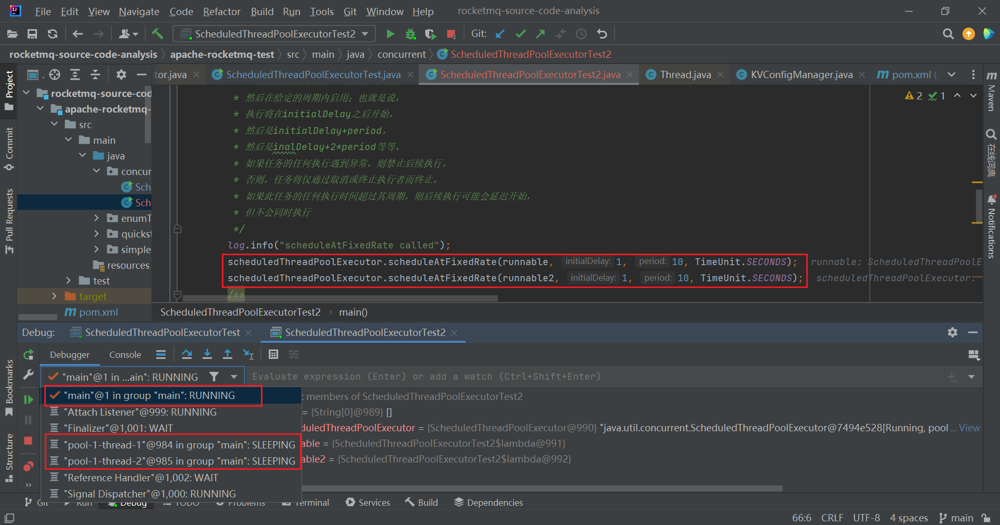

mqnamesrv 定时任务

```text
    private void startScheduleService() {
        this.scanExecutorService.scheduleAtFixedRate(NamesrvController.this.routeInfoManager::scanNotActiveBroker,
            5, this.namesrvConfig.getScanNotActiveBrokerInterval(), TimeUnit.MILLISECONDS);

        this.scheduledExecutorService.scheduleAtFixedRate(NamesrvController.this.kvConfigManager::printAllPeriodically,
            1, 10, TimeUnit.MINUTES);

        this.scheduledExecutorService.scheduleAtFixedRate(() -> {
            try {
                NamesrvController.this.printWaterMark();
            } catch (Throwable e) {
                LOGGER.error("printWaterMark error.", e);
            }
        }, 10, 1, TimeUnit.SECONDS);
    }
```

## 启动mqnamesrv

call mqnamesrv     
"D:\java\jdk1.8.0_333\bin\java.exe"  -server -Xms2g -Xmx2g -Xmn1g -XX:MetaspaceSize=128m -XX:MaxMetaspaceSize=320m -XX:+UseConcMarkSweepGC -XX:+UseCMSCompactAtFullCollection -XX:CMSInitiatingOccupancyFraction=70 -XX:+CMSParallelRemarkEnabled -XX:SoftRefLRUPolicyMSPerMB=0 -XX:+CMSClassUnloadingEnabled -XX:SurvivorRatio=8 -XX:-UseParNewGC -verbose:gc -Xloggc:"C:\Users\zhouh\rmq_srv_gc.log" -XX:+PrintGCDetails -XX:+PrintGCDateStamps -XX:-OmitStackTraceInFastThrow -XX:-UseLargePages -cp ".;E:\java-project\rocketmq-source-code-analysis\rocketmq-all-5.0.0-source-release\distribution\target\rocketmq-5.0.0\rocketmq-5.0.0\conf;E:\java-project\rocketmq-source-code-analysis\rocketmq-all-5.0.0-source-release\distribution\target\rocketmq-5.0.0\rocketmq-5.0.0\lib\*;" org.apache.rocketmq.namesrv.NamesrvStartup

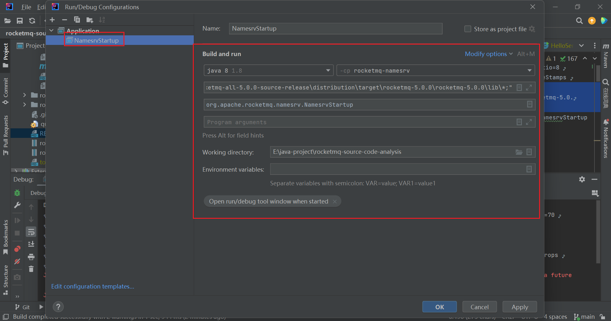

## 生产一条消息


消息 生成、存储、消费 消息即数据 RocketMQ即特殊数据库 可为业务提供请求堆积功能 尤其适合有超量请求的业务

高可用、高性能、负载均衡、动态扩容缩容

削峰填谷、异步解耦

（冗余/镜像、分片）

## Bash 条件表达式

https://www.gnu.org/software/bash/manual/bash.html#Bash-Conditional-Expressions

```text
6.4 Bash Conditional Expressions
Conditional expressions are used by the [[ compound command (see Conditional Constructs) and the test and [ builtin commands (see Bourne Shell Builtins). The test and [ commands determine their behavior based on the number of arguments; see the descriptions of those commands for any other command-specific actions.

Expressions may be unary or binary, and are formed from the following primaries. Unary expressions are often used to examine the status of a file. There are string operators and numeric comparison operators as well. Bash handles several filenames specially when they are used in expressions. If the operating system on which Bash is running provides these special files, Bash will use them; otherwise it will emulate them internally with this behavior: If the file argument to one of the primaries is of the form /dev/fd/N, then file descriptor N is checked. If the file argument to one of the primaries is one of /dev/stdin, /dev/stdout, or /dev/stderr, file descriptor 0, 1, or 2, respectively, is checked.

When used with [[, the ‘<’ and ‘>’ operators sort lexicographically using the current locale. The test command uses ASCII ordering.

Unless otherwise specified, primaries that operate on files follow symbolic links and operate on the target of the link, rather than the link itself.

-a file
True if file exists.

-b file
True if file exists and is a block special file.

-c file
True if file exists and is a character special file.

-d file
True if file exists and is a directory.

-e file
True if file exists.

-f file
True if file exists and is a regular file.

-g file
True if file exists and its set-group-id bit is set.

-h file
True if file exists and is a symbolic link.

-k file
True if file exists and its "sticky" bit is set.

-p file
True if file exists and is a named pipe (FIFO).

-r file
True if file exists and is readable.

-s file
True if file exists and has a size greater than zero.

-t fd
True if file descriptor fd is open and refers to a terminal.

-u file
True if file exists and its set-user-id bit is set.

-w file
True if file exists and is writable.

-x file
True if file exists and is executable.

-G file
True if file exists and is owned by the effective group id.

-L file
True if file exists and is a symbolic link.

-N file
True if file exists and has been modified since it was last read.

-O file
True if file exists and is owned by the effective user id.

-S file
True if file exists and is a socket.

file1 -ef file2
True if file1 and file2 refer to the same device and inode numbers.

file1 -nt file2
True if file1 is newer (according to modification date) than file2, or if file1 exists and file2 does not.

file1 -ot file2
True if file1 is older than file2, or if file2 exists and file1 does not.

-o optname
True if the shell option optname is enabled. The list of options appears in the description of the -o option to the set builtin (see The Set Builtin).

-v varname
True if the shell variable varname is set (has been assigned a value).

-R varname
True if the shell variable varname is set and is a name reference.

-z string
True if the length of string is zero.

-n string
string
True if the length of string is non-zero.

string1 == string2
string1 = string2
True if the strings are equal. When used with the [[ command, this performs pattern matching as described above (see Conditional Constructs).

‘=’ should be used with the test command for POSIX conformance.

string1 != string2
True if the strings are not equal.

string1 < string2
True if string1 sorts before string2 lexicographically.

string1 > string2
True if string1 sorts after string2 lexicographically.

arg1 OP arg2
OP is one of ‘-eq’, ‘-ne’, ‘-lt’, ‘-le’, ‘-gt’, or ‘-ge’. These arithmetic binary operators return true if arg1 is equal to, not equal to, less than, less than or equal to, greater than, or greater than or equal to arg2, respectively. Arg1 and arg2 may be positive or negative integers. When used with the [[ command, Arg1 and Arg2 are evaluated as arithmetic expressions (see Shell Arithmetic).

```

## Netty 异步事件驱动的网络应用程序框架

比Java原生的Socket等，高性能、更方便开发

框架就是有一套框架API，遵循API规范使用即可，避免很多不必要的业务处理

网络连接、断线重连、状态检测、...

编码解码器，处理数据包的粘包/拆包，如果自己处理会比较麻烦，例如数据包还没到齐就处理了，导出错误。

Netty 可以做HTTP服务器、UDP服务器、TCP服务器、RPC服务器、WebSocket服务器等

## BrokerContainer

```text
背景
在RocketMQ 4.x版本中，一个进程只有一个broker，通常会以主备或者DLedger（Raft）的形式部署，但是一个进程中只有一个broker，而slave一般只承担冷备或热备的作用，节点之间角色的不对等导致slave节点资源没有充分被利用。 因此在RocketMQ 5.x版本中，提供一种新的模式BrokerContainer，在一个BrokerContainer进程中可以加入多个Broker（Master Broker、Slave Broker、DLedger Broker），来提高单个节点的资源利用率，并且可以通过各种形式的交叉部署来实现节点之间的对等部署。 该特性的优点包括：

一个BrokerContainer进程中可以加入多个broker，通过进程内混部来提高单个节点的资源利用率
通过各种形式的交叉部署来实现节点之间的对等部署，增强单节点的高可用能力
利用BrokerContainer可以实现单进程内多CommitLog写入，也可以实现单机的多磁盘写入
BrokerContainer中的CommitLog天然隔离的，不同的CommitLog（broker）可以采取不同作用，比如可以用来比如创建单独的broker做不同TTL的CommitLog。
```

_来自网络_

## 启动类命名特点

BrokerContainerStartup BrokerStartup ControllerStartup MQAdminStartup NamesrvStartup ProxyStartup

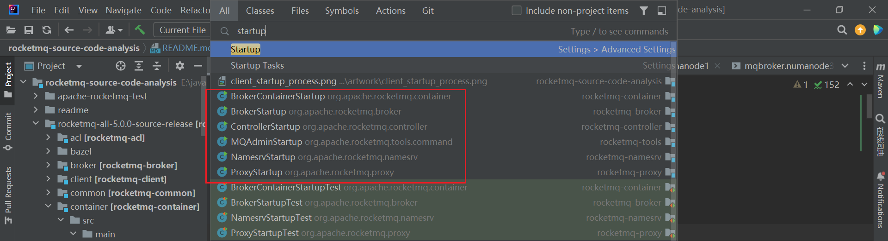

startup n. 新兴公司；（动作、过程的）开始，启动

## UMA、NUMA

```text
NUMA的诞生背景
在NUMA出现之前，CPU朝着高频率的方向发展遇到了天花板，转而向着多核心的方向发展。

在一开始，内存控制器还在北桥中，所有CPU对内存的访问都要通过北桥来完成。此时所有CPU访问内存都是“一致的”，如下图所示：

UMA
这样的架构称为UMA(Uniform Memory Access)，直译为“统一内存访问”，这样的架构对软件层面来说非常容易，总线模型保证所有的内存访问是一致的，即每个处理器核心共享相同的内存地址空间。但随着CPU核心数的增加，这样的架构难免遇到问题，比如对总线的带宽带来挑战、访问同一块内存的冲突问题。为了解决这些问题，有人搞出了NUMA。

NUMA构架细节
NUMA 全称 Non-Uniform Memory Access，译为“非一致性内存访问”。这种构架下，不同的内存器件和CPU核心从属不同的 Node，每个 Node 都有自己的集成内存控制器（IMC，Integrated Memory Controller）。

在 Node 内部，架构类似SMP，使用 IMC Bus 进行不同核心间的通信；不同的 Node 间通过QPI（Quick Path Interconnect）进行通信
...
```

_来自网络_

## 看源码技巧

+ 看到没看过的类，先看它继承了什么类，实现了那些接口
+ 然后看一遍他的所有属性
+ 然后看一遍他的所有构造方法
+ 其他方法，等具体用到了在具体看

## rocketmq 5.0.0 程序结构

```text
├─benchmark
├─bin
│  ├─controller
│  └─dledger
├─conf
│  ├─2m-2s-async
│  ├─2m-2s-sync
│  ├─2m-noslave
│  ├─container
│  │  └─2container-2m-2s
│  ├─controller
│  │  ├─cluster-3n-independent
│  │  ├─cluster-3n-namesrv-plugin
│  │  └─quick-start
│  └─dledger
└─lib
```
包括文件

```text
│  LICENSE
│  NOTICE
│  README.md
│
├─benchmark
│      batchproducer.sh
│      consumer.sh
│      producer.sh
│      runclass.sh
│      shutdown.sh
│      tproducer.sh
│
├─bin
│  │  cachedog.sh
│  │  cleancache.sh
│  │  cleancache.v1.sh
│  │  export.sh
│  │  mqadmin
│  │  mqadmin.cmd
│  │  mqbroker
│  │  mqbroker.cmd
│  │  mqbroker.numanode0
│  │  mqbroker.numanode1
│  │  mqbroker.numanode2
│  │  mqbroker.numanode3
│  │  mqbrokercontainer
│  │  mqcontroller
│  │  mqcontroller.cmd
│  │  mqnamesrv
│  │  mqnamesrv.cmd
│  │  mqproxy
│  │  mqproxy.cmd
│  │  mqshutdown
│  │  mqshutdown.cmd
│  │  os.sh
│  │  play.cmd
│  │  play.sh
│  │  README.md
│  │  runbroker.cmd
│  │  runbroker.sh
│  │  runserver.cmd
│  │  runserver.sh
│  │  setcache.sh
│  │  startfsrv.sh
│  │  tools.cmd
│  │  tools.sh
│  │
│  ├─controller
│  │      fast-try-independent-deployment.sh
│  │      fast-try-namesrv-plugin.sh
│  │      fast-try.sh
│  │
│  └─dledger
│          fast-try.sh
│
├─conf
│  │  broker.conf
│  │  logback_broker.xml
│  │  logback_controller.xml
│  │  logback_namesrv.xml
│  │  logback_proxy.xml
│  │  logback_tools.xml
│  │  plain_acl.yml
│  │  rmq-proxy.json
│  │  tools.yml
│  │
│  ├─2m-2s-async
│  │      broker-a-s.properties
│  │      broker-a.properties
│  │      broker-b-s.properties
│  │      broker-b.properties
│  │
│  ├─2m-2s-sync
│  │      broker-a-s.properties
│  │      broker-a.properties
│  │      broker-b-s.properties
│  │      broker-b.properties
│  │
│  ├─2m-noslave
│  │      broker-a.properties
│  │      broker-b.properties
│  │      broker-trace.properties
│  │
│  ├─container
│  │  └─2container-2m-2s
│  │          broker-a-in-container1.conf
│  │          broker-a-in-container2.conf
│  │          broker-b-in-container1.conf
│  │          broker-b-in-container2.conf
│  │          broker-container1.conf
│  │          broker-container2.conf
│  │          nameserver.conf
│  │
│  ├─controller
│  │  │  controller-standalone.conf
│  │  │
│  │  ├─cluster-3n-independent
│  │  │      controller-n0.conf
│  │  │      controller-n1.conf
│  │  │      controller-n2.conf
│  │  │
│  │  ├─cluster-3n-namesrv-plugin
│  │  │      namesrv-n0.conf
│  │  │      namesrv-n1.conf
│  │  │      namesrv-n2.conf
│  │  │
│  │  └─quick-start
│  │          broker-n0.conf
│  │          broker-n1.conf
│  │          namesrv.conf
│  │
│  └─dledger
│          broker-n0.conf
│          broker-n1.conf
│          broker-n2.conf
│
└─lib
        animal-sniffer-annotations-1.19.jar
        annotations-4.1.1.4.jar
        annotations-api-6.0.53.jar
        awaitility-4.1.0.jar
        bcpkix-jdk15on-1.69.jar
        bcprov-jdk15on-1.69.jar
        bcutil-jdk15on-1.69.jar
        caffeine-2.9.3.jar
        checker-qual-3.12.0.jar
        commons-beanutils-1.9.4.jar
        commons-cli-1.4.jar
        commons-codec-1.13.jar
        commons-collections-3.2.2.jar
        commons-digester-2.1.jar
        commons-io-2.7.jar
        commons-lang3-3.12.0.jar
        commons-logging-1.2.jar
        commons-validator-1.7.jar
        concurrentlinkedhashmap-lru-1.4.2.jar
        disruptor-1.2.10.jar
        dledger-0.3.1.jar
        error_prone_annotations-2.10.0.jar
        failureaccess-1.0.1.jar
        fastjson-1.2.69_noneautotype.jar
        grpc-api-1.45.0.jar
        grpc-context-1.45.0.jar
        grpc-core-1.45.0.jar
        grpc-netty-shaded-1.45.0.jar
        grpc-protobuf-1.45.0.jar
        grpc-protobuf-lite-1.45.0.jar
        grpc-services-1.45.0.jar
        grpc-stub-1.45.0.jar
        gson-2.8.9.jar
        guava-31.0.1-jre.jar
        hamcrest-2.1.jar
        j2objc-annotations-1.3.jar
        jaeger-thrift-1.6.0.jar
        jaeger-tracerresolver-1.6.0.jar
        javassist-3.20.0-GA.jar
        javax.annotation-api-1.3.2.jar
        jna-4.2.2.jar
        jsr305-3.0.2.jar
        kotlin-stdlib-common-1.4.0.jar
        libthrift-0.14.1.jar
        listenablefuture-9999.0-empty-to-avoid-conflict-with-guava.jar
        logback-classic-1.2.10.jar
        logback-core-1.2.10.jar
        lz4-java-1.8.0.jar
        netty-all-4.1.65.Final.jar
        okhttp-4.9.0.jar
        okio-2.8.0.jar
        openmessaging-api-0.3.1-alpha.jar
        opentracing-noop-0.33.0.jar
        opentracing-tracerresolver-0.1.8.jar
        opentracing-util-0.33.0.jar
        perfmark-api-0.23.0.jar
        proto-google-common-protos-2.0.1.jar
        protobuf-java-3.20.1.jar
        protobuf-java-util-3.20.1.jar
        rocketmq-acl-5.0.0.jar
        rocketmq-broker-5.0.0.jar
        rocketmq-client-5.0.0.jar
        rocketmq-common-5.0.0.jar
        rocketmq-container-5.0.0.jar
        rocketmq-controller-5.0.0.jar
        rocketmq-example-5.0.0.jar
        rocketmq-filter-5.0.0.jar
        rocketmq-logging-5.0.0.jar
        rocketmq-namesrv-5.0.0.jar
        rocketmq-openmessaging-5.0.0.jar
        rocketmq-proto-2.0.0.jar
        rocketmq-proxy-5.0.0.jar
        rocketmq-remoting-5.0.0.jar
        rocketmq-srvutil-5.0.0.jar
        rocketmq-store-5.0.0.jar
        rocketmq-tools-5.0.0.jar
        slf4j-api-1.7.7.jar
        snakeyaml-1.30.jar
        tomcat-annotations-api-8.5.46.jar
        tomcat-embed-core-8.5.46.jar
        zstd-jni-1.5.2-2.jar

```

## RAID磁盘阵列

## PageCache页缓存

文件一般存放在硬盘（机械硬盘或固态硬盘）中，CPU 并不能直接访问硬盘中的数据，而是需要先将硬盘中的数据读入到内存中，然后才能被 CPU 访问。

由于读写硬盘的速度比读写内存要慢很多（DDR4 内存读写速度是机械硬盘500倍，是固态硬盘的200倍），所以为了避免每次读写文件时，都需要对硬盘进行读写操作，Linux 内核使用 页缓存（Page Cache） 机制来对文件中的数据进行缓存。

本文使用的 Linux 内核版本为：Linux-2.6.23

什么是页缓存
为了提升对文件的读写效率，Linux 内核会以页大小（4KB）为单位，将文件划分为多数据块。当用户对文件中的某个数据块进行读写操作时，内核首先会申请一个内存页（称为 页缓存）与文件中的数据块进行绑定。

...

_来自网络_

## CommitLog、ConsumeQueue、indexFile、...

**CommitLog**

commit log 消息的提交记录 消息保存到磁盘 单个Broker，一个Topic的所有队列，是统一保存在同一个commit log文件，(而不是每个队列一个commit log文件，据说Kafka是这样)，
但commit log单个文件会有大小上限，超过大小，使用下一个commit log文件存储(即会创建新的存储文件)。

消息内容原文的存储文件，同Kafka一样，消息是变长的，顺序写入

生成规则：  
每个文件的默认1G =1024 * 1024 * 1024，commitlog的文件名fileName，名字长度为20位，左边补零，剩余为起始偏移量；比如00000000000000000000代表了第一个文件，起始偏移量为0，文件大小为1G=1 073 741 824Byte；当这个文件满了，第二个文件名字为00000000001073741824，起始偏移量为1073741824, 消息存储的时候会顺序写入文件，当文件满了则写入下一个文件

**ConsumeQueue**

ConsumeQueue中并不需要存储消息的内容，而存储的是消息在CommitLog中的offset。也就是说，ConsumeQueue其实是CommitLog的一个索引文件。

一个ConsumeQueue文件对应topic下的一个队列

ConsumeQueue是定长的结构，每1条记录固定的20个字节。很显然，Consumer消费消息的时候，要读2次：先读ConsumeQueue得到offset，再通过offset找到CommitLog对应的消息内容

ConsumeQueue的作用

通过broker保存的offset（offsetTable.offset json文件中保存的ConsumerQueue的下标）可以在ConsumeQueue中获取消息，从而快速的定位到commitLog的消息位置
过滤tag是也是通过遍历ConsumeQueue来实现的（先比较hash(tag)符合条件的再到consumer比较tag原文）
并且ConsumeQueue还能保存于操作系统的PageCache进行缓存提升检索性能

onsumeQueue：消息消费队列，引入的目的主要是提高消息消费的性能，由于RocketMQ是基于主题topic的订阅模式，消息消费是针对主题进行的，如果要遍历commitlog文件中根据topic检索消息是非常低效的。Consumer即可根据ConsumeQueue来查找待消费的消息。其中，ConsumeQueue（逻辑消费队列）作为消费消息的索引，保存了指定Topic下的队列消息在CommitLog中的起始物理偏移量offset，消息大小size和消息Tag的HashCode值。

consumequeue文件可以看成是基于topic的commitlog索引文件，故consumequeue文件夹的组织方式如下：topic/queue/file三层组织结构，具体存储路径为：$HOME/store/consumequeue/{topic}/{queueId}/{fileName}。同样consumequeue文件采取定长设计，每一个条目共20个字节，分别为8字节的commitlog物理偏移量、4字节的消息长度、8字节tag hashcode，单个文件由30W个条目组成，可以像数组一样随机访问每一个条目，每个ConsumeQueue文件大小约5.72M。

**indexFile**

如果我们需要根据消息ID，来查找消息，consumequeue 中没有存储消息ID,如果不采取其他措施，又得遍历 commitlog文件了，indexFile就是为了解决这个问题的文件

参考：快速弄明白RocketMQ的CommitLog、ConsumeQueue、indexFile、offsetTable 以及多种偏移量对比

**消费队列ConsumeQueue里面的 minOffset consumeOffset MaxOffset**

最小偏移、目前正在消费的偏移、最大偏移

## 轮询调度算法/均衡的加权轮询算法 

**Round Robin**

最近重温了下nginx，看到负载均衡调度算法默认是 round robin，也就是轮询调度算法。  
算法本身很简单，轮着一个一个来，非常简单高效公平的调度算法。  
突然发现了一直被忽视的问题，为啥叫 round robin ？  

_来自网络_

轮询调度算法假设所有服务器的处理性能都相同，不关心每台服务器的当前连接数和响应速度。当请求服务间隔时间变化比较大时，轮询调度算法容易导致服务器间的负载不平衡。

所以此种均衡算法适合于服务器组中的所有服务器都有相同的软硬件配置并且平均服务请求相对均衡的情况。

**Weighted Round Robin**

轮询算法并没有考虑每台服务器的处理能力，实际中可能并不是这种情况。  
由于每台服务器的配置、安装的业务应用等不同，其处理能力会不一样。  
所以，加权轮询算法的原理就是：根据服务器的不同处理能力，给每个服务器分配不同的权值，使其能够接受相应权值数的服务请求。

machine a - weight 3
machine b - weight 2

假如有5个请求，不是第一台连续3个请求，然后第二台连续2个请求，而是均衡的加权轮询调度算法

不是 a a a b b 而是 a b a b a 

不然连续把请求交给第一台时，第二台一直处于空闲状态。

## Broker 集群

**单Master**

部署简单，测试时使用，生产环境不用，存在单点问题

**多Master**

优点：

部署简单，单个Master宕机或重启不影响应用正常运作，如果使用RAID10磁盘，  
异步刷盘会丢失少量数据(补充，丢失少了数据是指，客户端发消息已经发到Master的内存，此时已经响应客户端发成功了，那么客户端以为发成功了，但实际上没刷盘成功，消息实际上时丢失的)，  
同步刷盘不会丢失数据(补充，不会丢失是指，刷盘不成功，那么客户端不会收到成功的响应，此时客户端重试，会去其他Master重试。)  

缺点：

单个Master宕机或重启，未被消费的消息无法被消费，需要等Master正常启动后，才能被消费。  
会影响消息的实时性。（但如果业务对实时性要求不高，也无所谓，实时性要求高的业务，可能不推荐使用该方式。）

**多Master多slave - 异步复制**

一般只需要一个Master挂一个Slave，数据同步有一定延时，毫秒级。如果Master宕机，Slave会自动切换为Master，接替原来的Master进行工作。

读写都是Master，Slave做备份用，可以不是读写分离，应该也可以做读写分离。

Master宕机，由于是异步复制，可能会丢失少量数据。数据同步延时时间越短，丢失的数据越少。

**多Master多Slave - 同步复制**


## 刷盘策略、复制策略

生产者 →  |  broke-master 内存 → 磁盘 |
                   ↓
         |  broke-slave 内存 → 磁盘 |

**刷盘策略**

+ 同步刷盘，生产者发消息发送到master内存，然后内存落盘到磁盘后，才响应生产者消息发送成功
+ 异步刷盘，生产者发消息发送到master内存，发成功后，立马响应生产者消息发送成功，然后异步将消息落盘到磁盘，生产者不知道消息落盘到磁盘成功与否
+ 如果结合复制策略，那么slave也是如此

同步刷盘，适合公司核心业务，例如金融类业务  
异步刷盘，适合公司非核心业务，例如日志类业务

**复制策略**

+ 同步复制，生产者发消息到master，master同步到slave成功后(可能同步刷盘、可能异步刷盘)，才响应生产者消息发送成功
+ 异步复制，生产者发消息到master，发成功后(可能同步刷盘、可能异步刷盘)，立马响应生产者消息发送成功，然后异步同步消息到slave，生产者不知道消息同步到slave成功与否

同步复制，适合公司核心业务，例如金融类业务  
异步复制，适合公司非核心业务，例如日志类业务

同步策略，性能较低，但安全性更高  
异步策略，安全性更地，但性能较高

异步策略，减小了响应时间RT，增加了系统吞吐率。

broker消息写入内存是写入到PageCache，异步策略，是当PageCache容量到达一定数量时刷盘，同步策略是马上刷盘。
                   
## 定时消息

## 死信队列

默认重试16次，都失败则写入到死信队列

```text
  public RemotingCommand sendMessage(final ChannelHandlerContext ctx,
        final RemotingCommand request,
        final SendMessageContext sendMessageContext,
        final SendMessageRequestHeader requestHeader,
        final TopicQueueMappingContext mappingContext,
        final SendMessageCallback sendMessageCallback) throws RemotingCommandException {
        ...
        // DLQ - 死信队列 ( Dead Letter Queue )
        if (!handleRetryAndDLQ(requestHeader, response, request, msgInner, topicConfig, oriProps)) {
            return response;
        }
```

## 消息发送/存储 store

```text
RequestCode.SEND_MESSAGE 

Find Usages...

public SendResult sendMessage(
        final String addr,
        final String brokerName,
        final Message msg,
        final SendMessageRequestHeader requestHeader,
        final long timeoutMillis,
        final CommunicationMode communicationMode,
        final SendCallback sendCallback,
        final TopicPublishInfo topicPublishInfo,
        final MQClientInstance instance,
        final int retryTimesWhenSendFailed,
        final SendMessageContext context,
        final DefaultMQProducerImpl producer
    ) throws RemotingException, MQBrokerException, InterruptedException {
                ...
                request = RemotingCommand.createRequestCommand(RequestCode.SEND_MESSAGE, requestHeader);
            }
        }
        request.setBody(msg.getBody());
        ...
        
        
// broker
public RemotingCommand processRequest(ChannelHandlerContext ctx,
        RemotingCommand request) throws RemotingCommandException {
        ...
        switch (request.getCode()) {
            case RequestCode.CONSUMER_SEND_MSG_BACK:
                return this.consumerSendMsgBack(ctx, request);
            default:
                // 解析请求头
                SendMessageRequestHeader requestHeader = parseRequestHeader(request);
               

                RemotingCommand response;
                
                if (requestHeader.isBatch()) { // 批量发送
                    response = this.sendBatchMessage(ctx, request, traceContext, requestHeader, mappingContext,
                        (ctx1, response1) -> executeSendMessageHookAfter(response1, ctx1));
                } else { // 单条发送
                    response = this.sendMessage(ctx, request, traceContext, requestHeader, mappingContext,
                        (ctx12, response12) -> executeSendMessageHookAfter(response12, ctx12));
                }
                // 返回响应
                return response;
        }
        
        
public RemotingCommand sendMessage(final ChannelHandlerContext ctx,
        final RemotingCommand request,
        final SendMessageContext sendMessageContext,
        final SendMessageRequestHeader requestHeader,
        final TopicQueueMappingContext mappingContext,
        final SendMessageCallback sendMessageCallback) throws RemotingCommandException {
        ...
        // 请求体
        final byte[] body = request.getBody();
        // 队列ID，由客户端选择
        int queueIdInt = requestHeader.getQueueId();
        TopicConfig topicConfig = this.brokerController.getTopicConfigManager().selectTopicConfig(requestHeader.getTopic());
        // 如果队列ID小于零，随机选一个队列
        if (queueIdInt < 0) {
            queueIdInt = randomQueueId(topicConfig.getWriteQueueNums());
        }

        // 消息内部
        MessageExtBrokerInner msgInner = new MessageExtBrokerInner();
        msgInner.setTopic(requestHeader.getTopic());
        msgInner.setQueueId(queueIdInt);

        msgInner.setBody(body);
        msgInner.setFlag(requestHeader.getFlag());
        ...
        if (brokerController.getBrokerConfig().isAsyncSendEnable()) {
            ...
        } else {
            PutMessageResult putMessageResult = null;
            if (sendTransactionPrepareMessage) {
                putMessageResult = this.brokerController.getTransactionalMessageService().prepareMessage(msgInner);
            } else { // 将消息写入磁盘
                putMessageResult = this.brokerController.getMessageStore().putMessage(msgInner);
            ...
        }
    } 
    
    // PutMessageResult 放消息结果 把消息放到磁盘的结果 同步调用/异步回调
    protected PutMessageResult encode(MessageExtBrokerInner msgInner) {
            this.byteBuf.clear();
            /**
             * Serialize message  序列化消息
             */
            final byte[] propertiesData =
                msgInner.getPropertiesString() == null ? null : msgInner.getPropertiesString().getBytes(MessageDecoder.CHARSET_UTF8);

            final int propertiesLength = propertiesData == null ? 0 : propertiesData.length;

            if (propertiesLength > Short.MAX_VALUE) {
                log.warn("putMessage message properties length too long. length={}", propertiesData.length);
                return new PutMessageResult(PutMessageStatus.PROPERTIES_SIZE_EXCEEDED, null);
            }

            final byte[] topicData = msgInner.getTopic().getBytes(MessageDecoder.CHARSET_UTF8);
            final int topicLength = topicData.length;

            final int bodyLength = msgInner.getBody() == null ? 0 : msgInner.getBody().length;

            final int msgLen = calMsgLength(msgInner.getSysFlag(), bodyLength, topicLength, propertiesLength);

            // Exceeds the maximum message body
            if (bodyLength > this.maxMessageBodySize) {
                CommitLog.log.warn("message body size exceeded, msg total size: " + msgLen + ", msg body size: " + bodyLength
                    + ", maxMessageSize: " + this.maxMessageBodySize);
                return new PutMessageResult(PutMessageStatus.MESSAGE_ILLEGAL, null);
            }

            final long queueOffset = msgInner.getQueueOffset();

            // Exceeds the maximum message
            if (msgLen > this.maxMessageSize) {
                CommitLog.log.warn("message size exceeded, msg total size: " + msgLen + ", msg body size: " + bodyLength
                    + ", maxMessageSize: " + this.maxMessageSize);
                return new PutMessageResult(PutMessageStatus.MESSAGE_ILLEGAL, null);
            }

            // 1 TOTALSIZE
            this.byteBuf.writeInt(msgLen);
            // 2 MAGICCODE
            this.byteBuf.writeInt(CommitLog.MESSAGE_MAGIC_CODE);
            // 3 BODYCRC
            this.byteBuf.writeInt(msgInner.getBodyCRC());
            // 4 QUEUEID
            this.byteBuf.writeInt(msgInner.getQueueId());
            // 5 FLAG
            this.byteBuf.writeInt(msgInner.getFlag());
            // 6 QUEUEOFFSET
            this.byteBuf.writeLong(queueOffset);
            // 7 PHYSICALOFFSET, need update later
            this.byteBuf.writeLong(0);
            // 8 SYSFLAG
            this.byteBuf.writeInt(msgInner.getSysFlag());
            // 9 BORNTIMESTAMP
            this.byteBuf.writeLong(msgInner.getBornTimestamp());

            // 10 BORNHOST
            ByteBuffer bornHostBytes = msgInner.getBornHostBytes();
            this.byteBuf.writeBytes(bornHostBytes.array());

            // 11 STORETIMESTAMP
            this.byteBuf.writeLong(msgInner.getStoreTimestamp());

            // 12 STOREHOSTADDRESS
            ByteBuffer storeHostBytes = msgInner.getStoreHostBytes();
            this.byteBuf.writeBytes(storeHostBytes.array());

            // 13 RECONSUMETIMES
            this.byteBuf.writeInt(msgInner.getReconsumeTimes());
            // 14 Prepared Transaction Offset
            this.byteBuf.writeLong(msgInner.getPreparedTransactionOffset());
            // 15 BODY
            this.byteBuf.writeInt(bodyLength);
            if (bodyLength > 0)
                this.byteBuf.writeBytes(msgInner.getBody());
            // 16 TOPIC
            this.byteBuf.writeByte((byte) topicLength);
            this.byteBuf.writeBytes(topicData);
            // 17 PROPERTIES
            this.byteBuf.writeShort((short) propertiesLength);
            if (propertiesLength > 0)
                this.byteBuf.writeBytes(propertiesData);

            return null;
        }           
```

## 写消息高可用

如果一个主题的队列是broker-a的q0 q1 q2 q3 和 broker-b的q0 q1 q2 q3，共8个队列，分布在两个broker。  
因为发消息是轮询的，如果往broker-a的q0发消息失败，那么会将broker-a的所有队列屏蔽一段时间，  
此时消息会发送给broker-b的q0。屏蔽时间过后，如果还失败，屏蔽时间会递增，但有上限。

简单来比喻，更实际会有出入，例如队列索引。生产者往TopicA发消息，TopicA共5个队列，队列1 队列2在BrokerA，队列3 队列4 队列5在BrokerB，
如果BrokerA宕机了，那么队列1 队列2是不可用的

```text
private SendResult sendDefaultImpl(
        Message msg,
        final CommunicationMode communicationMode,
        final SendCallback sendCallback,
        final long timeout
    ) throws MQClientException, RemotingException, MQBrokerException, InterruptedException {
        this.makeSureStateOK();
        TopicPublishInfo topicPublishInfo = this.tryToFindTopicPublishInfo(msg.getTopic());
        if (topicPublishInfo != null && topicPublishInfo.ok()) {
            
            for (; times < timesTotal; times++) {
                String lastBrokerName = null == mq ? null : mq.getBrokerName();
                MessageQueue mqSelected = this.selectOneMessageQueue(topicPublishInfo, lastBrokerName);
                if (mqSelected != null) {
                    try {
                        // 发送消息
                        sendResult = this.sendKernelImpl(msg, mq, communicationMode, sendCallback, topicPublishInfo, timeout - costTime);
        
                        ...
                        this.updateFaultItem(mq.getBrokerName(), endTimestamp - beginTimestampPrev, false);
                        
                    } catch (RemotingException e) {  // 发送失败
                        ...
                        this.updateFaultItem(mq.getBrokerName(), endTimestamp - beginTimestampPrev, true);
                    } catch (MQClientException e) {  // 发送失败
                        ...
                        this.updateFaultItem(mq.getBrokerName(), endTimestamp - beginTimestampPrev, true);
                    } catch (MQBrokerException e) {  // 发送失败
                        ...
                        this.updateFaultItem(mq.getBrokerName(), endTimestamp - beginTimestampPrev, true);
                    } catch (InterruptedException e) {  // 发送失败
                        ...
                        this.updateFaultItem(mq.getBrokerName(), endTimestamp - beginTimestampPrev, false);
                    }
                    ...
    }
    
// MQ故障策略    
public class MQFaultStrategy {
    ...
    private long[] latencyMax = {50L, 100L, 550L, 1000L, 2000L, 3000L, 15000L};
    private long[] notAvailableDuration = {0L, 0L, 30000L, 60000L, 120000L, 180000L, 600000L};
    ...
    
latency
noun [ U ]   formal
UK  /ˈleɪ.tən.si/ US  /ˈleɪ.tən.si/
 
the fact of being present but needing particular conditions to become active, obvious, or completely developed
潜在因素；潜伏
The latency period for the cancer is 15 years.
癌症的潜伏期是十五年。
They measured the latency of the brain's response to a stimulus.
他们测量了大脑对刺激做出反应的潜在因素。
```

## Netty 网络编程框架

https://netty.io/

Netty is an asynchronous event-driven network application framework
for rapid development of maintainable high performance protocol servers & clients.

使用 NIO 非阻塞IO 高性能的网络编程框架

要实现服务器，方式很多，性能比较差的有，  
一个请求就开启一个新线程进行处理，这样无法做到高性能，因为开启线程需要资源，线程上下文切换需要耗时，多线程的性能很依赖CPU核数，如果16核CPU，跑16个线程性能最优，适合连接数比较少的情况。  
另一种是使用线程池，但在阻塞IO的情况下，没有抢到线程的客户端请求会被强制等待或丢弃，适合请求处理时间短，短连接情况，处理完马上断开连接，以处理其他请求。

selector

IO多路复用 非阻塞 新连接、可读、可写...

## NameServer 无状态

HTTP协议是无状态的，Web服务器不记录和客户端的连接状态，第一次请求处理完，第二次请求再来，不清楚是不是还是原来的客户端。

业务中使用Session、Cookie、Token等记录的信息，可以使请求有状态，但是这是业务中实现的，并不是HTTP协议实现的

NameServer 无状态，意味着不会记录和客户端请求/连接状态，不清楚请求的发起者是谁，也不记录是谁。

## Linux 环境

```shell
yum install lrzsz
rz

https://www.oracle.com/java/technologies/javase/javase8u211-later-archive-downloads.html
yum install jdk-8u351-linux-x64.rpm

vim /etc/profile
export JAVA_HOME=/usr/java/jdk1.8.0_351-amd64
source /etc/profile
```

## JPS

```shell
[root@centos /opt/rocketmq/rocketmq-all-5.0.0-bin-release]# jps
9713 ProxyStartup
9204 NamesrvStartup
9758 Jps

```

## SecureCRT参考配置

Theme: Linux

Font: bold 14

## 虚拟机参考配置

vmware  2G 处理器 1 硬盘 20G

## 日志默认存放位置

家目录的logs

~/logs/...

## gRPC 远程服务调用框架/远程过程调用框架

类似Thrift、Dubble等RPC框架，Thrift最初由Facebook开发，后面变成Apache项目

gRPC 最初由Google开发

不是使用HTTP协议，因为性能相对较差，使用自定义的协议，基于TCP。

输出的是字节流，字节流需要序列化/反序列化，序列化/反序列化使用的不是JSON/XML，因为性能相对较差，使用的是Google开源的Protocol Buffers。

Protocol Buffers 性能比JSON/XML高，压缩率也更大，体积更小，更利于网络传输。

gRPC或者RPC使用的是Client/Server架构。

## 调试启动时修改内存

runserver.sh runbroker.sh

## RocketMQ relative repositories

https://github.com/orgs/apache/repositories?q=rocketmq&type=all&language=&sort=

## 创建主题 Dashboard

writeQueueNums  16  
readQueueNums 16  
perm 6  

读写队列数量，物理上是同一个队列，是逻辑上的队列数量，第一次创建时一般需要一样，如果不一样，那么以更大的数量为主，创建物理队列

作用是为了让主题的队列进行动态扩容/缩容，不丢失任何数据的动态扩容/缩容，例如如果要缩容，那么可以先把写队列数量设置为8，那么生产者会往0 1 2 3 4 5 6 7队列写消息，
但不会往8 9 10 11 12 13 14 15队列写消息，但是读队列数量还是16，8 9 10 11 12 13 14 15堆积的消息，依然能被消费者消费。
等8 9 10 11 12 13 14 15队列里面的数据全被消费完后，再把读队列数量也改为8，实现动态缩容，最后物理队列也会变成8。

如果要进行扩容，例如原来读写队列数量都是8，那么可以先把读队列数量改为16，那么消费者会读取0 1 2 3 4 5 6 7 8 9 10 11 12 13 14 15队列的数据，
但是目前8 9 10 11 12 13 14 15没有任何数据可以读，等读队列准备好后，这时候写队列再改成16，那么8 9 10 11 12 13 14 15就会有数据，实现不丢任何数据的扩容。

+ 缩容，先改小写，再改小读
+ 缩容，先改大读，再改大写

perm 2 4 6 只读 只写 读写，主题的权限，作用，可以临时关闭读或关闭写，实现生产者/消费者的调整

## Broker

+ Remoting Module 处理 客户端 请求
+ Client Manager 客户端管理器，管理客户端
+ Store Service 存储服务，消息存储到物理磁盘
+ HA Service 高可用服务，Master Broker和Slave Broker之间数据同步
+ Index Service 索引服务 特定消息Key索引服务
+ ...

高可用，主Broker宕机，备用Broker顶上

brokerName相同可抽象理解为同一个Broker，brokerId 0表示Master 非0表示Slave，所有Broker都会跟NameServer建立长连接，并且默认每30秒向NameServer发送自己的心跳包

DefaultCluster默认集群名

## 主从集群/主备集群

主从集群的从节点需要工作

主备集群的备节点不需要工作，之作备份用，主出问题时，顶上

## 消息标签（MessageTag）

消息标签是Apache RocketMQ 提供的细粒度消息分类属性，可以在主题层级之下做消息类型的细分。消费者通过订阅特定的标签来实现细粒度过滤。

## 生成端发送，选择主题里面的队列

负载均衡

简单情况，轮询其中一个队列进行发送

```text
// rocketmq-client
    private SendResult sendDefaultImpl(
        Message msg,
        final CommunicationMode communicationMode,
        final SendCallback sendCallback,
        final long timeout
    ) throws MQClientException, RemotingException, MQBrokerException, InterruptedException {
        ...
        // 找到主题发布信息
        TopicPublishInfo topicPublishInfo = this.tryToFindTopicPublishInfo(msg.getTopic());
        if (topicPublishInfo != null && topicPublishInfo.ok()) {
            ...
            // 发消息重试机制
            for (; times < timesTotal; times++) {
                String lastBrokerName = null == mq ? null : mq.getBrokerName();
                // 选择一个消息队列
                MessageQueue mqSelected = this.selectOneMessageQueue(topicPublishInfo, lastBrokerName);
                ...

    public MessageQueue selectOneMessageQueue(final TopicPublishInfo tpInfo, final String lastBrokerName) {
        if (this.sendLatencyFaultEnable) {
            try {
                int index = tpInfo.getSendWhichQueue().incrementAndGet();
                for (int i = 0; i < tpInfo.getMessageQueueList().size(); i++) {
                    int pos = Math.abs(index++) % tpInfo.getMessageQueueList().size();
                    if (pos < 0)
                        pos = 0;
                    MessageQueue mq = tpInfo.getMessageQueueList().get(pos);
                    if (latencyFaultTolerance.isAvailable(mq.getBrokerName()))
                        return mq;
                }

                final String notBestBroker = latencyFaultTolerance.pickOneAtLeast();
                int writeQueueNums = tpInfo.getQueueIdByBroker(notBestBroker);
                if (writeQueueNums > 0) {
                    final MessageQueue mq = tpInfo.selectOneMessageQueue();
                    if (notBestBroker != null) {
                        mq.setBrokerName(notBestBroker);
                        mq.setQueueId(tpInfo.getSendWhichQueue().incrementAndGet() % writeQueueNums);
                    }
                    return mq;
                } else {
                    latencyFaultTolerance.remove(notBestBroker);
                }
            } catch (Exception e) {
                log.error("Error occurred when selecting message queue", e);
            }

            return tpInfo.selectOneMessageQueue();
        }
        // 默认情况
        return tpInfo.selectOneMessageQueue(lastBrokerName);
    }            
    
     public MessageQueue selectOneMessageQueue(final String lastBrokerName) {
        if (lastBrokerName == null) {
            return selectOneMessageQueue();
        } else {
            for (int i = 0; i < this.messageQueueList.size(); i++) {
                int index = this.sendWhichQueue.incrementAndGet();
                // 累加 与 队列大小 取余
                int pos = Math.abs(index) % this.messageQueueList.size();
                if (pos < 0)
                    pos = 0;
                // 获取具体索引的队列    
                MessageQueue mq = this.messageQueueList.get(pos);
                if (!mq.getBrokerName().equals(lastBrokerName)) {
                    return mq;
                }
            }
            return selectOneMessageQueue();
        }
    }
    
    public MessageQueue selectOneMessageQueue() {
        // 累加 与 队列大小 取余
        int index = this.sendWhichQueue.incrementAndGet();
        int pos = Math.abs(index) % this.messageQueueList.size();
        if (pos < 0)
            pos = 0;
        return this.messageQueueList.get(pos);
    }
```

## NameServer

NameServer是注册中心，类似Zookeeper、Nacos

不同的是，NameServer集群的每个NameServer是不互相通信的

Broker启动时需要指定所有NameServer地址，并且NameServer和Broker会有长连接，会有心跳检测、剔除机制等。

## 自动创建主题

生成客户端，发送消息，如果主题路由没找到，那么会再找一次，进行自动创建主题

```text
    private TopicPublishInfo tryToFindTopicPublishInfo(final String topic) {
        TopicPublishInfo topicPublishInfo = this.topicPublishInfoTable.get(topic);
        // 找不到主题路由
        if (null == topicPublishInfo || !topicPublishInfo.ok()) {
            this.topicPublishInfoTable.putIfAbsent(topic, new TopicPublishInfo());
            // 从NameServer拉取主题路由信息
            this.mQClientFactory.updateTopicRouteInfoFromNameServer(topic);
            // 获取主题发布信息
            topicPublishInfo = this.topicPublishInfoTable.get(topic);
        }
        // 找到路由信息则返回
        if (topicPublishInfo.isHaveTopicRouterInfo() || topicPublishInfo.ok()) {
            return topicPublishInfo;
        } else {
            // 如果依然找不到主题路由信息，则会自动创建主题，注意第二个参数为true
            this.mQClientFactory.updateTopicRouteInfoFromNameServer(topic, true, this.defaultMQProducer);
            topicPublishInfo = this.topicPublishInfoTable.get(topic);
            return topicPublishInfo;
        }
    }
    
    public boolean updateTopicRouteInfoFromNameServer(final String topic, boolean isDefault,
        DefaultMQProducer defaultMQProducer) {
        try {
            if (this.lockNamesrv.tryLock(LOCK_TIMEOUT_MILLIS, TimeUnit.MILLISECONDS)) {
                try {
                    TopicRouteData topicRouteData;
                    if (isDefault && defaultMQProducer != null) {
                        topicRouteData = this.mQClientAPIImpl.getDefaultTopicRouteInfoFromNameServer(defaultMQProducer.getCreateTopicKey(),
                            clientConfig.getMqClientApiTimeout());
         ...
    }
    
    defaultMQProducer.getCreateTopicKey()
    
// rocketmq-common
public class TopicValidator {
    public static final String AUTO_CREATE_TOPIC_KEY_TOPIC = "TBW102"; // Will be created at broker when isAutoCreateTopicEnable
    public static final String RMQ_SYS_SCHEDULE_TOPIC = "SCHEDULE_TOPIC_XXXX";
    ...
    
// rocketmq-broker
    public TopicConfigManager(BrokerController brokerController) {
        this.brokerController = brokerController;
        {
            String topic = TopicValidator.RMQ_SYS_SELF_TEST_TOPIC;
            TopicConfig topicConfig = new TopicConfig(topic);
            TopicValidator.addSystemTopic(topic);
            topicConfig.setReadQueueNums(1);
            topicConfig.setWriteQueueNums(1);
            this.topicConfigTable.put(topicConfig.getTopicName(), topicConfig);
        }
        {
        }
            // 自动创建主题
            if (this.brokerController.getBrokerConfig().isAutoCreateTopicEnable()) {
                String topic = TopicValidator.AUTO_CREATE_TOPIC_KEY_TOPIC;
                TopicConfig topicConfig = new TopicConfig(topic);
                TopicValidator.addSystemTopic(topic);
                topicConfig.setReadQueueNums(this.brokerController.getBrokerConfig()
                    .getDefaultTopicQueueNums());
                topicConfig.setWriteQueueNums(this.brokerController.getBrokerConfig()
                    .getDefaultTopicQueueNums());
                int perm = PermName.PERM_INHERIT | PermName.PERM_READ | PermName.PERM_WRITE;
                topicConfig.setPerm(perm);
                this.topicConfigTable.put(topicConfig.getTopicName(), topicConfig);
            }
        }
        ...
```

## 客户端、服务端配置同步模型

+ push模型，发布订阅模型，实时性高，但服务端要维护客户端的长连接，要进行心跳检测等，需要占用较多的系统资源。
  适合用在实时性要求较高，客户端不多的情况。
+ pull模型，拉取模型，客户端定时向服务端拉取最新配置，实时性较差，一般30秒拉取一次，不需要维护长连接，拉取完后，直接断开连接。
+ long pulling模型，客户但定时向服务端拉去最新配置，但不会马上断开连接，服务端维护一段时间，如果这段时间内有配置更新，马上通知客户端。时间过了，就断开连接。
  中庸之道，充分考虑push和pull模型两者的优缺点。

## 生产端更新Topic路由信息 

生产客户端和NameServer服务端的配置同步是使用了pull模型

rocketmq-client (not rocketmq-client-java)

1. 定时更新，默认每隔30秒；
2. 主动更新，发消息时，具体的Topic路由

到NameServer获取最新的Topic路由，并保存到本地内存

rocketmq-all-5.0.0-source-release/example/src/main/java/org/apache/rocketmq/example/quickstart

```java
public class MQClientInstance {
    // ...
    private void startScheduledTask() {
        // ...
        this.scheduledExecutorService.scheduleAtFixedRate(() -> {
            try {
                MQClientInstance.this.updateTopicRouteInfoFromNameServer();
            } catch (Exception e) {
                log.error("ScheduledTask updateTopicRouteInfoFromNameServer exception", e);
            }
        }, 10, this.clientConfig.getPollNameServerInterval(), TimeUnit.MILLISECONDS);
        // ...
    }
    // ...
}    
```

```java
public class DefaultMQProducerImpl implements MQProducerInner {
    // ...
    private TopicPublishInfo tryToFindTopicPublishInfo(final String topic) {
        TopicPublishInfo topicPublishInfo = this.topicPublishInfoTable.get(topic);
        if (null == topicPublishInfo || !topicPublishInfo.ok()) {
            this.topicPublishInfoTable.putIfAbsent(topic, new TopicPublishInfo());
            this.mQClientFactory.updateTopicRouteInfoFromNameServer(topic);
            topicPublishInfo = this.topicPublishInfoTable.get(topic);
        }

        if (topicPublishInfo.isHaveTopicRouterInfo() || topicPublishInfo.ok()) {
            return topicPublishInfo;
        } else {
            this.mQClientFactory.updateTopicRouteInfoFromNameServer(topic, true, this.defaultMQProducer);
            topicPublishInfo = this.topicPublishInfoTable.get(topic);
            return topicPublishInfo;
        }
    }
    // ...
}    
```

## RocketMQ 官网

https://rocketmq.apache.org/

## 源码地址

RocketMQ https://github.com/apache/rocketmq

## 源码编译构建

```shell
> java -version
java version "1.8.0_333"
Java(TM) SE Runtime Environment (build 1.8.0_333-b02)
Java HotSpot(TM) 64-Bit Server VM (build 25.333-b02, mixed mode)

> mvn -Prelease-all -DskipTests -Dspotbugs.skip=true clean install -U
```

检查 java -version，尽量保证编译用的 java 版本，跟后面运行用的 java 版本一致，不然可能会出现奇怪问题。

例如：用 java 11 来编译，用 java 8 来运行 会出现

```shell
> .\bin\mqbroker.cmd --namesrvAddr localhost:9876
java.lang.NoSuchMethodError: java.nio.ByteBuffer.position(I)Ljava/nio/ByteBuffer;
        at org.apache.rocketmq.store.timer.TimerWheel.checkPhyPos(TimerWheel.java:176)
        at org.apache.rocketmq.store.timer.TimerMessageStore.recover(TimerMessageStore.java:281)
        at org.apache.rocketmq.store.timer.TimerMessageStore.load(TimerMessageStore.java:218)
        at org.apache.rocketmq.broker.BrokerController.initialize(BrokerController.java:757)
        at org.apache.rocketmq.broker.BrokerStartup.createBrokerController(BrokerStartup.java:224)
        at org.apache.rocketmq.broker.BrokerStartup.main(BrokerStartup.java:58)
```

## Could not find artifact io.grpc:grpc-core:jar:1.45.0

D:\apache-maven-3.8.6\conf\settings.xml 去掉 mirrors 里面的所有 mirror

## Windows 运行

启动 mqnamesrc (用 start 命令可以开启新的窗口)

```shell
> cd rocketmq-all-5.0.0-source-release\distribution\target\rocketmq-5.0.0\rocketmq-5.0.0
> .\bin\mqnamesrv.cmd
Please set the ROCKETMQ_HOME variable in your environment!
> set ROCKETMQ_HOME=E:\java-project\rocketmq-source-code-analysis\rocketmq-all-5.0.0-source-release\distribution\target\rocketmq-5.0.0\rocketmq-5.0.0
(最好设置环境变量，避免每次都要设置临时环境变量)
> .\bin\mqnamesrv.cmd
Java HotSpot(TM) 64-Bit Server VM warning: Option UseConcMarkSweepGC was deprecated in version 9.0 and will likely be removed in a future release.
Unrecognized VM option 'UseCMSCompactAtFullCollection'
Error: Could not create the Java Virtual Machine.
Error: A fatal exception has occurred. Program will exit.

解决方案：使用支持 VM option 'UseCMSCompactAtFullCollection' 的 Java 版本。
也可以考虑去掉这个选项，但可能要改的地方很多，并且会出现新的错误 Unrecognized VM option 'UseParNewGC'。

JDK 8 下载 https://www.oracle.com/java/technologies/javase/javase8u211-later-archive-downloads.html

> .\bin\mqnamesrv.cmd
Java HotSpot(TM) 64-Bit Server VM warning: Using the DefNew young collector with the CMS collector is deprecated and will likely be removed in a future release
Java HotSpot(TM) 64-Bit Server VM warning: UseCMSCompactAtFullCollection is deprecated and will likely be removed in a future release.
The Name Server boot success. serializeType=JSON

查看环境变量 `set XXX`
临时设置环境变量 `set XXX=XXX`
临时追加环境变量 `set PATH=...;%PATH%`
(变量名不区分大小写)

留意 start call 执行命令的区别，简单理解 start 会启动新的窗口
```

启动 mqbroker

```shell
> .\bin\mqbroker.cmd -h
usage: mqbroker [-c <arg>] [-h] [-m] [-n <arg>] [-p]
 -c,--configFile <arg>       Broker config properties file
 -h,--help                   Print help
 -m,--printImportantConfig   Print important config item
 -n,--namesrvAddr <arg>      Name server address list, eg: '192.168.0.1:9876;192.168.0.2:9876'
 -p,--printConfigItem        Print all config item
"Broker starts OK"

> start .\bin\mqbroker.cmd --namesrvAddr localhost:9876
(新窗口)
The broker[BROKER_NAME, 192.168.1.103:10911] boot success. serializeType=JSON and name server is localhost:9876
```

输出 mqbroker 配置项

```shell
>.\bin\mqbroker.cmd --printConfigItem
2023-02-10 15:08:34 INFO main - brokerConfigPath=
2023-02-10 15:08:34 INFO main - rocketmqHome=E:\java-project\rocketmq-source-code-analysis\rocketmq-all-5.0.0-source-release\distribution\target\rocketmq-5.0.0\rocketmq-5.0.0
2023-02-10 15:08:34 INFO main - namesrvAddr=
2023-02-10 15:08:34 INFO main - listenPort=6888
2023-02-10 15:08:34 INFO main - brokerIP1=192.168.1.103
2023-02-10 15:08:34 INFO main - brokerIP2=192.168.1.103
2023-02-10 15:08:34 INFO main - brokerPermission=6
2023-02-10 15:08:34 INFO main - defaultTopicQueueNums=8
2023-02-10 15:08:34 INFO main - autoCreateTopicEnable=true
2023-02-10 15:08:34 INFO main - clusterTopicEnable=true
2023-02-10 15:08:34 INFO main - brokerTopicEnable=true
2023-02-10 15:08:34 INFO main - autoCreateSubscriptionGroup=true
2023-02-10 15:08:34 INFO main - messageStorePlugIn=
2023-02-10 15:08:34 INFO main - msgTraceTopicName=RMQ_SYS_TRACE_TOPIC
2023-02-10 15:08:34 INFO main - traceTopicEnable=false
2023-02-10 15:08:34 INFO main - sendMessageThreadPoolNums=4
2023-02-10 15:08:34 INFO main - putMessageFutureThreadPoolNums=4
2023-02-10 15:08:34 INFO main - pullMessageThreadPoolNums=40
2023-02-10 15:08:34 INFO main - litePullMessageThreadPoolNums=40
2023-02-10 15:08:34 INFO main - ackMessageThreadPoolNums=3
2023-02-10 15:08:34 INFO main - processReplyMessageThreadPoolNums=40
2023-02-10 15:08:34 INFO main - queryMessageThreadPoolNums=20
2023-02-10 15:08:34 INFO main - adminBrokerThreadPoolNums=16
2023-02-10 15:08:34 INFO main - clientManageThreadPoolNums=32
2023-02-10 15:08:34 INFO main - consumerManageThreadPoolNums=32
2023-02-10 15:08:34 INFO main - loadBalanceProcessorThreadPoolNums=32
2023-02-10 15:08:34 INFO main - heartbeatThreadPoolNums=12
2023-02-10 15:08:34 INFO main - endTransactionThreadPoolNums=32
2023-02-10 15:08:34 INFO main - flushConsumerOffsetInterval=5000
2023-02-10 15:08:34 INFO main - flushConsumerOffsetHistoryInterval=60000
2023-02-10 15:08:34 INFO main - rejectTransactionMessage=false
2023-02-10 15:08:34 INFO main - fetchNamesrvAddrByAddressServer=false
2023-02-10 15:08:34 INFO main - sendThreadPoolQueueCapacity=10000
2023-02-10 15:08:34 INFO main - putThreadPoolQueueCapacity=10000
2023-02-10 15:08:34 INFO main - pullThreadPoolQueueCapacity=100000
2023-02-10 15:08:34 INFO main - litePullThreadPoolQueueCapacity=100000
2023-02-10 15:08:34 INFO main - ackThreadPoolQueueCapacity=100000
2023-02-10 15:08:34 INFO main - replyThreadPoolQueueCapacity=10000
2023-02-10 15:08:34 INFO main - queryThreadPoolQueueCapacity=20000
2023-02-10 15:08:34 INFO main - clientManagerThreadPoolQueueCapacity=1000000
2023-02-10 15:08:34 INFO main - consumerManagerThreadPoolQueueCapacity=1000000
2023-02-10 15:08:34 INFO main - heartbeatThreadPoolQueueCapacity=50000
2023-02-10 15:08:34 INFO main - endTransactionPoolQueueCapacity=100000
2023-02-10 15:08:34 INFO main - adminBrokerThreadPoolQueueCapacity=10000
2023-02-10 15:08:34 INFO main - loadBalanceThreadPoolQueueCapacity=100000
2023-02-10 15:08:34 INFO main - filterServerNums=0
2023-02-10 15:08:34 INFO main - longPollingEnable=true
2023-02-10 15:08:34 INFO main - shortPollingTimeMills=1000
2023-02-10 15:08:34 INFO main - notifyConsumerIdsChangedEnable=true
2023-02-10 15:08:34 INFO main - highSpeedMode=false
2023-02-10 15:08:34 INFO main - commercialBaseCount=1
2023-02-10 15:08:34 INFO main - commercialSizePerMsg=4096
2023-02-10 15:08:34 INFO main - accountStatsEnable=true
2023-02-10 15:08:34 INFO main - accountStatsPrintZeroValues=true
2023-02-10 15:08:34 INFO main - transferMsgByHeap=true
2023-02-10 15:08:34 INFO main - maxDelayTime=40
2023-02-10 15:08:34 INFO main - regionId=DefaultRegion
2023-02-10 15:08:34 INFO main - registerBrokerTimeoutMills=24000
2023-02-10 15:08:34 INFO main - sendHeartbeatTimeoutMillis=1000
2023-02-10 15:08:34 INFO main - slaveReadEnable=false
2023-02-10 15:08:34 INFO main - disableConsumeIfConsumerReadSlowly=false
2023-02-10 15:08:34 INFO main - consumerFallbehindThreshold=17179869184
2023-02-10 15:08:34 INFO main - brokerFastFailureEnable=true
2023-02-10 15:08:34 INFO main - waitTimeMillsInSendQueue=200
2023-02-10 15:08:34 INFO main - waitTimeMillsInPullQueue=5000
2023-02-10 15:08:34 INFO main - waitTimeMillsInLitePullQueue=5000
2023-02-10 15:08:34 INFO main - waitTimeMillsInHeartbeatQueue=31000
2023-02-10 15:08:34 INFO main - waitTimeMillsInTransactionQueue=3000
2023-02-10 15:08:34 INFO main - waitTimeMillsInAckQueue=3000
2023-02-10 15:08:34 INFO main - startAcceptSendRequestTimeStamp=0
2023-02-10 15:08:34 INFO main - traceOn=true
2023-02-10 15:08:34 INFO main - enableCalcFilterBitMap=false
2023-02-10 15:08:34 INFO main - rejectPullConsumerEnable=false
2023-02-10 15:08:34 INFO main - expectConsumerNumUseFilter=32
2023-02-10 15:08:34 INFO main - maxErrorRateOfBloomFilter=20
2023-02-10 15:08:34 INFO main - filterDataCleanTimeSpan=86400000
2023-02-10 15:08:34 INFO main - filterSupportRetry=false
2023-02-10 15:08:34 INFO main - enablePropertyFilter=false
2023-02-10 15:08:34 INFO main - compressedRegister=false
2023-02-10 15:08:34 INFO main - forceRegister=true
2023-02-10 15:08:34 INFO main - registerNameServerPeriod=30000
2023-02-10 15:08:34 INFO main - brokerHeartbeatInterval=1000
2023-02-10 15:08:34 INFO main - brokerNotActiveTimeoutMillis=10000
2023-02-10 15:08:34 INFO main - enableNetWorkFlowControl=false
2023-02-10 15:08:34 INFO main - popPollingSize=1024
2023-02-10 15:08:34 INFO main - popPollingMapSize=100000
2023-02-10 15:08:34 INFO main - maxPopPollingSize=100000
2023-02-10 15:08:34 INFO main - reviveQueueNum=8
2023-02-10 15:08:34 INFO main - reviveInterval=1000
2023-02-10 15:08:34 INFO main - reviveMaxSlow=3
2023-02-10 15:08:34 INFO main - reviveScanTime=10000
2023-02-10 15:08:34 INFO main - enablePopLog=false
2023-02-10 15:08:34 INFO main - enablePopBufferMerge=false
2023-02-10 15:08:34 INFO main - popCkStayBufferTime=10000
2023-02-10 15:08:34 INFO main - popCkStayBufferTimeOut=3000
2023-02-10 15:08:34 INFO main - popCkMaxBufferSize=200000
2023-02-10 15:08:34 INFO main - popCkOffsetMaxQueueSize=20000
2023-02-10 15:08:34 INFO main - realTimeNotifyConsumerChange=true
2023-02-10 15:08:34 INFO main - litePullMessageEnable=true
2023-02-10 15:08:34 INFO main - syncBrokerMemberGroupPeriod=1000
2023-02-10 15:08:34 INFO main - loadBalancePollNameServerInterval=30000
2023-02-10 15:08:34 INFO main - cleanOfflineBrokerInterval=30000
2023-02-10 15:08:34 INFO main - serverLoadBalancerEnable=true
2023-02-10 15:08:34 INFO main - defaultMessageRequestMode=PULL
2023-02-10 15:08:34 INFO main - defaultPopShareQueueNum=-1
2023-02-10 15:08:34 INFO main - transactionTimeOut=6000
2023-02-10 15:08:34 INFO main - transactionCheckMax=15
2023-02-10 15:08:34 INFO main - transactionCheckInterval=60000
2023-02-10 15:08:34 INFO main - aclEnable=false
2023-02-10 15:08:34 INFO main - storeReplyMessageEnable=true
2023-02-10 15:08:34 INFO main - enableDetailStat=true
2023-02-10 15:08:34 INFO main - autoDeleteUnusedStats=false
2023-02-10 15:08:34 INFO main - isolateLogEnable=false
2023-02-10 15:08:34 INFO main - forwardTimeout=3000
2023-02-10 15:08:34 INFO main - enableSlaveActingMaster=false
2023-02-10 15:08:34 INFO main - enableRemoteEscape=false
2023-02-10 15:08:34 INFO main - skipPreOnline=false
2023-02-10 15:08:34 INFO main - asyncSendEnable=true
2023-02-10 15:08:34 INFO main - consumerOffsetUpdateVersionStep=500
2023-02-10 15:08:34 INFO main - delayOffsetUpdateVersionStep=200
2023-02-10 15:08:34 INFO main - lockInStrictMode=false
2023-02-10 15:08:34 INFO main - compatibleWithOldNameSrv=true
2023-02-10 15:08:34 INFO main - enableControllerMode=false
2023-02-10 15:08:34 INFO main - controllerAddr=
2023-02-10 15:08:34 INFO main - syncBrokerMetadataPeriod=5000
2023-02-10 15:08:34 INFO main - checkSyncStateSetPeriod=5000
2023-02-10 15:08:34 INFO main - syncControllerMetadataPeriod=10000
2023-02-10 15:08:34 INFO main - bindAddress=0.0.0.0
2023-02-10 15:08:34 INFO main - listenPort=10911
2023-02-10 15:08:34 INFO main - serverWorkerThreads=8
2023-02-10 15:08:34 INFO main - serverCallbackExecutorThreads=0
2023-02-10 15:08:34 INFO main - serverSelectorThreads=3
2023-02-10 15:08:34 INFO main - serverOnewaySemaphoreValue=256
2023-02-10 15:08:34 INFO main - serverAsyncSemaphoreValue=64
2023-02-10 15:08:34 INFO main - serverChannelMaxIdleTimeSeconds=120
2023-02-10 15:08:34 INFO main - serverSocketSndBufSize=0
2023-02-10 15:08:34 INFO main - serverSocketRcvBufSize=0
2023-02-10 15:08:34 INFO main - writeBufferHighWaterMark=0
2023-02-10 15:08:34 INFO main - writeBufferLowWaterMark=0
2023-02-10 15:08:34 INFO main - serverSocketBacklog=1024
2023-02-10 15:08:34 INFO main - serverPooledByteBufAllocatorEnable=true
2023-02-10 15:08:34 INFO main - useEpollNativeSelector=false
2023-02-10 15:08:34 INFO main - clientWorkerThreads=4
2023-02-10 15:08:34 INFO main - clientCallbackExecutorThreads=12
2023-02-10 15:08:34 INFO main - clientOnewaySemaphoreValue=65535
2023-02-10 15:08:34 INFO main - clientAsyncSemaphoreValue=65535
2023-02-10 15:08:34 INFO main - connectTimeoutMillis=3000
2023-02-10 15:08:34 INFO main - channelNotActiveInterval=60000
2023-02-10 15:08:34 INFO main - clientChannelMaxIdleTimeSeconds=120
2023-02-10 15:08:34 INFO main - clientSocketSndBufSize=0
2023-02-10 15:08:34 INFO main - clientSocketRcvBufSize=0
2023-02-10 15:08:34 INFO main - clientPooledByteBufAllocatorEnable=false
2023-02-10 15:08:34 INFO main - clientCloseSocketIfTimeout=true
2023-02-10 15:08:34 INFO main - useTLS=false
2023-02-10 15:08:34 INFO main - writeBufferHighWaterMark=0
2023-02-10 15:08:34 INFO main - writeBufferLowWaterMark=0
2023-02-10 15:08:34 INFO main - disableCallbackExecutor=false
2023-02-10 15:08:34 INFO main - disableNettyWorkerGroup=false
2023-02-10 15:08:34 INFO main - storePathRootDir=C:\Users\zhouh\store
2023-02-10 15:08:34 INFO main - storePathCommitLog=
2023-02-10 15:08:34 INFO main - storePathDLedgerCommitLog=
2023-02-10 15:08:34 INFO main - storePathEpochFile=C:\Users\zhouh\store\epochFileCheckpoint
2023-02-10 15:08:34 INFO main - readOnlyCommitLogStorePaths=
2023-02-10 15:08:34 INFO main - mappedFileSizeCommitLog=1073741824
2023-02-10 15:08:34 INFO main - mappedFileSizeTimerLog=104857600
2023-02-10 15:08:34 INFO main - timerPrecisionMs=1000
2023-02-10 15:08:34 INFO main - timerRollWindowSlot=172800
2023-02-10 15:08:34 INFO main - timerFlushIntervalMs=1000
2023-02-10 15:08:34 INFO main - timerGetMessageThreadNum=3
2023-02-10 15:08:34 INFO main - timerPutMessageThreadNum=3
2023-02-10 15:08:34 INFO main - timerEnableDisruptor=false
2023-02-10 15:08:34 INFO main - timerEnableCheckMetrics=true
2023-02-10 15:08:34 INFO main - timerInterceptDelayLevel=false
2023-02-10 15:08:34 INFO main - timerMaxDelaySec=259200
2023-02-10 15:08:34 INFO main - timerWheelEnable=true
2023-02-10 15:08:34 INFO main - disappearTimeAfterStart=-1
2023-02-10 15:08:34 INFO main - timerStopEnqueue=false
2023-02-10 15:08:34 INFO main - timerCheckMetricsWhen=05
2023-02-10 15:08:34 INFO main - timerSkipUnknownError=false
2023-02-10 15:08:34 INFO main - timerWarmEnable=false
2023-02-10 15:08:34 INFO main - timerStopDequeue=false
2023-02-10 15:08:34 INFO main - timerCongestNumEachSlot=2147483647
2023-02-10 15:08:34 INFO main - timerMetricSmallThreshold=1000000
2023-02-10 15:08:34 INFO main - timerProgressLogIntervalMs=10000
2023-02-10 15:08:34 INFO main - mappedFileSizeConsumeQueue=6000000
2023-02-10 15:08:34 INFO main - enableConsumeQueueExt=false
2023-02-10 15:08:34 INFO main - mappedFileSizeConsumeQueueExt=50331648
2023-02-10 15:08:34 INFO main - mapperFileSizeBatchConsumeQueue=13800000
2023-02-10 15:08:34 INFO main - bitMapLengthConsumeQueueExt=64
2023-02-10 15:08:34 INFO main - flushIntervalCommitLog=500
2023-02-10 15:08:34 INFO main - commitIntervalCommitLog=200
2023-02-10 15:08:34 INFO main - maxRecoveryCommitlogFiles=30
2023-02-10 15:08:34 INFO main - diskSpaceWarningLevelRatio=90
2023-02-10 15:08:34 INFO main - diskSpaceCleanForciblyRatio=85
2023-02-10 15:08:34 INFO main - useReentrantLockWhenPutMessage=true
2023-02-10 15:08:34 INFO main - flushCommitLogTimed=true
2023-02-10 15:08:34 INFO main - flushIntervalConsumeQueue=1000
2023-02-10 15:08:34 INFO main - cleanResourceInterval=10000
2023-02-10 15:08:34 INFO main - deleteCommitLogFilesInterval=100
2023-02-10 15:08:34 INFO main - deleteConsumeQueueFilesInterval=100
2023-02-10 15:08:34 INFO main - destroyMapedFileIntervalForcibly=120000
2023-02-10 15:08:34 INFO main - redeleteHangedFileInterval=120000
2023-02-10 15:08:34 INFO main - deleteWhen=04
2023-02-10 15:08:34 INFO main - diskMaxUsedSpaceRatio=75
2023-02-10 15:08:34 INFO main - fileReservedTime=72
2023-02-10 15:08:34 INFO main - deleteFileBatchMax=10
2023-02-10 15:08:34 INFO main - putMsgIndexHightWater=600000
2023-02-10 15:08:34 INFO main - maxMessageSize=4194304
2023-02-10 15:08:34 INFO main - checkCRCOnRecover=true
2023-02-10 15:08:34 INFO main - flushCommitLogLeastPages=4
2023-02-10 15:08:34 INFO main - commitCommitLogLeastPages=4
2023-02-10 15:08:34 INFO main - flushLeastPagesWhenWarmMapedFile=4096
2023-02-10 15:08:34 INFO main - flushConsumeQueueLeastPages=2
2023-02-10 15:08:34 INFO main - flushCommitLogThoroughInterval=10000
2023-02-10 15:08:34 INFO main - commitCommitLogThoroughInterval=200
2023-02-10 15:08:34 INFO main - flushConsumeQueueThoroughInterval=60000
2023-02-10 15:08:34 INFO main - maxTransferBytesOnMessageInMemory=262144
2023-02-10 15:08:34 INFO main - maxTransferCountOnMessageInMemory=32
2023-02-10 15:08:34 INFO main - maxTransferBytesOnMessageInDisk=65536
2023-02-10 15:08:34 INFO main - maxTransferCountOnMessageInDisk=8
2023-02-10 15:08:34 INFO main - accessMessageInMemoryMaxRatio=40
2023-02-10 15:08:34 INFO main - messageIndexEnable=true
2023-02-10 15:08:34 INFO main - maxHashSlotNum=5000000
2023-02-10 15:08:34 INFO main - maxIndexNum=20000000
2023-02-10 15:08:34 INFO main - maxMsgsNumBatch=64
2023-02-10 15:08:34 INFO main - messageIndexSafe=false
2023-02-10 15:08:34 INFO main - haListenPort=10912
2023-02-10 15:08:34 INFO main - haSendHeartbeatInterval=5000
2023-02-10 15:08:34 INFO main - haHousekeepingInterval=20000
2023-02-10 15:08:34 INFO main - haTransferBatchSize=32768
2023-02-10 15:08:34 INFO main - haMasterAddress=
2023-02-10 15:08:34 INFO main - haMaxGapNotInSync=268435456
2023-02-10 15:08:34 INFO main - brokerRole=ASYNC_MASTER
2023-02-10 15:08:34 INFO main - flushDiskType=ASYNC_FLUSH
2023-02-10 15:08:34 INFO main - syncFlushTimeout=5000
2023-02-10 15:08:34 INFO main - putMessageTimeout=8000
2023-02-10 15:08:34 INFO main - slaveTimeout=3000
2023-02-10 15:08:34 INFO main - messageDelayLevel=1s 5s 10s 30s 1m 2m 3m 4m 5m 6m 7m 8m 9m 10m 20m 30m 1h 2h
2023-02-10 15:08:34 INFO main - flushDelayOffsetInterval=10000
2023-02-10 15:08:34 INFO main - cleanFileForciblyEnable=true
2023-02-10 15:08:34 INFO main - warmMapedFileEnable=false
2023-02-10 15:08:34 INFO main - offsetCheckInSlave=false
2023-02-10 15:08:34 INFO main - debugLockEnable=false
2023-02-10 15:08:34 INFO main - duplicationEnable=false
2023-02-10 15:08:34 INFO main - diskFallRecorded=true
2023-02-10 15:08:34 INFO main - osPageCacheBusyTimeOutMills=1000
2023-02-10 15:08:34 INFO main - defaultQueryMaxNum=32
2023-02-10 15:08:34 INFO main - transientStorePoolEnable=false
2023-02-10 15:08:34 INFO main - transientStorePoolSize=5
2023-02-10 15:08:34 INFO main - fastFailIfNoBufferInStorePool=false
2023-02-10 15:08:34 INFO main - enableDLegerCommitLog=false
2023-02-10 15:08:34 INFO main - dLegerGroup=
2023-02-10 15:08:34 INFO main - dLegerPeers=
2023-02-10 15:08:34 INFO main - dLegerSelfId=
2023-02-10 15:08:34 INFO main - preferredLeaderId=
2023-02-10 15:08:34 INFO main - isEnableBatchPush=false
2023-02-10 15:08:34 INFO main - enableScheduleMessageStats=true
2023-02-10 15:08:34 INFO main - enableLmq=false
2023-02-10 15:08:34 INFO main - enableMultiDispatch=false
2023-02-10 15:08:34 INFO main - maxLmqConsumeQueueNum=20000
2023-02-10 15:08:34 INFO main - enableScheduleAsyncDeliver=false
2023-02-10 15:08:34 INFO main - scheduleAsyncDeliverMaxPendingLimit=2000
2023-02-10 15:08:34 INFO main - scheduleAsyncDeliverMaxResendNum2Blocked=3
2023-02-10 15:08:34 INFO main - maxBatchDeleteFilesNum=50
2023-02-10 15:08:34 INFO main - dispatchCqThreads=10
2023-02-10 15:08:34 INFO main - dispatchCqCacheNum=4096
2023-02-10 15:08:34 INFO main - enableAsyncReput=true
2023-02-10 15:08:34 INFO main - recheckReputOffsetFromCq=false
2023-02-10 15:08:34 INFO main - maxTopicLength=1000
2023-02-10 15:08:34 INFO main - travelCqFileNumWhenGetMessage=1
2023-02-10 15:08:34 INFO main - correctLogicMinOffsetSleepInterval=1
2023-02-10 15:08:34 INFO main - correctLogicMinOffsetForceInterval=300000
2023-02-10 15:08:34 INFO main - mappedFileSwapEnable=true
2023-02-10 15:08:34 INFO main - commitLogForceSwapMapInterval=43200000
2023-02-10 15:08:34 INFO main - commitLogSwapMapInterval=3600000
2023-02-10 15:08:34 INFO main - commitLogSwapMapReserveFileNum=100
2023-02-10 15:08:34 INFO main - logicQueueForceSwapMapInterval=43200000
2023-02-10 15:08:34 INFO main - logicQueueSwapMapInterval=3600000
2023-02-10 15:08:34 INFO main - cleanSwapedMapInterval=300000
2023-02-10 15:08:34 INFO main - logicQueueSwapMapReserveFileNum=20
2023-02-10 15:08:34 INFO main - searchBcqByCacheEnable=true
2023-02-10 15:08:34 INFO main - dispatchFromSenderThread=false
2023-02-10 15:08:34 INFO main - wakeCommitWhenPutMessage=true
2023-02-10 15:08:34 INFO main - wakeFlushWhenPutMessage=false
2023-02-10 15:08:34 INFO main - enableCleanExpiredOffset=false
2023-02-10 15:08:34 INFO main - maxAsyncPutMessageRequests=5000
2023-02-10 15:08:34 INFO main - pullBatchMaxMessageCount=160
2023-02-10 15:08:34 INFO main - totalReplicas=1
2023-02-10 15:08:34 INFO main - inSyncReplicas=1
2023-02-10 15:08:34 INFO main - minInSyncReplicas=1
2023-02-10 15:08:34 INFO main - allAckInSyncStateSet=false
2023-02-10 15:08:34 INFO main - enableAutoInSyncReplicas=false
2023-02-10 15:08:34 INFO main - haFlowControlEnable=false
2023-02-10 15:08:34 INFO main - maxHaTransferByteInSecond=104857600
2023-02-10 15:08:34 INFO main - haMaxTimeSlaveNotCatchup=15000
2023-02-10 15:08:34 INFO main - syncMasterFlushOffsetWhenStartup=false
2023-02-10 15:08:34 INFO main - maxChecksumRange=1073741824
2023-02-10 15:08:34 INFO main - replicasPerDiskPartition=1
2023-02-10 15:08:34 INFO main - logicalDiskSpaceCleanForciblyThreshold=0.8
2023-02-10 15:08:34 INFO main - maxSlaveResendLength=268435456
2023-02-10 15:08:34 INFO main - syncFromLastFile=false
2023-02-10 15:08:34 INFO main - asyncLearner=false
"Broker starts OK"
```

## RocketMQ Dashboard

https://github.com/apache/rocketmq-dashboard

https://rocketmq.apache.org/zh/download#rocketmq-dashboard

旧版本源码是在rocketmq-external里的rocketmq-console，新版本已经单独拆分成rocketmq-dashboard

https://rocketmq.apache.org/zh/docs/deploymentOperations/04Dashboard

`mvn spring-boot:run`

推荐使用Jar包的方式启动

## Java 版本命名

例如 jdk 8u101

```text
jdk: Java development Kit
8: jdk版本，即是jdk 1.8
u: update 更新的意思
101: 更新次数，即 jdk 1.8 版本更新了 101 次了
```


## 简单测试

```shell
$ export NAMESRV_ADDR=localhost:9876
$ sh bin/tools.sh org.apache.rocketmq.example.quickstart.Producer
SendResult [sendStatus=SEND_OK, msgId= ...
$ sh bin/tools.sh org.apache.rocketmq.example.quickstart.Consumer
ConsumeMessageThread_%d Receive New Messages: [MessageExt...

> set NAMESRV_ADDR=localhost:9876

> call bin\tools.cmd org.apache.rocketmq.example.quickstart.Producer
SendResult [sendStatus=SEND_OK, msgId=7F0000012D98214C265E31BFB8990000, offsetMsgId=C0A8016700002A9F000000000003ACFA, messageQueue=MessageQueue [topic=TopicTest, brokerName=BROKER_NAME, queueId=3], queueOffset=250]
SendResult [sendStatus=SEND_OK, msgId=7F0000012D98214C265E31BFB8A10001, offsetMsgId=C0A8016700002A9F000000000003ADE9, messageQueue=MessageQueue [topic=TopicTest, brokerName=BROKER_NAME, queueId=0], queueOffset=250]
SendResult [sendStatus=SEND_OK, msgId=7F0000012D98214C265E31BFB8A20002, offsetMsgId=C0A8016700002A9F000000000003AED8, messageQueue=MessageQueue [topic=TopicTest, brokerName=BROKER_NAME, queueId=1], queueOffset=250]
SendResult [sendStatus=SEND_OK, msgId=7F0000012D98214C265E31BFB8A30003, offsetMsgId=C0A8016700002A9F000000000003AFC7, messageQueue=MessageQueue [topic=TopicTest, brokerName=BROKER_NAME, queueId=2], queueOffset=250]
...

> call bin\tools.cmd org.apache.rocketmq.example.quickstart.Consumer
Consumer Started.
ConsumeMessageThread_please_rename_unique_group_name_4_7 Receive New Messages: [MessageExt [brokerName=BROKER_NAME, queueId=0, storeSize=239, queueOffset=767, sysFlag=0, bornTim
estamp=1676015545864, bornHost=/192.168.1.103:52747, storeTimestamp=1676015545864, storeHost=/192.168.1.103:10911, msgId=C0A8016700002A9F00000000000B4C1C, commitLogOffset=740
380, bodyCRC=988340972, reconsumeTimes=0, preparedTransactionOffset=0, toString()=Message{topic='TopicTest', flag=0, properties={MIN_OFFSET=0, TRACE_ON=true, MAX_OFFSET=862, 
MSG_REGION=DefaultRegion, CONSUME_START_TIME=1676015566432, UNIQ_KEY=7F0000010A24214C265E31C136080007, CLUSTER=DefaultCluster, WAIT=true, TAGS=TagA}, body=[72, 101, 108, 108, 111, 32, 82, 111, 99, 107, 101, 116, 77, 81, 32, 55], transactionId='null'}]]
ConsumeMessageThread_please_rename_unique_group_name_4_20 Receive New Messages: [MessageExt [brokerName=BROKER_NAME, queueId=3, storeSize=240, queueOffset=771, sysFlag=0, bornTi
mestamp=1676015545877, bornHost=/192.168.1.103:52747, storeTimestamp=1676015545877, storeHost=/192.168.1.103:10911, msgId=C0A8016700002A9F00000000000B5669, commitLogOffset=74
3017, bodyCRC=89962020, reconsumeTimes=0, preparedTransactionOffset=0, toString()=Message{topic='TopicTest', flag=0, properties={MIN_OFFSET=0, TRACE_ON=true, MAX_OFFSET=863, 
MSG_REGION=DefaultRegion, CONSUME_START_TIME=1676015566432, UNIQ_KEY=7F0000010A24214C265E31C136150012, CLUSTER=DefaultCluster, WAIT=true, TAGS=TagA}, body=[72, 101, 108, 108, 111, 32, 82, 111, 99, 107, 101, 116, 77, 81, 32, 49, 56], transactionId='null'}]]
ConsumeMessageThread_please_rename_unique_group_name_4_19 Receive New Messages: [MessageExt [brokerName=BROKER_NAME, queueId=1, storeSize=240, queueOffset=771, sysFlag=0, bornTi
mestamp=1676015545875, bornHost=/192.168.1.103:52747, storeTimestamp=1676015545875, storeHost=/192.168.1.103:10911, msgId=C0A8016700002A9F00000000000B5489, commitLogOffset=74
2537, bodyCRC=1659149091, reconsumeTimes=0, preparedTransactionOffset=0, toString()=Message{topic='TopicTest', flag=0, properties={MIN_OFFSET=0, TRACE_ON=true, MAX_OFFSET=863
, MSG_REGION=DefaultRegion, CONSUME_START_TIME=1676015566432, UNIQ_KEY=7F0000010A24214C265E31C136130010, CLUSTER=DefaultCluster, WAIT=true, TAGS=TagA}, body=[72, 101, 108, 108, 111, 32, 82, 111, 99, 107, 101, 116, 77, 81, 32, 49, 54], transactionId='null'}]]
...
(挂起，等待新的消息)

```
 
## RocketMQ Proxy

RocketMQ Proxy 是一个 RocketMQ Broker 的代理服务，支持客户端用 GRPC 协议访问 Broker

```shell
> start .\bin\mqproxy.cmd -n localhost:9876
(新窗口)
Java HotSpot(TM) 64-Bit Server VM warning: Using the DefNew young collector with the CMS collector is deprecated and will likely be removed in a future release
Java HotSpot(TM) 64-Bit Server VM warning: UseCMSCompactAtFullCollection is deprecated and will likely be removed in a future release.
Fri Feb 10 16:10:47 CST 2023 rocketmq-proxy startup successfully
```

## 通过 mqadmin 创建 topic

```shell
$ sh bin/mqadmin updatetopic -n localhost:9876 -t TestTopic -c DefaultCluster

> call bin\mqadmin.cmd updatetopic -n localhost:9876 -t TestTopic123 -c DefaultCluster
create topic to 192.168.1.103:10911 success.
TopicConfig [topicName=TestTopic123, readQueueNums=8, writeQueueNums=8, perm=RW-, topicFilterType=SINGLE_TAG, topicSysFlag=0, order=false, attributes={}]

```

## rocketmq-client-java 和 rocketmq-client

https://github.com/apache/rocketmq-clients

https://github.com/apache/rocketmq-clients/issues/325

> 欢迎关注 5.0 客户端，rocketmq-client-java 对应的客户端是 RocketMQ 社区推荐的新的 5.0 客户端，未来 RocketMQ 客户端新的 feature 和主力维护方向是在当前仓库进行的（包含以此衍生的所有多语言客户端），关于这一点，你可以在 RocketMQ 官网进行参阅。
rocketmq-client 对应的是 RocketMQ 旧有的客户端，沿袭 RocketMQ 的旧有设计和编码，原则上只做 bugfix，不再进行 feature 新增。

## Articles

+ 全面升级 —— Apache RocketMQ 5.0 SDK 的新面貌 https://developer.aliyun.com/article/797655__
